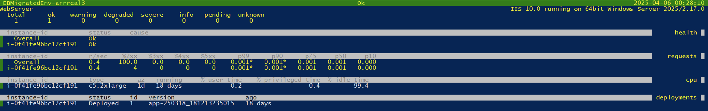

# Performing basic IIS

migrations

This section guides you through the process of migrating your IIS applications to Elastic Beanstalk
using the **eb migrate** command.

## Exploring your IIS

environment

Before making any changes, you'll want to understand what resources exist on your server.
Start by exploring your IIS sites by running **eb migrate explore**, as shown
in the following example:

```
`PS C:\migrations_workspace>` `eb migrate explore`
```

This command reveals your IIS sites. Refer to the following listing:

```
Default Web Site
Intranet
API.Internal
Reports
```

For a detailed view of each site's configuration, including bindings, applications, and
virtual directories, add the `--verbose` option, as shown in this example:

```
`PS C:\migrations_workspace>` `eb migrate explore --verbose`
```

The following listing shows the comprehensive information about your environment the command provides:

```
`1: Default Web Site:
 - Bindings:
 - `*`:80:www.example.com
 - `*`:443:www.example.com
 - Application '/':
 - Application Pool: DefaultAppPool
 - Enabled Protocols: http
 - Virtual Directories:
 - /:
 - Physical Path: C:\inetpub\wwwroot
 - Logon Method: ClearText
 - Application '/api':
 - Application Pool: ApiPool
 - Enabled Protocols: http
 - Virtual Directories:
 - /:
 - Physical Path: C:\websites\api
 - Logon Method: ClearText
2: Intranet:
...
3. API.Internal:
...
4. Reports:
...`
```

### Understanding the discovery output

The verbose output provides the following critical information for migration planning:

Sites

The discovery output lists all IIS sites on your server. Each site is identified
by its name (e.g., "Default Web Site", "Intranet", "API.Internal") and numbered
sequentially. When multiple sites exist on a server, the `eb migrate` command can
package and deploy each one separately or together, depending on your migration
strategy.

Bindings

Protocol bindings reveal which protocols (HTTP/HTTPS) your sites use and on which
ports they operate. The binding information includes host header requirements that
define domain-based routing configurations.

Applications

Application paths show both root and nested application structures within your IIS
configuration. Application pool assignments indicate how your applications are
isolated from each other for security and resource management.

Virtual directories

Physical path mappings indicate where your content resides on the file system.
Authentication settings show special access requirements that need to be maintained
after migration.

## Preparing for

migration

With an understanding of your environment, ensure that your server meets the prerequisites.
First, verify your IIS version with the following PowerShell command:

```
`PS C:\migrations_workspace>` `Get-ItemProperty "HKLM:\SOFTWARE\Microsoft\InetStp\" -Name MajorVersion`
```

You need IIS 7.0 or later. The migration tool uses Web Deploy 3.6 for packaging your
applications. Verify its installation with the following command:

```
`PS C:\migrations_workspace>` `Get-ItemProperty "HKLM:\SOFTWARE\Microsoft\IIS Extensions\MSDeploy\3" -Name InstallPath`
```

If Web Deploy isn't installed on your server, you can download it from the [Microsoft Web Platform
Installer](https://www.iis.net/downloads/microsoft/web-deploy "https://www.iis.net/downloads/microsoft/web-deploy") download page.

## Your first

migration

Let's start with a basic migration of the Default Web Site. The following example shows the simplest command, **eb migrate**.

```
`PS C:\migrations_workspace>` `eb migrate`
```

This command initiates a series of automated steps, shown in the following example output:

```
`Identifying VPC configuration of this EC2 instance (i-0123456789abcdef0)
 id: vpc-1234567890abcdef0
 publicip: true
 elbscheme: public
 ec2subnets: subnet-123,subnet-456,subnet-789
 securitygroups: sg-123,sg-456
 elbsubnets: subnet-123,subnet-456,subnet-789

Using .\migrations\latest to contain artifacts for this migration run.
Generating source bundle for sites, applications, and virtual directories...
 Default Web Site/ -> .\migrations\latest\upload_target\DefaultWebSite.zip`
```

The migration tool creates a structured directory containing your deployment
artifacts. The following listing shows the directory structure:

```
`C:\migration_workspace\
└── .\migrations\latest\
 └── upload_target\
 ├── DefaultWebSite.zip
 ├── aws-windows-deployment-manifest.json
 └── ebmigrateScripts\
 ├── site_installer.ps1
 ├── permission_handler.ps1
 └── >other helper scripts<`
```

## Controlling the

migration

For more control over the migration process, you can specify exactly which sites to
migrate with the following command:

```
`PS C:\migrations_workspace>` `eb migrate --sites "Default Web Site,Intranet"`
```

You can also customize the environment name and application name, as shown in the following example command:

```
`PS C:\migrations_workspace>` `eb migrate `
 --sites "Default Web Site" `
 --application-name "CorporateApp" `
 --environment-name "Production"`
```

For a complete list of options, see [eb migrate](eb3-migrate.md "eb3-migrate.md").

## Monitoring

progress

During migration, **eb migrate** provides real-time status updates. Refer to the following output example:

```
`...
Creating application version
Creating environment... This may take a few minutes

2024-03-18 18:12:15 INFO Environment details for: Production
 Application name: CorporateApp
 Region: us-west-2
 Deployed Version: app-230320_153045
 Environment ID: e-abcdef1234
 Platform: 64bit Windows Server 2019 v2.7.0 running IIS 10.0
 Tier: WebServer-Standard-1.0
 CNAME: production.us-west-2.elasticbeanstalk.com
 Updated: 2024-03-20 15:30:45
2025-03-18 18:12:17 INFO createEnvironment is starting.
2025-03-18 18:12:19 INFO Using elasticbeanstalk-us-east-1-180301529717 as Amazon S3 storage bucket for environment data.
2025-03-18 18:12:40 INFO Created security group named: sg-0fdd4d696a26b086a
2025-03-18 18:12:48 INFO Environment health has transitioned to Pending. Initialization in progress (running for 7 seconds). There are no instances.
...
2025-03-18 18:23:59 INFO Application available at EBMigratedEnv-arrreal3.us-east-1.elasticbeanstalk.com.
2025-03-18 18:24:00 INFO Successfully launched environment: EBMigratedEnv-arrreal3`
```

## Verifying the

migration

Once the environment is ready, Elastic Beanstalk provides several ways to verify your
deployment.

Access your application

Open your application URL (CNAME) in a web browser to verify it's working
correctly.

Check environment health

Use the **eb health** command to view the health of your
environment.

```
`PS C:\migrations_workspace>` `eb health`
```

The following screen image shows instance health, application response metrics, and system resource
utilization.



Use the **eb logs** command to access logs to troubleshoot any issues:

```
`PS C:\migrations_workspace>` `eb logs --zip`
```

The **eb logs** command downloads logs to the `.elasticbeanstalk/logs` directory.
For more information, see [Using Elastic Beanstalk with Amazon CloudWatch Logs](AWSHowTo.md "AWSHowTo.md").

Connect to instances

If you specified a key pair during migration, you can connect to your instances
using RDP for direct troubleshooting.

Access the Elastic Beanstalk console

You can view the environment's health, logs, and configuration properties through
the [environment management console](environments-console.md "environments-console.md") for that
environment.

## Managing migration

artifacts

The **eb migrate** command creates local artifacts during the migration process. These
artifacts contain sensitive information and can consume significant disk space over time. Use the
**cleanup** subcommand to manage these artifacts, as shown in the following example:

```
P`S C:\migrations_workspace>` `eb migrate cleanup`
Are you sure you would like to cleanup older artifacts within ./migrations/? (Y/N):
```

To force cleanup without confirmation use the **--force** option:

```
`PS C:\migrations_workspace>` `eb migrate cleanup --force`
```

The cleanup process preserves the most recent successful migration in the
`./migrations/latest` directory and removes older migration directories
