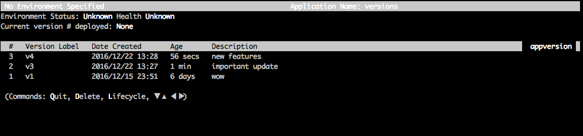
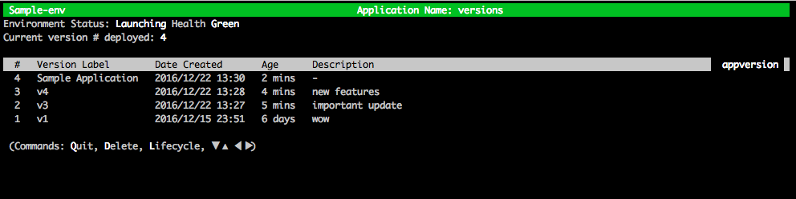

# **eb appversion**

## Description

The EB CLI `appversion` command manages your Elastic Beanstalk [application versions](concepts.md#concepts-version "concepts.md#concepts-version"). You can create a new
version of the application without deploying, delete a version of the application, or create the [application
version lifecycle policy](applications-lifecycle.md "applications-lifecycle.md"). If you invoke the command without any options, it enters the [interactive
mode](#eb3-appversion-interactive "#eb3-appversion-interactive").

Use the `--create` option to create a new version of the application.

Use the `--delete` option to delete a version of the application.

Use the `lifecycle` option to display or create the application version lifecycle policy. For more information, see [Configuring application version lifecycle settings](applications-lifecycle.md "applications-lifecycle.md").

## Syntax

**eb appversion**

**eb appversion [-c | --create]**

**eb appversion [-d | --delete] `version-label`**

**eb appversion lifecycle [-p | --print]**

## Options

| Name                                                                | Description Type: String                                                                                                                                                                                                                                                                              |
| ------------------------------------------------------------------- | ----------------------------------------------------------------------------------------------------------------------------------------------------------------------------------------------------------------------------------------------------------------------------------------------------- | ------------------------------------------------------------------------------------------------------------------------------------------------------------------------------------------------------------------------------------------------------------------------------------------------------------------------------------------------------------------------------------------------------------------------------------------------------------------------------------------------------------------------------------------------------------------------------------------------------------------------------------------------------------------------------------------------------------------------------------------------------------------------------------------------------------------------------------------------------------------------------------------------------------------------------------------------------------------------------------------------------------------------------------------------------------------------------------------------------------------------------------------------------------------------------------------------------------------------------------------------------------------------------------------------------------------------------------------------------------------------------------------------------------------------------------------------------------------------------------------------------------------------------------------------------------------------------------------------------------------------------------------------------------------------------------------------------------------------------------------------------------------------------------------------------------------------------------------------------------------------------------------------------------------------------------------------------------------------------------------------------------------------------------------------------------------------------------------------------------------------------------------------------------------- |
| -a `application-name` or --application_name `application-name`      | The name of the application. If an application with the specified name isn't found, the EB CLI creates an application version for a new application. Only applicable with the `--create` option. Type: String                                                                                         |
| -c or --create                                                      | Create a [new version](concepts.md#concepts-version "concepts.md#concepts-version") of the application.                                                                                                                                                                                               |
| -d `version-label` or --delete `version-label`                      | Delete the version of the application that is labeled `version-label`.                                                                                                                                                                                                                                |
| `-l` `version_label` or `--label` `version_label`                   | Specify a label to use for the version that the EB CLI creates. If you don't use this option, the EB CLI generates a new unique label. If you provide a version label, make sure that it's unique. Only applicable with the `--create` option. Type: String                                           |
| lifecycle                                                           | Invoke the default editor to create a new application version lifecycle policy. Use this policy to avoid reaching the [application version quota](../../../general/latest/gr/elasticbeanstalk.md#limits_elastic_beanstalk "../../../general/latest/gr/elasticbeanstalk.md#limits_elastic_beanstalk"). |
| lifecycle -p or lifecycle --print                                   | Display the current application lifecycle policy.                                                                                                                                                                                                                                                     |
| `-m` "`version_description`" or `--message` "`version_description`" | The description for the application version. It's enclosed in double quotation marks. Only applicable with the `--create` option. Type: String                                                                                                                                                        |
| `-p` or `--process`                                                 | Preprocess and validate the environment manifest and configuration files in the source bundle. Validating configuration files can identify issues. We recommend you do this before deploying the application version to the environment. Only applicable with the `--create` option.                  |
| `--source codecommit/`repository-name`/`branch-name``               | CodeCommit repository and branch. Only applicable with the `--create` option.                                                                                                                                                                                                                         |
| `--staged`                                                          | Use the files staged in the git index, instead of the HEAD commit, to create the application version. Only applicable with the `--create` option.                                                                                                                                                     |
| `--timeout` `minutes`                                               | The number of minutes before the command times out. Only applicable with the `--create` option.                                                                                                                                                                                                       |
| [Common options](eb3-cmd-options.md "eb3-cmd-options.md")           |                                                                                                                                                                                                                                                                                                       | ## Using the command interactively If you use the command without any arguments, the output displays the versions of the application. They're listed in reverse chronological order, with the lastest version listed first. See the **Examples** section for examples of what the screen looks like. Note that the status line is displayed at the bottom. The status line displays context-sensitive information. Press `d` to delete an application version, press `l` to manage the lifecycle policy for your application, or press `q` to quit without making any changes. ###### Note If the version is deployed to any environment, you can't delete that version. ## Output The command with the `--create` option displays a message confirming that the application version was created. The command with the `--delete` `version-label` option displays a message confirming that the application version was deleted. ## Examples The following example shows the interactive window for an application with no deployments.  The following example shows the interactive window for an application with the fourth version, with version label **Sample Application**, deployed.  The following example shows the output from an **eb appversion lifecycle -p** command, where `ACCOUNT-ID` is the user's account ID: ``Application details for: lifecycle Region: sa-east-1 Description: Application created from the EB CLI using "eb init" Date Created: 2016/12/20 02:48 UTC Date Updated: 2016/12/20 02:48 UTC Application Versions: ['Sample Application'] Resource Lifecycle Config(s): VersionLifecycleConfig: MaxCountRule: DeleteSourceFromS3: False Enabled: False MaxCount: 200 MaxAgeRule: DeleteSourceFromS3: False Enabled: False MaxAgeInDays: 180 ServiceRole: arn:aws:iam::`ACCOUNT-ID`:role/aws-elasticbeanstalk-service-role`` |
