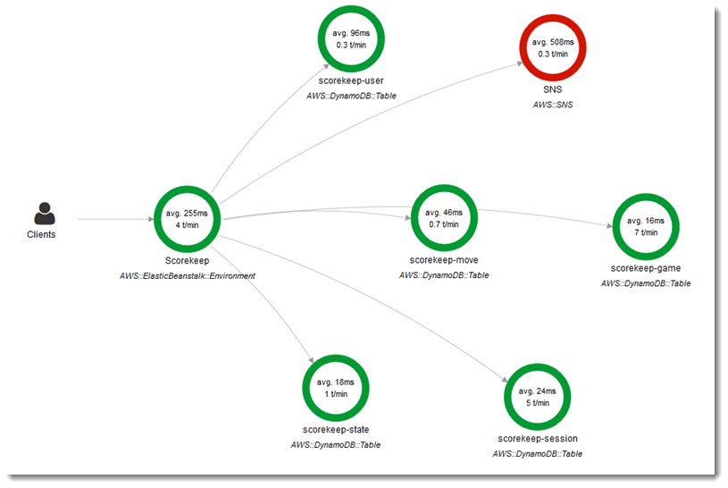

# Configuring AWS X-Ray debugging

You can use the AWS Elastic Beanstalk console or a configuration file to run the AWS X-Ray daemon on
the instances in your environment. X-Ray is an AWS service that gathers data about the
requests that your application serves, and uses it to construct a service map that you can use
to identify issues with your application and opportunities for optimization.

###### Note

Some regions don't offer X-Ray. If you create an environment in one of these regions, you can't run the X-Ray daemon on the instances in
your environment.

For information about the AWS services offered in each Region, see
[Region Table](https://aws.amazon.com/about-aws/global-infrastructure/regional-product-services/ "https://aws.amazon.com/about-aws/global-infrastructure/regional-product-services/").


X-Ray provides an SDK that you can use to instrument your application code, and a
daemon application that relays debugging information from the SDK to the X-Ray API.

###### Supported platforms

You can use the X-Ray SDK with the following Elastic Beanstalk platforms:

- **Go** - version 2.9.1 and later
- **Java 8** - version 2.3.0 and later
- **Java 8 with Tomcat 8** - version 2.4.0 and later
- **Node.js** - version 3.2.0 and later
- **Windows Server** - all platform versions released on or after December 18th, 2016
- **Python** - version 2.5.0 and later
  On supported platforms, you can use a configuration option to run the X-Ray daemon on the instances in your environment. You can enable the daemon in
  the [Elastic Beanstalk console](#environment-configuration-debugging-console "#environment-configuration-debugging-console") or by using a [configuration file](#environment-configuration-debugging-namespace "#environment-configuration-debugging-namespace").

To upload data to X-Ray, the X-Ray daemon requires IAM permissions in the **AWSXrayWriteOnlyAccess** managed policy.
These permissions are included in [the Elastic Beanstalk instance profile](concepts-roles-instance.md "concepts-roles-instance.md"). If you don't use the default instance
profile, see [Giving the Daemon Permission to Send Data to
X-Ray](../../../xray/latest/devguide/xray-daemon.md#xray-daemon-permissions "../../../xray/latest/devguide/xray-daemon.md#xray-daemon-permissions") in the _AWS X-Ray Developer Guide_.

Debugging with X-Ray requires the use of the X-Ray SDK. See the [Getting Started with
AWS X-Ray](../../../xray/latest/devguide/xray-gettingstarted.md "../../../xray/latest/devguide/xray-gettingstarted.md") in the _AWS X-Ray Developer Guide_ for instructions and sample applications.

If you use a platform version that doesn't include the daemon, you can still run it with a script in a configuration file. For more information,
see [Downloading and Running the X-Ray Daemon Manually (Advanced)](../../../xray/latest/devguide/xray-daemon-beanstalk.md#xray-daemon-beanstalk-manual "../../../xray/latest/devguide/xray-daemon-beanstalk.md#xray-daemon-beanstalk-manual")
in the _AWS X-Ray Developer Guide_.

###### Sections

- [Configuring debugging](#environment-configuration-debugging-console "#environment-configuration-debugging-console")
- [The aws:elasticbeanstalk:xray
  namespace](#environment-configuration-debugging-namespace "#environment-configuration-debugging-namespace")

## Configuring debugging

You can enable the X-Ray daemon on a running environment in the Elastic Beanstalk console.

###### To enable debugging in the Elastic Beanstalk console

1. Open the [Elastic Beanstalk console](https://console.aws.amazon.com/elasticbeanstalk "https://console.aws.amazon.com/elasticbeanstalk"),
   and in the **Regions** list, select your AWS Region.
2. In the navigation pane, choose **Environments**, and then choose the name of your environment from the list.
3. In the navigation pane, choose **Configuration**.
4. In the **Updates, monitoring, and logging** configuration category, choose **Edit**.
5. In the **Amazon X-Ray** section, select **Activated**.
6. To save the changes choose **Apply** at the bottom of the page.

You can also enable this option during environment creation. For more information, see
[The create new environment wizard](environments-create-wizard.md "environments-create-wizard.md").

## The aws:elasticbeanstalk:xray

namespace

You can use the `XRayEnabled` option in the
`aws:elasticbeanstalk:xray` namespace to enable debugging.

To enable debugging automatically when you deploy your application, set the option in a
[configuration file](ebextensions.md "ebextensions.md") in your source code, as
follows.

###### Example .ebextensions/debugging.config

```
option_settings:
  aws:elasticbeanstalk:xray:
    XRayEnabled: true
```
