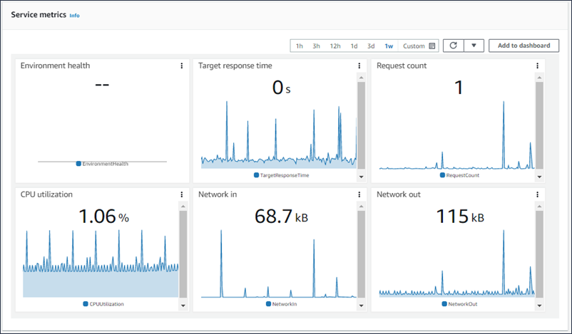

# Monitoring environment health in the AWS management console

You can access operational information about your application from the Elastic Beanstalk console. The console displays your environment's status and application
health at a glance. In the console's **Environments** page and in each application's page, the environments on the list are color-coded to
indicate status.

###### To monitor an environment in the Elastic Beanstalk console

1. Open the [Elastic Beanstalk console](https://console.aws.amazon.com/elasticbeanstalk "https://console.aws.amazon.com/elasticbeanstalk"),
   and in the **Regions** list, select your AWS Region.
2. In the navigation pane, choose **Environments**, and then choose the name of your environment from the list.
3. In the navigation pane, choose **Monitoring**.
   The Monitoring page shows you overall statistics about your environment, such as CPU utilization and average latency. In addition to the overall
   statistics, you can view monitoring graphs that show resource usage over time. You can click any of the graphs to view more detailed information.

###### Note

By default, only basic CloudWatch metrics are enabled, which return data in five-minute periods. You can enable more granular one-minute CloudWatch metrics by
editing your environment's configuration settings.

## Monitoring graphs

The **Monitoring** page shows an overview of health-related metrics for your environment. This includes the default set of
metrics provided by Elastic Load Balancing and Amazon EC2, and graphs that show how the environment's health has changed over time.

The bar above the graphs provides a variety of time intervals for you to select. For example, select **1w** to display
information that spans over the last week. Or select **3h** to display information that spans over the last three hours.

For a greater variety of time interval selections, choose **Custom**. From here you have two range options:
_Absolute_ or _Relative_. The **Absolute** option allows you to specify a specific date
range, such as _January 1, 2023 to June 30, 2023_. The **Relative** option allows to select an integer with a
specific time unit: _Minutes_, _Hours,_
_Days_, _Weeks_, or _Months_. Examples include
_10 Hours_, _10 Days_, and _10 Months_.

## Customizing the monitoring console

To create and view custom metrics you must use Amazon CloudWatch. With CloudWatch you can create custom dashboards to monitor your resources in a single view.
Select **Add to dashboard** to navigate to the Amazon CloudWatch console from the **Monitoring** page. Amazon CloudWatch provides
you the option to create a new dashboard or select an existing one. For more information, see [Using Amazon CloudWatch dashboards](../../../AmazonCloudWatch/latest/monitoring/CloudWatch_Dashboards.md "../../../AmazonCloudWatch/latest/monitoring/CloudWatch_Dashboards.md") in the
_Amazon CloudWatch User Guide_.

[Elastic Load Balancing](../../../AmazonCloudWatch/latest/DeveloperGuide/elb-metricscollected.md "../../../AmazonCloudWatch/latest/DeveloperGuide/elb-metricscollected.md") and [Amazon EC2](../../../AmazonCloudWatch/latest/DeveloperGuide/ec2-metricscollected.md "../../../AmazonCloudWatch/latest/DeveloperGuide/ec2-metricscollected.md") metrics are
enabled for all environments.

With [enhanced health](health-enhanced.md "health-enhanced.md"), the EnvironmentHealth metric is enabled,
and a graph is added to the monitoring console automatically.
Enhanced health also adds the [Health page](health-enhanced-console.md#health-enhanced-console-healthpage "health-enhanced-console.md#health-enhanced-console-healthpage") to the management console.
For a list of available enhanced health metrics, see [Publishing Amazon CloudWatch custom metrics for an environment](health-enhanced-cloudwatch.md "health-enhanced-cloudwatch.md").
