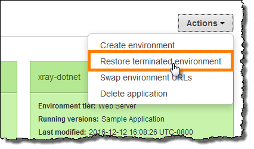
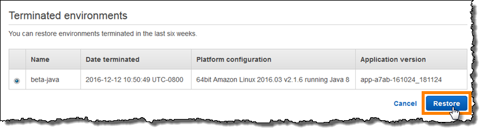

# Rebuilding Elastic Beanstalk environments

Your AWS Elastic Beanstalk environment can become unusable if you don't use Elastic Beanstalk functionality to
modify or terminate the environment's underlying AWS resources. If this happens, you can
**rebuild** the environment to attempt to restore it to a working
state. Rebuilding an environment terminates all of its resources and replaces them with new
resources with the same configuration.

You can also rebuild terminated environments within six weeks (42 days) of their
termination. When you rebuild, Elastic Beanstalk attempts to create a new environment with the same name,
ID, and configuration.

## Rebuilding a running

environment

You can rebuild an environment through the Elastic Beanstalk console or by using the
`RebuildEnvironment` API.

###### Warning

If your environment has a coupled database, **it will be deleted as
part of the rebuild**, and the new database in the rebuilt environment will not
contain the previous data. If you would like to retain the database or take a snapshot, make
sure you have the database deletion policy configured properly for the desired results after
it's rebuilt. For more information, see [Database lifecycle](using-features.managing.md#environments-cfg-rds-lifecycle "using-features.managing.md#environments-cfg-rds-lifecycle").

###### To rebuild a running environment (console)

1. Open the [Elastic Beanstalk console](https://console.aws.amazon.com/elasticbeanstalk "https://console.aws.amazon.com/elasticbeanstalk"),
   and in the **Regions** list, select your AWS Region.
2. In the navigation pane, choose **Environments**, and then choose the name of your environment from the list.
3. Choose **Actions**, and then choose **Rebuild
   environment**.
4. Choose **Rebuild**.

To rebuild a running environment with the Elastic Beanstalk API, use the [`RebuildEnvironment`](../api/API_RebuildEnvironment.md "../api/API_RebuildEnvironment.md")
action with the AWS CLI or the AWS SDK.

```
$ `aws elasticbeanstalk rebuild-environment --environment-id e-`vdnftxubwq``
```

## Rebuilding a terminated

environment

You can rebuild and restore a terminated environment by using the Elastic Beanstalk console, the EB
CLI, or the `RebuildEnvironment` API.

###### Note

Unless you are using your own custom domain name with your terminated environment, the
environment uses a subdomain of elasticbeanstalk.com. These subdomains are shared within an
Elastic Beanstalk region. Therefore, they can be used by any environment created by any customer in the
same region. While your environment was terminated, another environment could use its
subdomain. In this case, the rebuild would fail.

You can avoid this issue by using a custom domain. See [Your Elastic Beanstalk environment's Domain name](customdomains.md "customdomains.md") for details.

Recently terminated environments appear in the application overview for up to an hour.
During this time, you can view events for the environment in its [dashboard](environments-console.md "environments-console.md"), and use the **Restore
environment**
[action](environments-dashboard-actions.md "environments-dashboard-actions.md") to rebuild it.

To rebuild an environment that is no longer visible, use the **Restore terminated
environment** option from the application page.

###### To rebuild a terminated environment (console)

1. Open the [Elastic Beanstalk console](https://console.aws.amazon.com/elasticbeanstalk "https://console.aws.amazon.com/elasticbeanstalk"),
   and in the **Regions** list, select your AWS Region.
2. In the navigation pane, choose **Applications**, and then choose your application's name from the list.
3. Choose **Actions**, and then choose **Restore terminated
   environment**.

 4. Choose a terminated environment. 5. Choose **Restore**.



Elastic Beanstalk attempts to create a new environment with the same name, ID, and configuration. If
an environment with the same name or URL exists when you attempt to rebuild, the rebuild
fails. Deleting the application version that was deployed to the environment will also cause
the rebuild to fail.

If you use the EB CLI to manage your environment, use the **eb restore**
command to rebuild a terminated environment.

```
$ `eb restore e-`vdnftxubwq``
```

See [eb restore](eb3-restore.md "eb3-restore.md") for more
information.

To rebuild a terminated environment with the Elastic Beanstalk API, use the [`RebuildEnvironment`](../api/API_RebuildEnvironment.md "../api/API_RebuildEnvironment.md")
action with the AWS CLI or the AWS SDK.

```
$ `aws elasticbeanstalk rebuild-environment --environment-id e-`vdnftxubwq``
```
