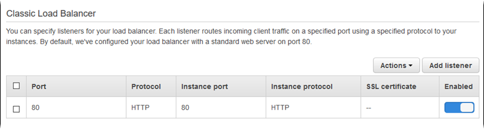
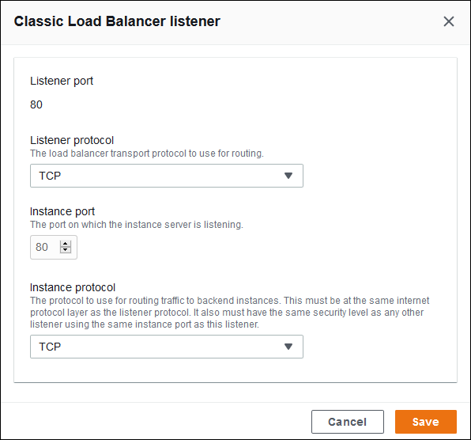
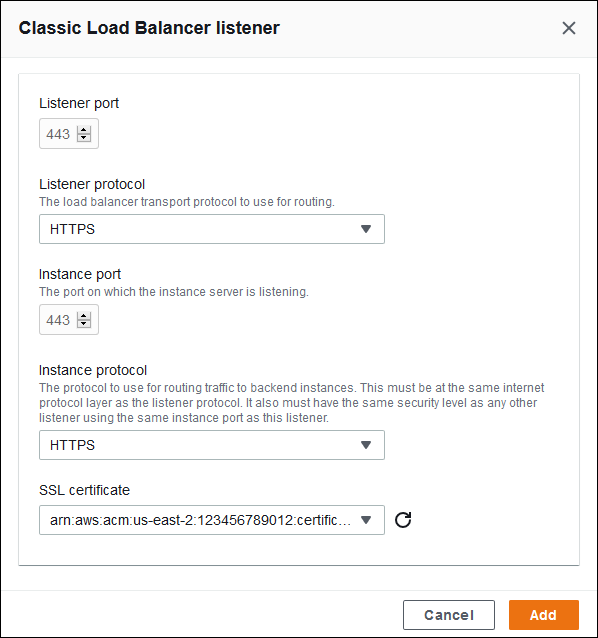
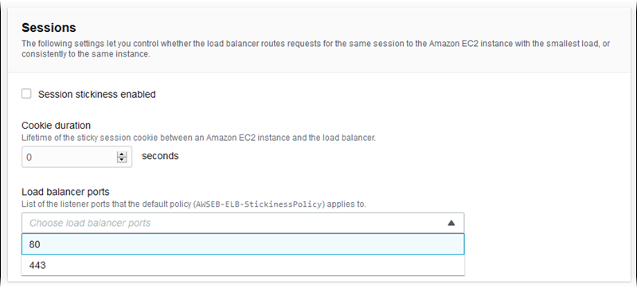
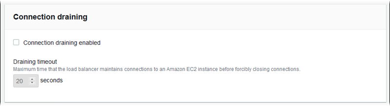
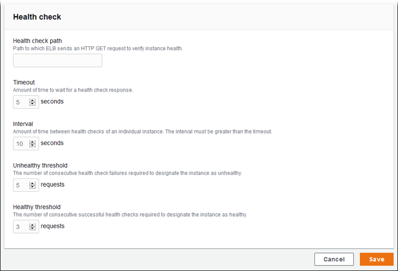

# Configuring a Classic Load Balancer

When you [enable load balancing](using-features-managing-env-types.md#using-features.managing.changetype "using-features-managing-env-types.md#using-features.managing.changetype"), your AWS Elastic Beanstalk environment is equipped with an Elastic Load Balancing load
balancer to distribute traffic among the instances in your environment. ELB supports several load balancer types. To learn about them, see the
[Elastic Load Balancing User Guide](../../../elasticloadbalancing/latest/userguide.md "../../../elasticloadbalancing/latest/userguide.md"). Elastic Beanstalk can create a load balancer for you, or let you specify a shared load balancer that you've created.

This topic describes the configuration of a [Classic Load Balancer](../../../elasticloadbalancing/latest/classic.md "../../../elasticloadbalancing/latest/classic.md") that Elastic Beanstalk creates and dedicates to your environment. For
information about configuring all the load balancer types that Elastic Beanstalk supports, see [Load balancer for your Elastic Beanstalk environment](using-features.managing.md "using-features.managing.md").

###### Note

You can choose the type of load balancer that your environment uses only during environment creation. Later, you can change settings to manage the
behavior of your running environment's load balancer, but you can't change its type.

## Introduction

A [Classic Load Balancer](../../../elasticloadbalancing/latest/classic.md "../../../elasticloadbalancing/latest/classic.md") is the Elastic Load Balancing previous-generation load balancer. It supports routing HTTP, HTTPS, or TCP request traffic
to different ports on environment instances.

When your environment uses a Classic Load Balancer, Elastic Beanstalk configures it by default to [listen](../../../elasticloadbalancing/latest/classic/elb-listener-config.md "../../../elasticloadbalancing/latest/classic/elb-listener-config.md") for HTTP
traffic on port 80 and forward it to instances on the same port. Although you cannot delete the port 80 default listener, you can disable it, which
achieves the same functionality by blocking traffic. Note that you can add or delete other listeners. To support secure connections, you can configure
your load balancer with a listener on port 443 and a TLS certificate.

The load balancer uses a [health check](../../../elasticloadbalancing/latest/classic/elb-healthchecks.md "../../../elasticloadbalancing/latest/classic/elb-healthchecks.md") to determine whether the Amazon EC2 instances running your
application are healthy. The health check makes a request to a specified URL at a set interval. If the URL returns an error message, or fails to return
within a specified timeout period, the health check fails.

If your application performs better by serving multiple requests from the same client on a single server, you can configure your load balancer to use
[sticky sessions](../../../elasticloadbalancing/latest/classic/elb-sticky-sessions.md "../../../elasticloadbalancing/latest/classic/elb-sticky-sessions.md"). With sticky sessions, the load balancer adds a cookie to HTTP responses that
identifies the Amazon EC2 instance that served the request. When a subsequent request is received from the same client, the load balancer uses the cookie to
send the request to the same instance.

With [cross-zone load balancing](../../../elasticloadbalancing/latest/classic/enable-disable-crosszone-lb.md "../../../elasticloadbalancing/latest/classic/enable-disable-crosszone-lb.md"), each load balancer node for your Classic Load Balancer distributes
requests evenly across the registered instances in all enabled Availability Zones. If cross-zone load balancing is disabled, each load balancer node
distributes requests evenly across the registered instances in its Availability Zone only.

When an instance is removed from the load balancer because it has become unhealthy or the environment is scaling down, [connection draining](../../../elasticloadbalancing/latest/classic/config-conn-drain.md "../../../elasticloadbalancing/latest/classic/config-conn-drain.md") gives the instance time to complete requests before closing the connection between
the instance and the load balancer. You can change the amount of time given to instances to send a response, or disable connection draining
completely.

###### Note

Connection draining is enabled by default when you create an environment with the Elastic Beanstalk console or the EB CLI. For other clients, you can enable it
with [configuration options](#environments-cfg-clb-namespace "#environments-cfg-clb-namespace").

You can use advanced load balancer settings to configure listeners on arbitrary ports, modify additional sticky session settings, and configure the
load balancer to connect to EC2 instances securely. These settings are available through [configuration
options](#environments-cfg-clb-namespace "#environments-cfg-clb-namespace") that you can set by using configuration files in your source code, or directly on an environment by using the Elastic Beanstalk API. Many of these
settings are also available in the Elastic Beanstalk console. In addition, you can configure a load balancer to [upload access logs](environments-cfg-loadbalancer-accesslogs.md "environments-cfg-loadbalancer-accesslogs.md") to Amazon S3.

## Configuring a Classic Load Balancer using the Elastic Beanstalk console

You can use the Elastic Beanstalk console to configure a Classic Load Balancer's ports, HTTPS certificate, and other settings, during environment creation or later when your
environment is running.

###### Note

The Classic Load Balancer (CLB) option is disabled on the **Create Environment** console wizard. If you have an existing environment configured with a
Classic Load Balancer you can create a new one by [cloning the existing environment](using-features.managing.md "using-features.managing.md") using either the Elastic Beanstalk console or
the [EB CLI](using-features.managing.md#using-features.managing.clone.CLI "using-features.managing.md#using-features.managing.clone.CLI"). You also have the option to use the EB
CLI or the [AWS CLI](environments-create-awscli.md "environments-create-awscli.md") to create a new environment configured with a Classic Load Balancer. These command line tools
will create a new environment with a CLB even if one doesn’t already exist in your account.

###### To configure a running environment's Classic Load Balancer in the Elastic Beanstalk console

1. Open the [Elastic Beanstalk console](https://console.aws.amazon.com/elasticbeanstalk "https://console.aws.amazon.com/elasticbeanstalk"),
   and in the **Regions** list, select your AWS Region.
2. In the navigation pane, choose **Environments**, and then choose the name of your environment from the list.
3. In the navigation pane, choose **Configuration**.
4. In the **Load balancer** configuration category, choose **Edit**.

###### Note

If the **Load balancer** configuration category doesn't have an **Edit** button, your environment doesn't have
a load balancer. To learn how to set one up, see [Changing environment type](using-features-managing-env-types.md#using-features.managing.changetype "using-features-managing-env-types.md#using-features.managing.changetype"). 5. Make the Classic Load Balancer configuration changes that your environment requires. 6. To save the changes choose **Apply** at the bottom of the page.

###### Classic Load Balancer settings

- [Listeners](#using-features.managing.elb.listeners "#using-features.managing.elb.listeners")
- [Sessions](#using-features.managing.elb.sessions "#using-features.managing.elb.sessions")
- [Cross-zone load balancing](#using-features.managing.elb.cross-zone "#using-features.managing.elb.cross-zone")
- [Connection draining](#using-features.managing.elb.draining "#using-features.managing.elb.draining")
- [Health check](#using-features.managing.elb.healthchecks "#using-features.managing.elb.healthchecks")

### Listeners

Use this list to specify listeners for your load balancer. Each listener routes incoming client traffic on a specified port using a specified
protocol to your instances. Initially, the list shows the default listener, which routes incoming HTTP traffic on port 80 to your environment's instance
servers that are listening to HTTP traffic on port 80.

###### Note

Although you cannot delete the port 80 default listener, you can disable it, which achieves the same functionality by blocking traffic.



###### To configure an existing listener

1. Select the check box next to its table entry, choose **Actions**, and then choose the action you want.
2. If you chose **Edit**, use the **Classic Load Balancer listener** dialog box to edit settings, and then choose
   **Save**.

For example, you can edit the default listener and change the **Protocol** from **HTTP** to
**TCP** if you want the load balancer to forward a request as is. This prevents the load balancer from rewriting headers (including
`X-Forwarded-For`). The technique doesn't work with sticky sessions.



###### To add a listener

1. Choose **Add listener**.
2. In the **Classic Load Balancer listener** dialog box, configure the settings you want, and then choose
   **Add**.

Adding a secure listener is a common use case. The example in the following image adds a listener for HTTPS traffic on port 443. This listener
routes the incoming traffic to environment instance servers listening to HTTPS traffic on port 443.

Before you can configure an HTTPS listener, ensure that you have a valid SSL certificate. Do one of the following:

- If AWS Certificate Manager (ACM) is [available in your AWS Region](../../../general/latest/gr/acm.md "../../../general/latest/gr/acm.md"), create or import a certificate using ACM.
  For more information about requesting an ACM certificate, see [Request a Certificate](../../../acm/latest/userguide/gs-acm-request.md "../../../acm/latest/userguide/gs-acm-request.md") in the
  _AWS Certificate Manager User Guide_. For more information about importing third-party certificates into ACM, see [Importing Certificates](../../../acm/latest/userguide/import-certificate.md "../../../acm/latest/userguide/import-certificate.md") in the _AWS Certificate Manager User Guide_.
- If ACM isn't [available in your AWS Region](../../../general/latest/gr/acm.md "../../../general/latest/gr/acm.md"), upload your existing certificate and key to IAM. For
  more information about creating and uploading certificates to IAM, see [Working with Server
  Certificates](../../../IAM/latest/UserGuide/ManagingServerCerts.md "../../../IAM/latest/UserGuide/ManagingServerCerts.md") in the _IAM User Guide_.

For more detail on configuring HTTPS and working with certificates in Elastic Beanstalk, see [Configuring HTTPS for your Elastic Beanstalk environment](configuring-https.md "configuring-https.md").

For **SSL certificate**, choose the ARN of your SSL certificate. For example,
`arn:aws:iam::123456789012:server-certificate/abc/certs/build`, or
`arn:aws:acm:us-east-2:123456789012:certificate/12345678-12ab-34cd-56ef-12345678`.



For details about configuring HTTPS and working with certificates in Elastic Beanstalk, see [Configuring HTTPS for your Elastic Beanstalk environment](configuring-https.md "configuring-https.md").

### Sessions

Select or clear the **Session stickiness enabled** box to enable or disable sticky sessions. Use **Cookie
duration** to configure a sticky session's duration, up to `1000000` seconds. On the **Load balancer
ports** list, select listener ports that the default policy (`AWSEB-ELB-StickinessPolicy`) applies to.



### Cross-zone load balancing

Select or clear the **Load balancing across multiple Availability Zones enabled** box to enable or disable cross-zone load
balancing.


### Connection draining

Select or clear the **Connection draining enabled** box to enable or disable connection draining. Set the **Draining
timeout**, up to `3600` seconds.



### Health check

Use the following settings to configure load balancer health checks:

- **Health check path** – The path to which the load balancer sends health check requests. If you don't set the path, the
  load balancer attempts to make a TCP connection on port 80 to verify health.
- **Timeout** – The amount of time, in seconds, to wait for a health check response.
- **Interval** – The amount of time, in seconds, between health checks of an individual instance. The interval must be
  greater than the timeout.
- **Unhealthy threshold**, **Healthy threshold** – The number of health checks that must fail or pass,
  respectively, before ELB changes an instance's health state.



###### Note

The ELB health check doesn't affect the health check behavior of an environment's Amazon EC2 Auto Scaling group. Instances that fail an ELB health check are not
automatically replaced by Amazon EC2 Auto Scaling unless you manually configure Amazon EC2 Auto Scaling to do so. See [Amazon EC2 Auto Scaling health check setting for your Elastic Beanstalk environment](environmentconfig-autoscaling-healthchecktype.md "environmentconfig-autoscaling-healthchecktype.md") for details.

For more information about health checks and how they influence your environment's overall health, see [Basic health reporting](using-features.md "using-features.md").

## Configuring a Classic Load Balancer using the EB CLI

The EB CLI prompts you to choose a load balancer type when you run [eb create](eb3-create.md "eb3-create.md").

```
$ `eb create`
Enter Environment Name
(default is my-app): `test-env`
Enter DNS CNAME prefix
(default is my-app): `test-env-DLW24ED23SF`

Select a load balancer type
1) classic
2) application
3) network
(default is 1):
```

Press **Enter** to select `classic`.

You can also specify a load balancer type by using the `--elb-type` option.

```
$ `eb create test-env --elb-type classic`
```

## Classic Load Balancer configuration namespaces

You can find settings related to Classic Load Balancers in the following namespaces:

- [aws:elb:healthcheck](command-options-general.md#command-options-general-elbhealthcheck "command-options-general.md#command-options-general-elbhealthcheck") – Configure the thresholds, check interval,
  and timeout for load balancer health checks.
- [aws:elasticbeanstalk:application](command-options-general.md#command-options-general-elasticbeanstalkapplication "command-options-general.md#command-options-general-elasticbeanstalkapplication") – Configure the
  health check URL.
- [aws:elb:loadbalancer](command-options-general.md#command-options-general-elbloadbalancer "command-options-general.md#command-options-general-elbloadbalancer") – Enable cross-zone load balancing. Assign
  security groups to the load balancer and override the default security group that Elastic Beanstalk creates. This namespace also includes deprecated
  options for configuring the standard and secure listeners that have been replaced by options in the `aws:elb:listener` namespace.
- [aws:elb:listener](command-options-general.md#command-options-general-elblistener "command-options-general.md#command-options-general-elblistener") – Configure the default listener on port 80, a
  secure listener on port 443, or additional listeners for any protocol on any port. If you specify `aws:elb:listener` as the
  namespace, settings apply to the default listener on port 80. If you specify a port (for example, `aws:elb:listener:443`), a
  listener is configured on that port.
- [aws:elb:policies](command-options-general.md#command-options-general-elbpolicies "command-options-general.md#command-options-general-elbpolicies") – Configure additional settings for your load
  balancer. Use options in this namespace to configure listeners on arbitrary ports, modify additional sticky session settings, and configure the load
  balancer to connect to Amazon EC2 instances securely.

The EB CLI and Elastic Beanstalk console apply recommended values for the preceding options.
You must remove these settings if you want to use configuration files to configure the same. See
[Recommended values](command-options.md#configuration-options-recommendedvalues "command-options.md#configuration-options-recommendedvalues") for details.

###### Example .ebextensions/loadbalancer-terminatehttps.config

The following example configuration file creates an HTTPS listener on port 443, assigns a certificate that the load balancer uses to terminate the
secure connection, and disables the default listener on port 80. The load balancer forwards the decrypted requests to the EC2 instances in your
environment on HTTP:80.

```
option_settings:
  aws:elb:listener:443:
    ListenerProtocol: HTTPS
    SSLCertificateId: `arn:aws:acm:us-east-2:123456789012:certificate/12345678-12ab-34cd-56ef-12345678`
    InstancePort: 80
    InstanceProtocol: HTTP
  aws:elb:listener:
    ListenerEnabled: false
```
