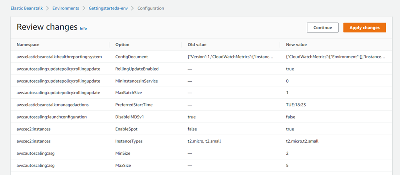

# Environment configuration using the Elastic Beanstalk console

This topic outlines the configuration options available through the Elastic Beanstalk console and explains how to navigate the configuration pages.

###### To view a summary of your environment's configuration

1. Open the [Elastic Beanstalk console](https://console.aws.amazon.com/elasticbeanstalk "https://console.aws.amazon.com/elasticbeanstalk"),
   and in the **Regions** list, select your AWS Region.
2. In the navigation pane, choose **Environments**, and then choose the name of your environment from the list.
3. In the navigation pane, choose **Configuration**.

## Configuration page

The **Configuration** overview page shows a set of configuration categories. Each configuration category groups a set of related
options.

###### Service access

The options in this category select the _service role_ and _EC2 instance profile_ that Elastic Beanstalk uses to manage
your environment. Optionally choose an EC2 key pair to securely log in to your EC2 instances.

###### Networking and database

The options in this category configure VPC settings, and subnets for the environment's EC2 instances and load balancer. They also provide the
option to set up an Amazon RDS database that's integrated with your environment.

###### Instance traffic and scaling

These options customize the capacity, scaling, and load balancing for the environment’s EC2 instances. You can also configure ELB to capture logs
with detailed information about requests sent to the load balancer.

The following options for your EC2 instances are also available for configuration:

- Root volume type, size, input/output operation rate (IOPS), and throughput.
- Enabling instance metadata service (IMDS).
- Selection of EC2 security groups to control instance traffic.
- CloudWatch metrics monitoring interval.
- Time interval for metrics logging.

###### Updates, monitoring, and logging

This category configures the following options:

- Environment health reporting, including the option to select enhanced health reporting.
- Managed platform updates that define when and how Elastic Beanstalk deploys changes to the environment.
- Enabling of the X-Ray service to collect data about your application's behavior to identify issues and optimization opportunities.
- Platform specific options, including the proxy server and OS environment properties.

### Navigating the configuration page

Choose **Edit** in a configuration category to launch the associated configuration page, where you can see full option values and
make changes.

###### Navigation in a configuration category

Navigate in a configuration category page with any of the following actions:

- **Cancel** – Go back to the **Configuration** overview page without applying your configuration changes.
  When you choose **Cancel**, the console loses any pending changes you made on any configuration category.

You can also cancel your configuration changes by choosing another item on the left navigation page, like **Events** or
**Logs**.

- **Continue** – Go back to the **Configuration** overview page. You can then continue making changes or
  apply pending ones.
- **Apply** – Apply the changes you made in any of the configuration categories to your environment. In some cases you're
  prompted to confirm a consequence of one of your configuration decisions.

###### Navigation on the **Configuration** overview page

Choose **Edit** in a configuration category to launch a related configuration page, where you can see full option values and make
changes. When you're done viewing and modifying options, you can choose one of the following actions from the **Configuration**
overview page:

- **Cancel** – Go back to the environment's dashboard without applying your configuration changes. When you choose
  **Cancel**, the console loses any pending changes you made on any configuration category.

You can also cancel your configuration changes by choosing another item on the left navigation page, like **Events** or
**Logs**.

- **Review changes** – Get a summary of all the pending changes you made in any of the configuration categories. For
  details, see [Review changes page](#environments-cfg-console.review "#environments-cfg-console.review").
- **Apply changes** – Apply the changes you made in any of the configuration categories to your environment. In some cases
  you're prompted to confirm a consequence of one of your configuration decisions.

## Review changes page

The **Review Changes** page displays a table showing all the pending option changes you made in any of the configuration categories
and haven't applied to your environment yet.

The tables lists each option as a combination of the **Namespace** and **Option** with which Elastic Beanstalk identifies it.
For details, see [Configuration options](command-options.md "command-options.md").

When you're done reviewing your changes, you can choose one of the following actions:

- **Continue** – Go back to the **Configuration** overview page. You can then continue making changes or
  apply pending ones.
- **Apply changes** – Apply the changes you made in any of the configuration categories to your environment. In some cases
  you're prompted to confirm a consequence of one of your configuration decisions.
