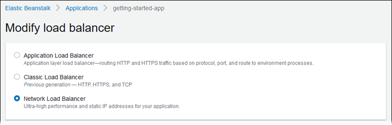
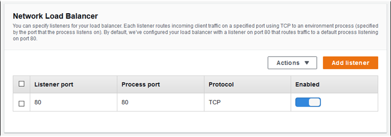
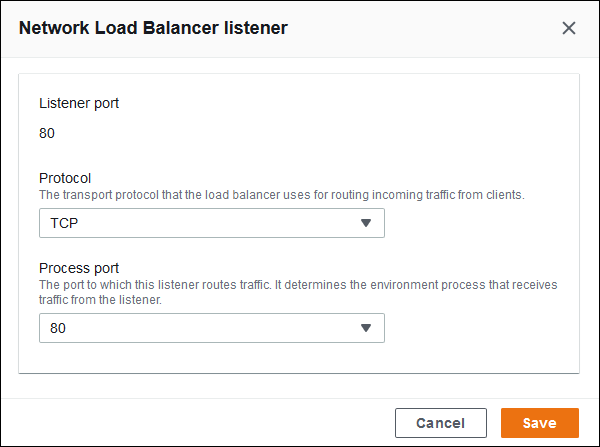
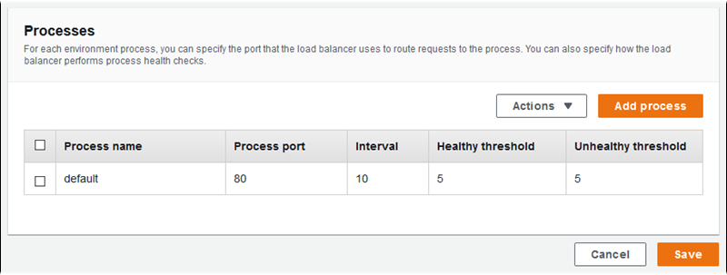
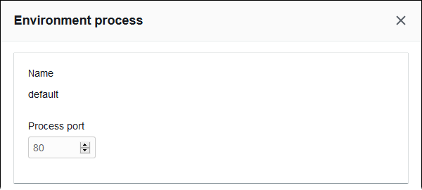
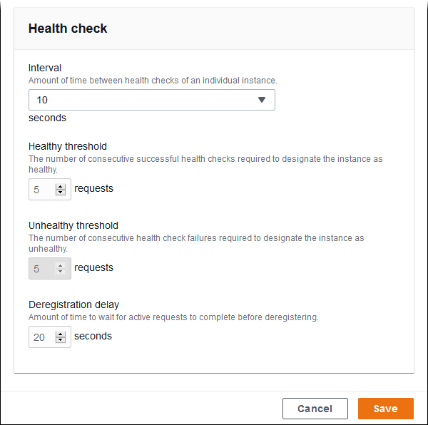
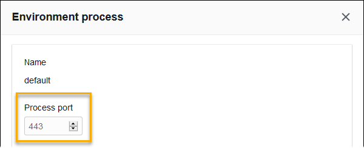
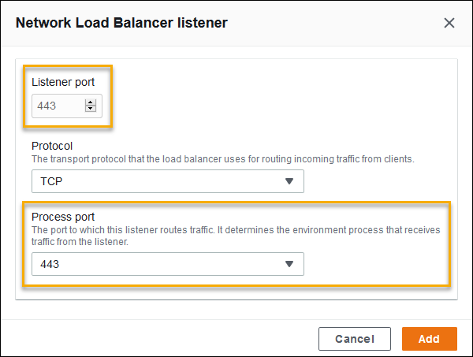
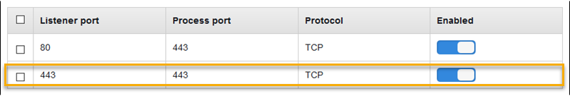
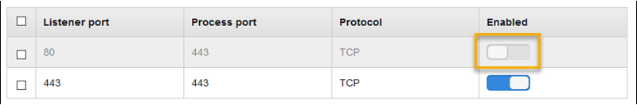

# Configuring a Network Load Balancer

When you [enable load balancing](using-features-managing-env-types.md#using-features.managing.changetype "using-features-managing-env-types.md#using-features.managing.changetype"), your AWS Elastic Beanstalk environment is equipped with an Elastic Load Balancing load
balancer to distribute traffic among the instances in your environment. ELB supports several load balancer types. To learn about them, see the
[Elastic Load Balancing User Guide](../../../elasticloadbalancing/latest/userguide.md "../../../elasticloadbalancing/latest/userguide.md"). Elastic Beanstalk can create a load balancer for you, or let you specify a shared load balancer that you've created.

This topic describes the configuration of a [Network Load Balancer](../../../elasticloadbalancing/latest/network.md "../../../elasticloadbalancing/latest/network.md") that Elastic Beanstalk creates and dedicates to your environment. For
information about configuring all the load balancer types that Elastic Beanstalk supports, see [Load balancer for your Elastic Beanstalk environment](using-features.managing.md "using-features.managing.md").

###### Note

You can choose the type of load balancer that your environment uses only during environment creation. You can change settings to manage the behavior
of your running environment's load balancer, but you can't change its type.

## Introduction

With a Network Load Balancer, the default listener accepts TCP requests on port 80 and distributes them to the instances in your environment. You can configure health
check behavior, configure the listener port, or add a listener on another port.

###### Note

Unlike a Classic Load Balancer or an Application Load Balancer, a Network Load Balancer can't have application layer (layer 7) HTTP or HTTPS listeners. It only supports transport layer (layer 4) TCP
listeners. HTTP and HTTPS traffic can be routed to your environment over TCP. To establish secure HTTPS connections between web clients and your
environment, install a [self-signed certificate](configuring-https-ssl.md "configuring-https-ssl.md") on the environment's instances, and configure the instances
to listen on the appropriate port (typically 443) and terminate HTTPS connections. The configuration varies per platform. See [Configuring HTTPS Termination at the instance](https-singleinstance.md "https-singleinstance.md") for instructions. Then configure your Network Load Balancer to add a listener that maps to a
process listening on the appropriate port.

A Network Load Balancer supports active health checks. These checks are based on messages to the root (`/`) path. In addition, a Network Load Balancer supports passive
health checks. It automatically detects faulty backend instances and routes traffic only to healthy instances.

## Configuring a Network Load Balancer using the Elastic Beanstalk console

You can use the Elastic Beanstalk console to configure a Network Load Balancer's listeners and processes during environment creation, or later when your environment is
running.

###### To configure a Network Load Balancer in the Elastic Beanstalk console during environment creation

1. Open the [Elastic Beanstalk console](https://console.aws.amazon.com/elasticbeanstalk "https://console.aws.amazon.com/elasticbeanstalk"),
   and in the **Regions** list, select your AWS Region.
2. In the navigation pane, choose **Environments**.
3. Choose [Create a new environment](environments-create-wizard.md "environments-create-wizard.md") to start creating your environment.
4. On the wizard's main page, before choosing **Create environment**, choose **Configure more options**.
5. Choose the **High availability** configuration preset.

Alternatively, in the **Capacity** configuration category, configure a **Load balanced** environment type. For
details, see [Capacity](environments-create-wizard.md#environments-create-wizard-capacity "environments-create-wizard.md#environments-create-wizard-capacity"). 6. In the **Load balancer** configuration category, choose **Edit**. 7. Select the **Network Load Balancer** option, if it isn't already selected.

 8. Make any Network Load Balancer configuration changes that your environment requires. 9. Choose **Save**, and then make any other configuration changes that your environment requires. 10. Choose **Create environment**.

###### To configure a running environment's Network Load Balancer in the Elastic Beanstalk console

1. Open the [Elastic Beanstalk console](https://console.aws.amazon.com/elasticbeanstalk "https://console.aws.amazon.com/elasticbeanstalk"),
   and in the **Regions** list, select your AWS Region.
2. In the navigation pane, choose **Environments**, and then choose the name of your environment from the list.
3. In the navigation pane, choose **Configuration**.
4. In the **Load balancer** configuration category, choose **Edit**.

###### Note

If the **Load balancer** configuration category doesn't have an **Edit** button, your environment doesn't have a
load balancer. To learn how to set one up, see [Changing environment type](using-features-managing-env-types.md#using-features.managing.changetype "using-features-managing-env-types.md#using-features.managing.changetype"). 5. Make the Network Load Balancer configuration changes that your environment requires. 6. To save the changes choose **Apply** at the bottom of the page.

###### Network Load Balancer settings

- [Listeners](#environments-cfg-nlb-console-listeners "#environments-cfg-nlb-console-listeners")
- [Processes](#environments-cfg-nlb-console-processes "#environments-cfg-nlb-console-processes")

### Listeners

Use this list to specify listeners for your load balancer. Each listener routes incoming client traffic on a specified port to a process on your
instances. Initially, the list shows the default listener, which routes incoming traffic on port 80 to a process named **default**,
which listens to port 80.



###### To configure an existing listener

1. Select the check box next to its table entry, and then choose **Actions**, **Edit**.
2. Use the **Network Load Balancer listener** dialog box to edit settings, and then choose **Save**.

###### To add a listener

1. Choose **Add listener**.
2. In the **Network Load Balancer listener** dialog box, configure the required settings, and then choose
   **Add**.

Use the **Network Load Balancer listener** dialog box to configure the port on which the listener listens to traffic, and to choose
the process to which you want to route traffic (specified by the port that the process listens to).



### Processes

Use this list to specify processes for your load balancer. A process is a target for listeners to route traffic to. Each listener routes incoming
client traffic on a specified port to a process on your instances. Initially, the list shows the default process, which listens to incoming
traffic on port 80.



You can edit the settings of an existing process, or add a new process. To start editing a process on the list or adding a process to it, use the
same steps listed for the [listener list](environments-cfg-alb.md#environments-cfg-alb-console-listeners "environments-cfg-alb.md#environments-cfg-alb-console-listeners"). The **Environment process**
dialog box opens.

###### Network Load Balancer's environment process dialog box settings

- [Definition](#environments-cfg-nlb-console-process-definition "#environments-cfg-nlb-console-process-definition")
- [Health check](#environments-cfg-nlb-console-process-healthchecks "#environments-cfg-nlb-console-process-healthchecks")

#### Definition

Use these settings to define the process: its **Name** and the **Process port** on which it listens to
requests.



#### Health check

Use the following settings to configure process health checks:

- **Interval** – The amount of time, in seconds, between health checks of an individual instance.
- **Healthy threshold** – The number of health checks that must pass before ELB changes an instance's health state.
  (For Network Load Balancer, **Unhealthy threshold** is a read-only setting that is always equal to the healthy threshold value.)
- **Deregistration delay** – The amount of time, in seconds, to wait for active requests to complete before deregistering an
  instance.



###### Note

The ELB health check doesn't affect the health check behavior of an environment's Auto Scaling group. Instances that fail an ELB health check will
not automatically be replaced by Amazon EC2 Auto Scaling unless you manually configure Amazon EC2 Auto Scaling to do so. See [Auto Scaling health check setting for your Elastic Beanstalk environment](environmentconfig-autoscaling-healthchecktype.md "environmentconfig-autoscaling-healthchecktype.md") for details.

For more information about health checks and how they influence your environment's overall health, see [Basic health reporting](using-features.md "using-features.md").

## Example: Network Load Balancer for an environment with end-to-end encryption

In this example, your application requires end-to-end traffic encryption. To configure your environment's Network Load Balancer to meet these requirements, you
configure the default process to listen to port 443, add a listener to port 443 that routes traffic to the default process, and disable the default
listener.

###### To configure the load balancer for this example

1. _Configure the default process._ Select the default process, and then, for **Actions**, choose
   **Edit**. For **Process port**, type `443`.

 2. _Add a port 443 listener._ Add a new listener. For **Listener port**, type `443`. For
**Process port**, make sure that `443` is selected.



You can now see your additional listener on the list.

 3. _Disable the default port 80 listener._ For the default listener, turn off the **Enabled** option.



## Configuring a Network Load Balancer using the EB CLI

The EB CLI prompts you to choose a load balancer type when you run [eb create](eb3-create.md "eb3-create.md").

```
$ `eb create`
Enter Environment Name
(default is my-app): `test-env`
Enter DNS CNAME prefix
(default is my-app): `test-env-DLW24ED23SF`

Select a load balancer type
1) classic
2) application
3) network
(default is 1): `3`
```

You can also specify a load balancer type with the `--elb-type` option.

```
$ `eb create test-env --elb-type network`
```

## Network Load Balancer namespaces

You can find settings related to Network Load Balancers in the following namespaces:

- `aws:elasticbeanstalk:environment` – Choose the load
  balancer type for the environment. The value for a Network Load Balancer is `network`.
- `aws:elbv2:listener` – Configure listeners on the Network Load Balancer. These
  settings map to the settings in `aws:elb:listener` for Classic Load Balancers.
- `aws:elasticbeanstalk:environment:process` – Configure health
  checks and specify the port and protocol for the processes that run on your environment's instances. The port and protocol settings map to the
  instance port and instance protocol settings in `aws:elb:listener` for a listener on a Classic Load Balancer. Health check settings map to the settings in
  the `aws:elb:healthcheck` and `aws:elasticbeanstalk:application` namespaces.

###### Example .ebextensions/network-load-balancer.config

To get started with a Network Load Balancer, use a [configuration file](ebextensions.md "ebextensions.md") to set the load balancer type to
`network`.

```
option_settings:
  aws:elasticbeanstalk:environment:
    LoadBalancerType: network
```

###### Note

You can set the load balancer type only during environment creation.

###### Example .ebextensions/nlb-default-process.config

The following configuration file modifies health check settings on the default process.

```
option_settings:
  aws:elasticbeanstalk:environment:process:default:
    DeregistrationDelay: '20'
    HealthCheckInterval: '10'
    HealthyThresholdCount: '5'
    UnhealthyThresholdCount: '5'
    Port: '80'
    Protocol: TCP
```

###### Example .ebextensions/nlb-secure-listener.config

The following configuration file adds a listener for secure traffic on port 443 and a matching target process that listens to port 443.

```
option_settings:
  aws:elbv2:listener:443:
    DefaultProcess: https
    ListenerEnabled: 'true'
  aws:elasticbeanstalk:environment:process:https:
    Port: '443'
```

The `DefaultProcess` option is named this way because of Application Load Balancers, which can have non-default listeners on the same port for traffic to
specific paths (see [Application Load Balancer](environments-cfg-alb.md "environments-cfg-alb.md") for details). For a Network Load Balancer the option specifies
the only target process for this listener.

In this example, we named the process `https` because it listens to secure (HTTPS) traffic. The listener sends traffic to the process on
the designated port using the TCP protocol, because a Network Load Balancer works only with TCP. This is okay, because network traffic for HTTP and HTTPS is implemented
on top of TCP.
