# The create new environment wizard

This topic describes the **Create environment** wizard and all the ways you can use it to configure the environment you want to
create.

###### Note

In [Creating an Elastic Beanstalk environment](using-features.md "using-features.md") we show how to launch the **Create
environment** wizard and quickly create an environment with default values and recommended settings. This current topic will walk you through
all of the options.

## Wizard page

The **Create environment** wizard provides a set of steps for you to create a new environment.

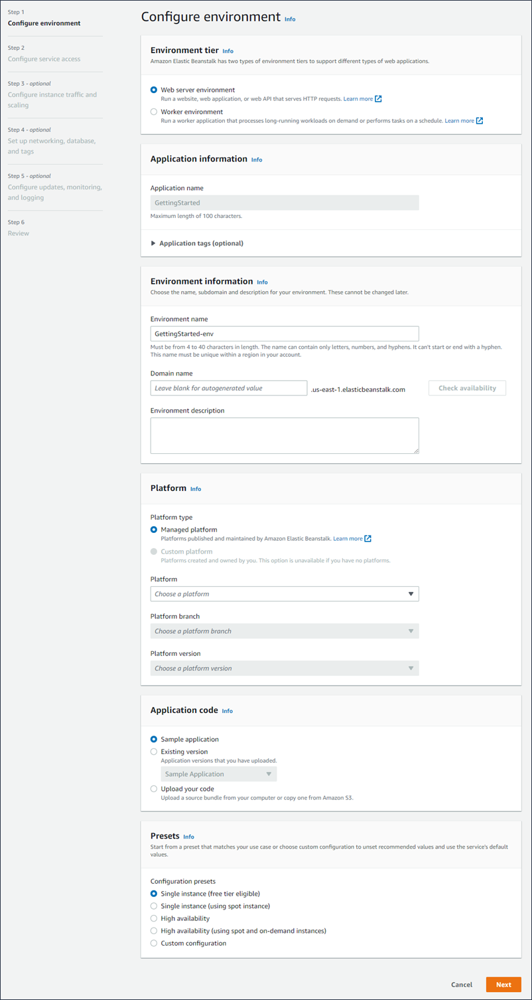

###### Environment tier

For **environment tier**, choose the **Web server environment** or **Worker environment**
[environment tier](concepts.md#concepts-tier "concepts.md#concepts-tier"). You can't change an environment's tier after creation.

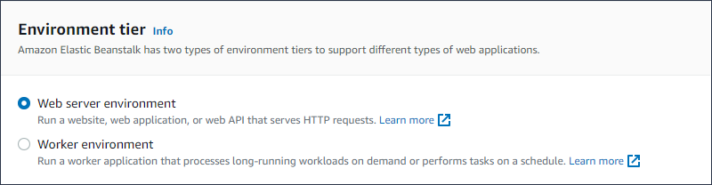

###### Note

The [.NET on Windows Server platform](create_deploy_NET.md "create_deploy_NET.md") doesn't support the worker environment tier.

###### Application information

If you launched the wizard by selecting **Create new environment** from the **Application overview** page, then
the **Application name** is prefilled. Otherwise, enter an application name. Optionally, add [application tags](applications-tagging.md "applications-tagging.md").

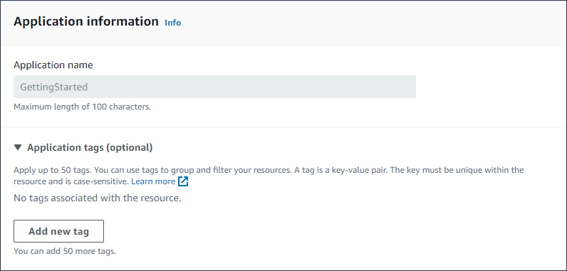

###### Environment information

Set the environment's name and domain, and create a description for your environment. Be aware that these environment settings cannot change after
the environment is created.

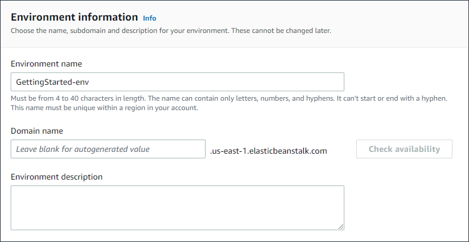

- **Name** – Enter a name for the environment. The form provides a generated name.
- **Domain** – (web server environments) Enter a unique domain name for your environment. The default name is the
  environment's name. You can enter a different domain name. Elastic Beanstalk uses this name to create a unique CNAME for the environment. To check whether the
  domain name you want is available, choose **Check Availability**.
- **Description** – Enter a description for this environment.

### Select a platform for the new environment

You can create a new environment from two types of platforms:

- Managed platform
- Custom platform

**Managed platform**

In most cases you use an Elastic Beanstalk managed platform for your new environment. When the new environment wizard starts, it selects the **Managed
platform** option by default.

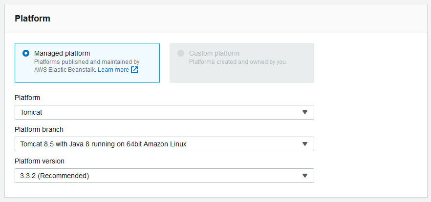

Select a platform, a platform branch within that platform, and a specific platform version in the branch. When you select a platform branch, the
recommended version within the branch is selected by default. In addition, you can select any platform version you've used before.

###### Note

For a production environment, we recommend that you choose a platform version in a supported platform branch. For details about platform branch
states, see the _Platform Branch_ definition in the [Elastic Beanstalk platforms glossary](platforms-glossary.md "platforms-glossary.md").

**Custom platform**

If an off-the-shelf platform doesn't meet your needs, you can create a new environment from a custom platform. To specify a custom platform, choose
the **Custom platform** option, and then select one of the available custom platforms. If there are no custom platforms available, this
option is dimmed.

### Provide application code

Now that you have selected the platform to use, the next step is to provide your application code.

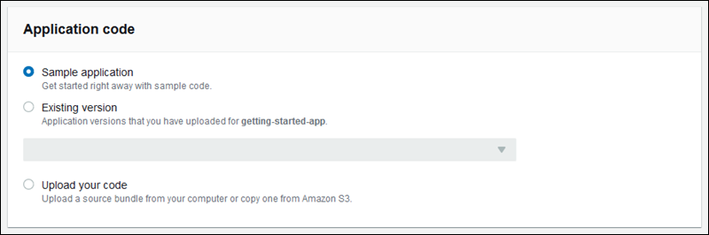

You have several options:

- You can use the sample application that Elastic Beanstalk provides for each platform.
- You can use code that you already deployed to Elastic Beanstalk. Choose **Existing version** and your application in the
  **Application code** section.
- You can upload new code. Choose **Upload your code**, and then choose **Upload**. You can upload new
  application code from a local file, or you can specify the URL for the Amazon S3 bucket that contains your application code.

###### Note

Depending on the platform version you selected, you can upload your application in a ZIP [source
bundle](applications-sourcebundle.md "applications-sourcebundle.md"), a [WAR file](java-tomcat-platform.md "java-tomcat-platform.md"), or a [plaintext Docker configuration](docker.md "docker.md"). The
file size limit is 500 MB.

When you choose to upload new code, you can also provide tags to associate with your new code. For more information about tagging an application
version, see [Tagging application versions](applications-versions-tagging.md "applications-versions-tagging.md").

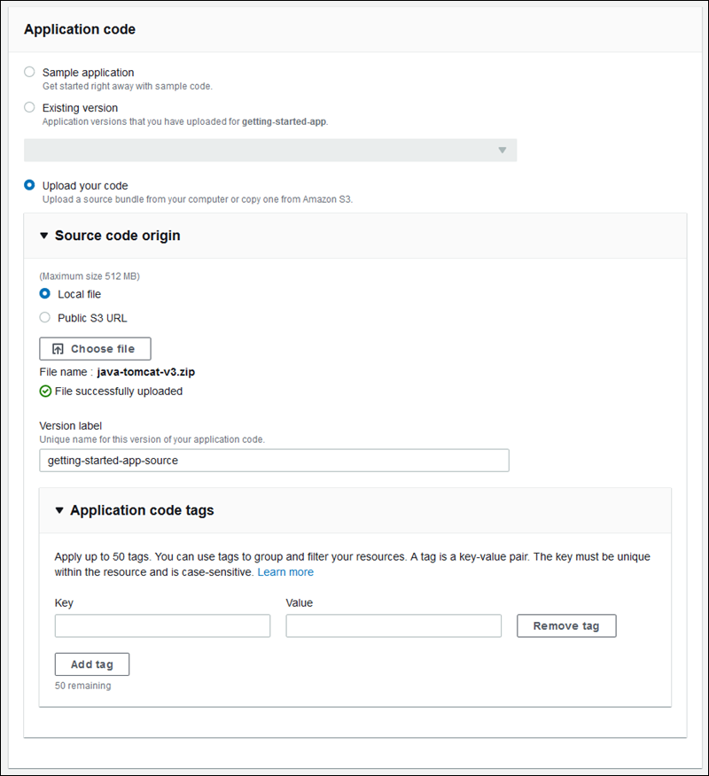

For quick environment creation using default configuration options, you can now choose **Create environment**. Choose
**Configure more options** to make additional configuration changes, as described in the following sections.

## Wizard configuration page

When you choose **Configure more options**, the wizard shows the **Configure** page. On this page you can select a
configuration preset, change the platform version you want your environment to use, or make specific configuration choices for the new environment.

### Choose a preset configuration

On the **Presets** section of the page, Elastic Beanstalk provides several configuration presets for different use cases. Each preset includes
recommended values for several [configuration options](command-options.md "command-options.md").

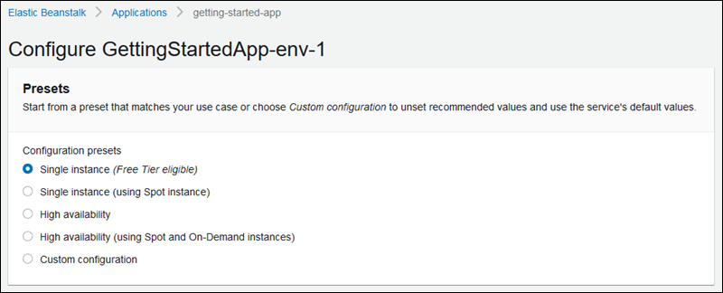

The **High availability** presets include a load balancer, and are recommended for production environments. Choose them if you want
an environment that can run multiple instances for high availability and scale in response to load. The **Single instance** presets are
primarily recommended for development. Two of the presets enable Spot Instance requests. For details about Elastic Beanstalk capacity configuration, see [Auto Scaling group](using-features.managing.md "using-features.managing.md").

The last preset, **Custom configuration**, removes all recommended values except role settings and uses the API defaults. Choose
this option if you are deploying a source bundle with [configuration files](ebextensions.md "ebextensions.md") that set configuration options.
**Custom configuration** is also selected automatically if you modify either the **Low cost** or **High
availability** configuration presets.

### Customize your configuration

In addition to (or instead of) choosing a configuration preset, you can fine-tune [configuration options](command-options.md "command-options.md") in
your environment. The **Configure** wizard wizard shows several configuration categories. Each configuration category displays a
summary of values for a group of configuration settings. Choose **Edit** to edit this group of settings.

###### Configuration Categories

- [Software settings](#environments-create-wizard-software "#environments-create-wizard-software")
- [Instances](#environments-create-wizard-instances "#environments-create-wizard-instances")
- [Capacity](#environments-create-wizard-capacity "#environments-create-wizard-capacity")
- [Load balancer](#environments-create-wizard-loadbalancer "#environments-create-wizard-loadbalancer")
- [Rolling updates and deployments](#environments-create-wizard-deployment-settings "#environments-create-wizard-deployment-settings")
- [Security](#environments-create-wizard-security "#environments-create-wizard-security")
- [Monitoring](#environments-create-wizard-monitoring "#environments-create-wizard-monitoring")
- [Managed updates](#environments-create-wizard-managed "#environments-create-wizard-managed")
- [Notifications](#environments-create-wizard-notifications "#environments-create-wizard-notifications")
- [Network](#environments-create-wizard-network "#environments-create-wizard-network")
- [Database](#environments-create-wizard-database "#environments-create-wizard-database")
- [Tags](#environments-create-wizard-tags "#environments-create-wizard-tags")
- [Worker environment](#environments-create-wizard-worker "#environments-create-wizard-worker")

#### Software settings

Use the **Modify software** configuration page to configure the software on the Amazon Elastic Compute Cloud (Amazon EC2) instances that run your
application. You can configure environment properties, AWS X-Ray debugging, instance log storing and streaming, and platform-specific settings. For
details, see [Environment variables and other software settings](environments-cfg-softwaresettings.md "environments-cfg-softwaresettings.md").

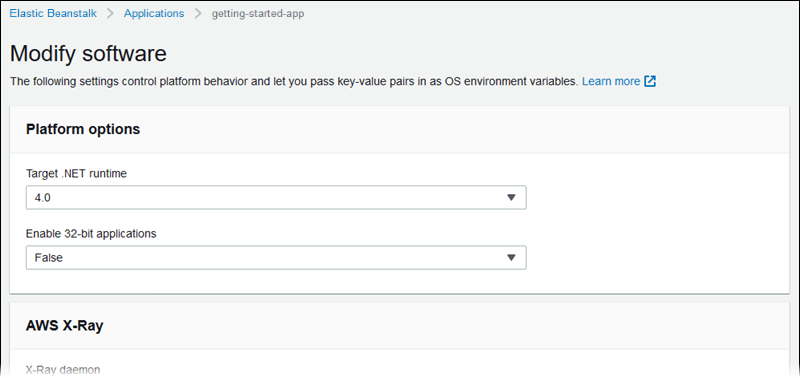

#### Instances

Use the **Modify instances** configuration page to configure the Amazon EC2 instances that run your application. For details, see
[The Amazon EC2 instances for your Elastic Beanstalk environment](using-features.managing.md "using-features.managing.md").

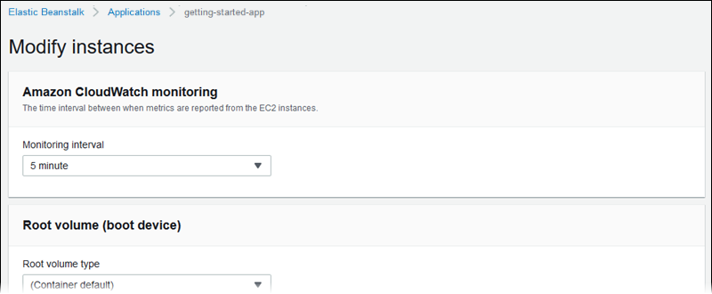

#### Capacity

Use the **Modify capacity** configuration page to configure the compute capacity of your environment and **Auto Scaling
group** settings to optimize the number and type of instances you're using. You can also change your environment capacity based on triggers
or on a schedule.

A load-balanced environment can run multiple instances for high availability and prevent downtime during configuration updates and deployments. In
a load-balanced environment, the domain name maps to the load balancer. In a single-instance environment, it maps to an elastic IP address on the
instance.

###### Warning

A single-instance environment isn't production ready. If the instance becomes unstable during deployment, or Elastic Beanstalk terminates and restarts the
instance during a configuration update, your application can be unavailable for a period of time. Use single-instance environments for development,
testing, or staging. Use load-balanced environments for production.

For more information about environment capacity settings, see [Auto Scaling your Elastic Beanstalk environment instances](using-features.managing.md "using-features.managing.md") and [The Amazon EC2 instances for your Elastic Beanstalk environment](using-features.managing.md "using-features.managing.md").

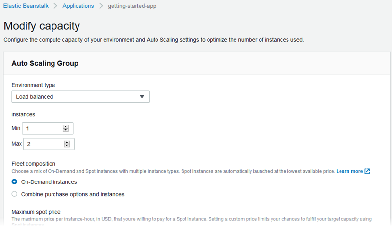

#### Load balancer

Use the **Modify load balancer** configuration page to select a load balancer type and to configure settings for it. In a
load-balanced environment, your environment's load balancer is the entry point for all traffic headed for your application. Elastic Beanstalk supports several
types of load balancer. By default, the Elastic Beanstalk console creates an Application Load Balancer and configures it to serve HTTP traffic on port 80.

###### Note

You can only select your environment's load balancer type during environment creation.

For more information about load balancer types and settings, see [Load balancer for your Elastic Beanstalk environment](using-features.managing.md "using-features.managing.md") and [Configuring HTTPS for your Elastic Beanstalk environment](configuring-https.md "configuring-https.md").

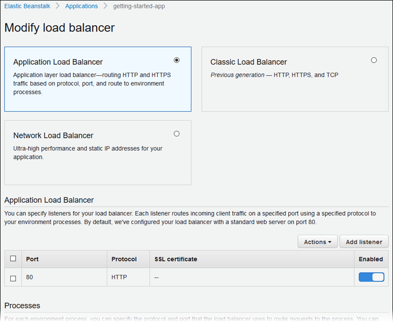

###### Note

The Classic Load Balancer (CLB) option is disabled on the **Create Environment** console wizard. If you have an existing environment configured with a
Classic Load Balancer you can create a new one by [cloning the existing environment](using-features.managing.md "using-features.managing.md") using either the Elastic Beanstalk console or
the [EB CLI](using-features.managing.md#using-features.managing.clone.CLI "using-features.managing.md#using-features.managing.clone.CLI"). You also have the option to use the EB
CLI or the [AWS CLI](environments-create-awscli.md "environments-create-awscli.md") to create a new environment configured with a Classic Load Balancer. These command line tools
will create a new environment with a CLB even if one doesn’t already exist in your account.

#### Rolling updates and deployments

Use the **Modify rolling updates and deployments** configuration page to configure how Elastic Beanstalk processes application deployments
and configuration updates for your environment.

Application deployments happen when you upload an updated application source bundle and deploy it to your environment. For more information about
configuring deployments, see [Deployment policies and settings](using-features.md "using-features.md").

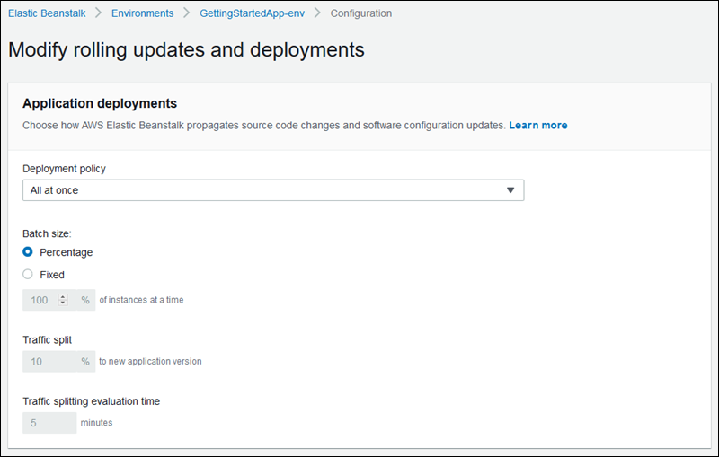

Configuration changes that modify the [launch configuration](command-options-general.md#command-options-general-autoscalinglaunchconfiguration "command-options-general.md#command-options-general-autoscalinglaunchconfiguration") or [VPC settings](command-options-general.md#command-options-general-ec2vpc "command-options-general.md#command-options-general-ec2vpc") require terminating all instances in your environment and replacing them. For more
information about setting the update type and other options, see [Configuration changes](environments-updating.md "environments-updating.md").

#### Security

Use the **Configure service access** page to configure service and instance security settings.

For a description of Elastic Beanstalk security concepts, see [Elastic Beanstalk Service roles, instance profiles, and user
policies](concepts-roles.md "concepts-roles.md").

The first time you create an environment in the Elastic Beanstalk console, you must create an EC2 instance profile with a default set of permissions. If the
**EC2 instance profile** dropdown list doesn't show any values to choose from, expand the procedure that follows. It provides steps
to create a Role that you can subsequently select for the **EC2 instance profile**.

###### To create or select an EC2 instance profile

1. If you have previously created an **EC2 instance profile** and would
   like to choose an existing one, select the value from the **EC2 instance
   profile** drop-down and skip the remainder of these steps to create an EC2
   instance profile.
2. If you don't see any values listed for **EC2 instance profile**, or you'd like
   to create a new one, continue with the next steps.
3. Choose **Create role**.
4. For **Trusted entity type**, choose **AWS
   service**.
5. For **Use case**, choose **Elastic Beanstalk –
   Compute**.
6. Choose **Next**.
7. Verify that **Permissions policies** include the following, then choose
   **Next**:
   - `AWSElasticBeanstalkWebTier`
   - `AWSElasticBeanstalkWorkerTier`
   - `AWSElasticBeanstalkMulticontainerDocker`

8. Choose **Create role**.
9. Return to the **Configure service access** tab, refresh the list, then
   select the newly created EC2 instance profile.

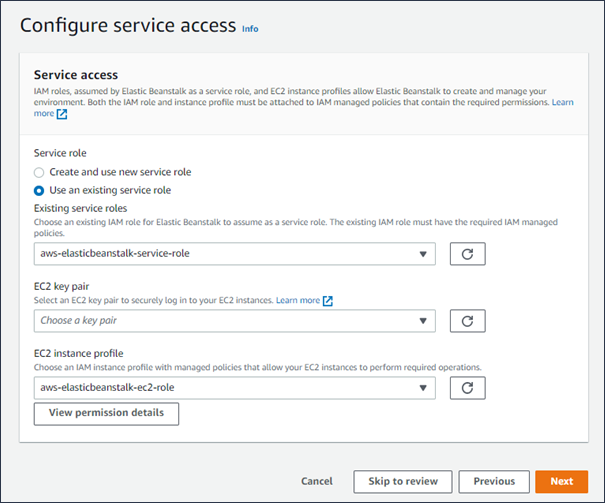

#### Monitoring

Use the **Modify monitoring** configuration page to configure health reporting, monitoring rules, and health event streaming. For
details, see [Enabling Elastic Beanstalk enhanced health reporting](health-enhanced-enable.md "health-enhanced-enable.md"), [Configuring enhanced health rules for an environment](health-enhanced-rules.md "health-enhanced-rules.md"), and [Streaming Elastic Beanstalk environment health information to Amazon CloudWatch Logs](AWSHowTo.cloudwatchlogs.md "AWSHowTo.cloudwatchlogs.md").

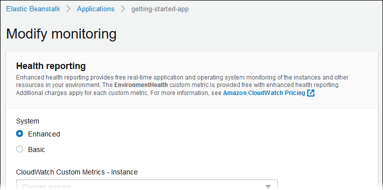

#### Managed updates

Use the **Modify managed updates** configuration page to configure managed platform updates. You can decide if you want them
enabled, set the schedule, and configure other properties. For details, see [Managed platform updates](environment-platform-update-managed.md "environment-platform-update-managed.md").

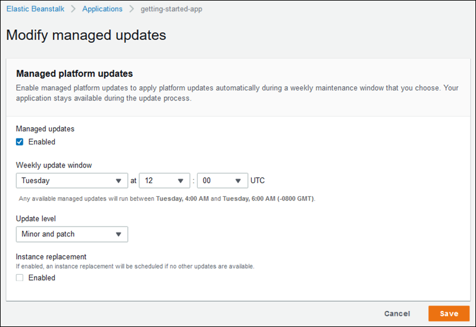

#### Notifications

Use the **Modify notifications** configuration page to specify an email address to receive [email notifications](using-features.managing.md "using-features.managing.md") for important events from your environment.

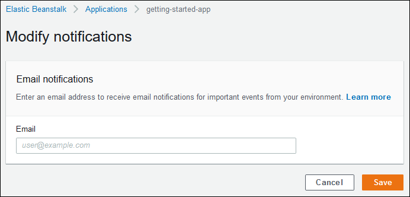

#### Network

If you have created a [custom VPC](using-features.managing.md "using-features.managing.md"), the **Modify network** configuration page to
configure your environment to use it. If you don't choose a VPC, Elastic Beanstalk uses the default VPC and subnets.

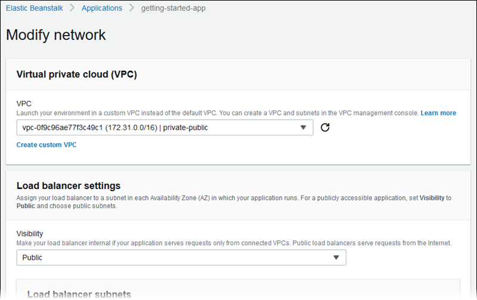

#### Database

Use the **Modify database** configuration page to add an Amazon Relational Database Service (Amazon RDS) database to your environment for development and
testing. Elastic Beanstalk provides connection information to your instances by setting environment properties for the database hostname, user name, password,
table name, and port.

For details, see [Adding a database to your Elastic Beanstalk environment](using-features.managing.md "using-features.managing.md").

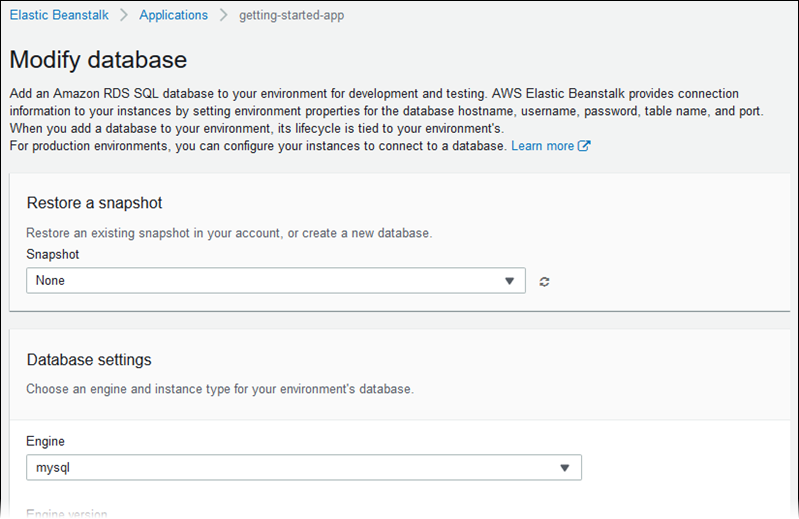

#### Tags

Use the **Modify tags** configuration page to add [tags](../../../AWSEC2/latest/UserGuide/Using_Tags.md "../../../AWSEC2/latest/UserGuide/Using_Tags.md") to the resources in
your environment. For more information about environment tagging, see [Tagging resources in your Elastic Beanstalk environments](using-features.md "using-features.md").

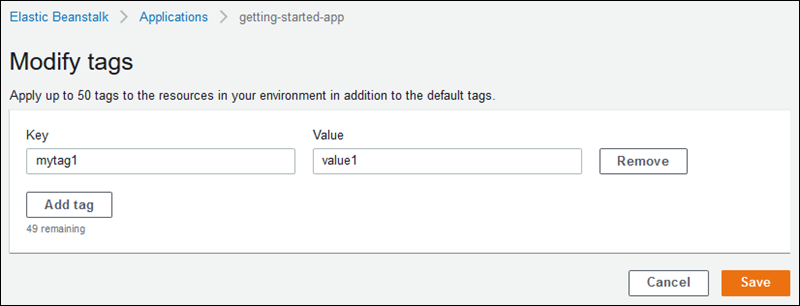

#### Worker environment

If you're creating a _worker tier environment_, use the **Modify worker** configuration
page to configure the worker environment. The worker daemon on the instances in your environment pulls items from an Amazon Simple Queue Service (Amazon SQS) queue and
relays them as post messages to your worker application. You can choose the Amazon SQS queue that the worker daemon reads from (auto-generated or
existing). You can also configure the messages that the worker daemon sends to your application.

For more information, see [Elastic Beanstalk worker environments](using-features-managing-env-tiers.md "using-features-managing-env-tiers.md").

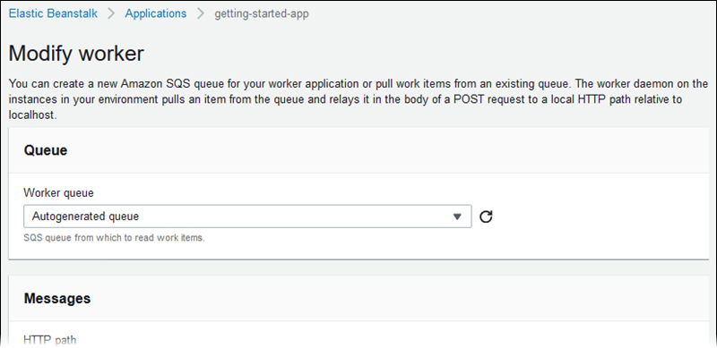
