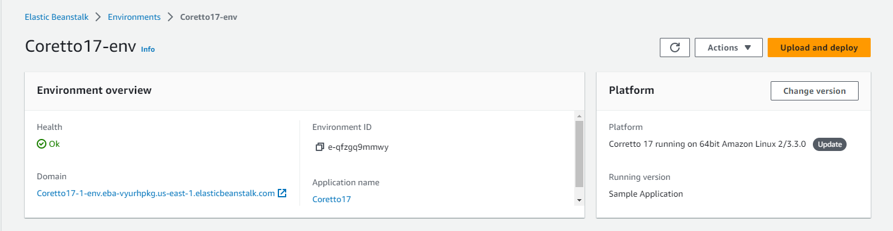

# Environment overview pane

This topic describes the information that the **Environment overview** pane provides. It shows top-level information about your
environment and is located on the top half of the environment management console.

The following image displays the **Environment overview** pane.

## Health

The overall health of the environment. If the health of your environment degrades, the **View causes** link displays next to the
environment health. Select this link to view the **Health** tab with more details.

## Domain

The environment's **Domain**, or URL, is located in the upper portion of the **Environment overview** page, below
the environment's **Health**. This is the URL of the web application that the environment is running. You can launch the application be
selecting the URL.

## Environment id

The environment ID. This is an internal ID that's generated when the environment is created.

## Application name

The name of the application that is deployed and running on your environment.

## Running version

The name of the application version that is deployed and running on your environment. Choose **Upload and deploy** to upload a
[source bundle](applications-sourcebundle.md "applications-sourcebundle.md") and deploy it to your environment. This option creates a new application
version.

## Platform

The name of the platform version running on your environment. Typically, this comprises the architecture, operating system (OS), language, and
application server (collectively known as the _platform branch_), with a specific platform version number.

If your platform version is not the most recently available, then a status label displays next to it in the **Platform** section.
The **Update** label indicates that although the platform version is supported a newer version is available. The platform version may
also be labeled as **Deprecated** or **Retired**. Select **Change version** to update your platform
branch to a newer version. For more information about the _states_ of a platform version, see the _Platform
Branch_ section in the [Elastic Beanstalk platforms glossary](platforms-glossary.md "platforms-glossary.md"). The previous image on this page illustrates
the **Update** status label for the given platform.
