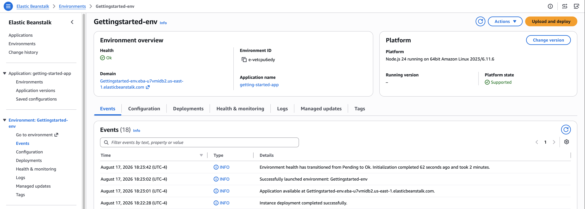

# Environment detail

This topic describes the additional information that the environment management console provides from the left navigation pane and the tabbed
pages.

The following image illustrates the environment management console.

The bottom half of the environment management console lists tabs that provide more detailed and varied information about the environment. You can
either select the tab page or the page label from the left navigation pane.

From the left navigation pane of the console under the environment name, there are two choices that are not in the tabbed pages. These are
**Go to environment** and **Configuration**.

###### Note

Select **Go to environment** to launch your application.

## Configuration

Use the **Configuration** page on the left navigation pane to view and update current configuration settings for your environment
and its resources. This includes networking configuration, database configuration, load balancing, notifications, health monitoring settings, managed
platform update configuration, deployment configuration, instance log streaming, CloudWatch integration, AWS X-Ray, proxy server settings, environment
properties, and platform specific options. Use the settings on this page to customize the behavior of your environment during deployments, enable
additional features, and modify the instance type and other settings that you chose during environment creation.

For more information, see [Configuring Elastic Beanstalk environments](customize-containers.md "customize-containers.md").

## Events

The **Events** page shows the event stream for your environment. Elastic Beanstalk outputs event messages whenever you interact with the
environment, and when any of your environment's resources are created or modified as a result.

For more information, see [Viewing an Elastic Beanstalk environment's event stream](using-features.md "using-features.md").

## Health

If enhanced health monitoring is enabled, this page lists the EC2 instances in your environment and the live health information for each
instance.

The **Overall health** page shows health data as an average for all of your environment’s instances combined.

The **Enhanced instance health** pane shows live health information for each individual EC2 instance in your environment. Enhanced
health monitoring enables Elastic Beanstalk to closely monitor the resources in your environment so that it can assess the health of your application more
accurately.

When enhanced health monitoring is enabled, this page shows information about the requests served by the instances in your environment and metrics
from the operating system, including latency, load, and CPU utilization.

For more information, see [Enhanced health reporting and monitoring in Elastic Beanstalk](health-enhanced.md "health-enhanced.md").

## Logs

The **Logs** page lets you retrieve logs from the EC2 instances in your environment. When you request logs, Elastic Beanstalk sends a command
to the instances, which then upload logs to your Elastic Beanstalk storage bucket in Amazon S3. When you request logs on this page, Elastic Beanstalk automatically deletes them from
Amazon S3 after 15 minutes.

You can also configure your environment's instances to upload logs to Amazon S3 for permanent storage after they have been rotated locally.

For more information, see [Viewing logs from Amazon EC2 instances in your Elastic Beanstalk environment](using-features.md "using-features.md").

## Monitoring

The **Monitoring** page shows an overview of health information for your environment. This includes the default set of metrics
provided by Elastic Load Balancing and Amazon EC2, and graphs that show how the environment's health has changed over time.

For more information, see [Monitoring environment health in the AWS management console](environment-health-console.md "environment-health-console.md").

## Alarms

The **Existing alarms** page shows information about any alarms that you have configured for your environment. You can use the
options on this page to create or delete alarms.

For more information, see [Manage alarms](using-features.md "using-features.md").

## Managed updates

The **Managed updates** page shows information about upcoming and completed managed platform updates and instance
replacement.

The managed update feature lets you configure your environment to update to the latest platform version automatically during a weekly maintenance
window that you choose. In between platform releases, you can choose to have your environment replace all of its Amazon EC2 instances during the maintenance
window. This can alleviate issues that occur when your application runs for extended periods of time.

For more information, see [Managed platform updates](environment-platform-update-managed.md "environment-platform-update-managed.md").

## Tags

The **Tags** page shows the tags that Elastic Beanstalk applied to the environment when you created it, and any tags that you added. You can
add, edit, and delete custom tags. You can't edit or delete the tags that Elastic Beanstalk applied.

Environment tags are applied to every resource that Elastic Beanstalk creates to support your application.

For more information, see [Tagging resources in your Elastic Beanstalk environments](using-features.md "using-features.md").
