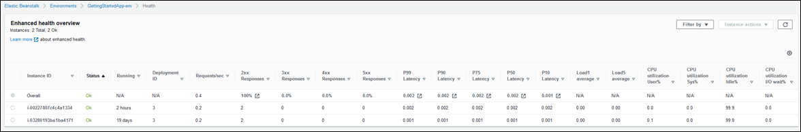
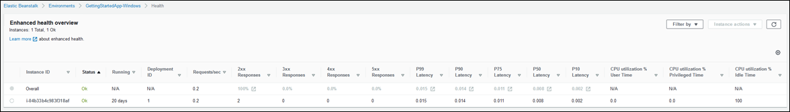
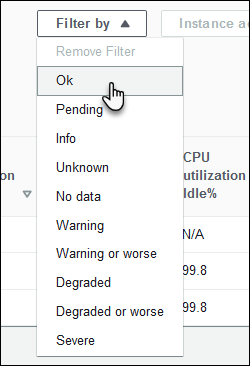
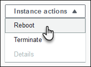
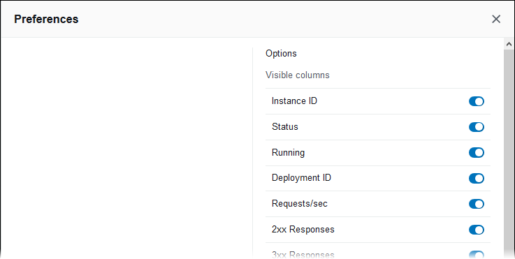
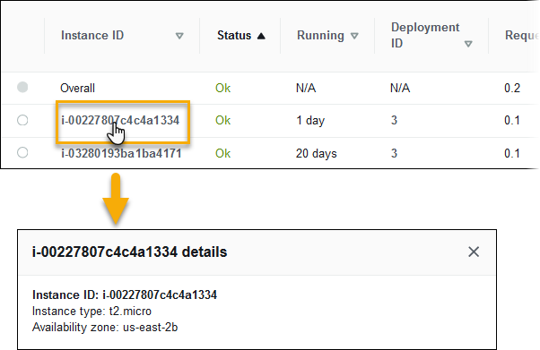
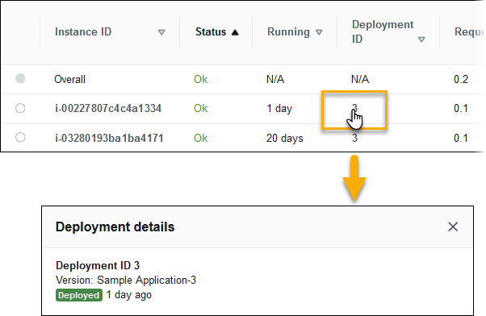
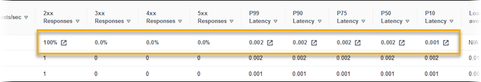

# Enhanced health monitoring with the environment management console

When you enable enhanced health reporting in AWS Elastic Beanstalk, you can monitor environment health in the [environment
management console](environments-console.md "environments-console.md").

###### Topics

- [Environment overview](#health-enhanced-console-overview "#health-enhanced-console-overview")
- [Environment health page](#health-enhanced-console-healthpage "#health-enhanced-console-healthpage")
- [Monitoring page](#health-enhanced-console-monitoringpage "#health-enhanced-console-monitoringpage")

## Environment overview

The [environment overview](environments-dashboard.md "environments-dashboard.md") displays the [health status](health-enhanced-status.md "health-enhanced-status.md") of the
environment and lists events that provide information about recent changes in health status.

###### To view the environment overview

1. Open the [Elastic Beanstalk console](https://console.aws.amazon.com/elasticbeanstalk "https://console.aws.amazon.com/elasticbeanstalk"),
   and in the **Regions** list, select your AWS Region.
2. In the navigation pane, choose **Environments**, and then choose the name of your environment from the list.

For detailed information about the current environment's health, open the **Health** page by choosing **Causes**.
Alternatively, in the navigation pane, choose **Health**.

## Environment health page

The **Health** page displays health status, metrics, and causes for the environment and for each Amazon EC2 instance in the
environment.

###### Note

Elastic Beanstalk displays the **Health** page only if you have [enabled enhanced health
monitoring](health-enhanced-enable.md "health-enhanced-enable.md") for the environment.

The following image shows the **Health** page for a Linux environment.

The following image shows the **Health** page for a Windows environment. Notice that CPU metrics are different from those on a Linux
environment.

At the top of the page you can see the total number of environment instances, as well as the number of instances per status. To display only instances
that have a particular status, choose**Filter By**, and then select a [status](health-enhanced-status.md "health-enhanced-status.md").

To reboot or terminate an unhealthy instance, choose **Instance Actions**, and then choose **Reboot** or
**Terminate**.

Elastic Beanstalk updates the **Health** page every 10 seconds. It reports information about environment and instance health.

For each Amazon EC2 instance in the environment, the page displays the instance's ID and [status](health-enhanced-status.md "health-enhanced-status.md"), the amount
of time since the instance was launched, the ID of the most recent deployment executed on the instance, the responses and latency of requests that the
instance served, and load and CPU utilization information. The **Overall** row displays average response and latency information for the
entire environment.

The page displays many details in a very wide table. To hide some of the columns, choose

(**Preferences**). Select or clear column names, and then choose **Confirm**.

Choose the **Instance ID** of any instance to view more information about the instance, including its Availability Zone and instance
type.

Choose the **Deployment ID** of any instance to view information about the last [deployment](using-features.md "using-features.md") to the instance.

Deployment information includes the following:

- **Deployment ID**—The unique identifier for the [deployment](using-features.md "using-features.md"). Deployment IDs starts at 1 and increase by one each time you deploy a new application version or change configuration settings
  that affect the software or operating system running on the instances in your environment.
- **Version**—The version label of the application source code used in the deployment.
- **Status**—The status of the deployment, which can be `In Progress`, `Deployed`, or
  `Failed`.
- **Time**— For in-progress deployments, the time that the deployment started. For completed deployments, the
  time that the deployment ended.

If you [enable X-Ray integration](environment-configuration-debugging.md "environment-configuration-debugging.md") on your environment and instrument your application with
the AWS X-Ray SDK, the **Health** page adds links to the AWS X-Ray console in the overview row.

Choose a link to view traces related to the highlighted statistic in the AWS X-Ray console.

## Monitoring page

The **Monitoring** page displays summary statistics and graphs for the custom Amazon CloudWatch metrics generated by the enhanced health
reporting system. See [Monitoring environment health in the AWS management console](environment-health-console.md "environment-health-console.md") for instructions on adding graphs and
statistics to this page.
