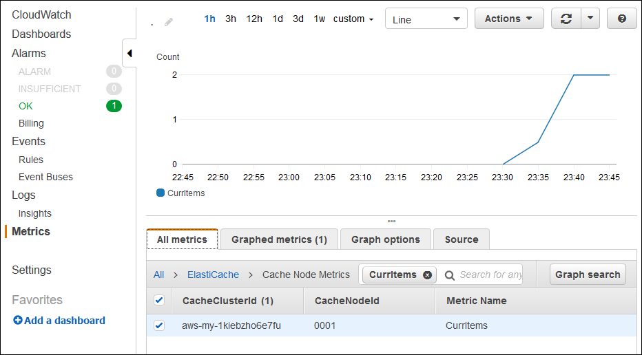

# Deploying a Node.js Express application with clustering to Elastic Beanstalk

This tutorial walks you through deploying a sample application to Elastic Beanstalk using the Elastic Beanstalk Command Line Interface (EB CLI), and then updating the
application to use the [Express](http://expressjs.com/ "http://expressjs.com/") framework, [Amazon ElastiCache](https://aws.amazon.com/elasticache/ "https://aws.amazon.com/elasticache/"),
and clustering. Clustering enhances your web application's high availability, performance, and security. To learn more about Amazon ElastiCache, go to
[What Is Amazon ElastiCache (Memcached)?](../../../AmazonElastiCache/latest/mem-ug/Introduction.md "../../../AmazonElastiCache/latest/mem-ug/Introduction.md") in the _Amazon ElastiCache (Memcached) User Guide_.

###### Note

This example creates AWS resources, which you might be charged for. For more information about AWS pricing, see
[https://aws.amazon.com/pricing/](https://aws.amazon.com/pricing/ "https://aws.amazon.com/pricing/"). Some services are part of the AWS Free Usage Tier. If you are a new
customer, you can test drive
these services for free. See [https://aws.amazon.com/free/](https://aws.amazon.com/free/ "https://aws.amazon.com/free/") for more information.

## Prerequisites

This tutorial requires the following prerequisites:

- The Node.js runtimes
- The default Node.js package manager software, npm
- The Express command line generator
- The Elastic Beanstalk Command Line Interface (EB CLI)

For details about installing the first three listed components and setting up your local development environment, see [Setting up your Node.js development environment for Elastic Beanstalk](nodejs-devenv.md "nodejs-devenv.md"). For this tutorial, you don't need to install the AWS SDK for Node.js, which is also mentioned in the referenced
topic.

For details about installing and configuring the EB CLI, see [Install EB CLI with setup script (recommended)](eb-cli3.md#eb-cli3-install "eb-cli3.md#eb-cli3-install") and [Configure the EB CLI](eb-cli3-configuration.md "eb-cli3-configuration.md").

## Create an Elastic Beanstalk environment

###### Your application directory

This tutorial uses a directory called `nodejs-example-express-elasticache` for the application source bundle. Create the `nodejs-example-express-elasticache`
directory for this tutorial.

```
~$ `mkdir nodejs-example-express-elasticache`
```

###### Note

Each tutorial in this chapter uses it's own directory for the application source bundle. The directory name matches the name of the sample application
used by the tutorial.

Change your current working directory to `nodejs-example-express-elasticache`.

```
~$ `cd nodejs-example-express-elasticache`
```

Now, let's set up an Elastic Beanstalk environment running the Node.js platform and the sample application. We'll use the Elastic Beanstalk command line interface (EB CLI).

###### To configure an EB CLI repository for your application and create an Elastic Beanstalk environment running the Node.js platform

1. Create a repository with the **[eb init](eb3-init.md "eb3-init.md")** command.

```
~/nodejs-example-express-elasticache$ `eb init --platform `node.js` --region `<region>``
```

This command creates a configuration file in a folder named `.elasticbeanstalk` that specifies settings for creating environments
for your application, and creates an Elastic Beanstalk application named after the current folder. 2. Create an environment running a sample application with the **[eb create](eb3-create.md "eb3-create.md")**
command.

```
~/nodejs-example-express-elasticache$ `eb create --sample `nodejs-example-express-elasticache``
```

This command creates a load-balanced environment with the default settings for the Node.js platform and the following resources:

    * **EC2 instance** – An Amazon Elastic Compute Cloud (Amazon EC2) virtual
     machine configured to run web apps on the platform that you choose.


    Each platform runs a specific set of software, configuration files, and scripts to support a specific language version, framework, web container, or
     combination of these. Most platforms use either Apache or NGINX as a reverse proxy that sits in front of your web app, forwards requests to it, serves
     static assets, and generates access and error logs.
    * **Instance security group** – An Amazon EC2 security group configured to allow inbound traffic on port 80. This
     resource lets HTTP traffic from the load balancer reach the EC2 instance running your web app. By default, traffic isn't allowed on other ports.
    * **Load balancer** – An ELB load balancer configured to distribute requests to the instances running your
     application. A load balancer also eliminates the need to expose your instances directly to the internet.
    * **Load balancer security group** – An Amazon EC2 security group configured to allow inbound traffic on port 80. This
     resource lets HTTP traffic from the internet reach the load balancer. By default, traffic isn't allowed on other ports.
    * **Amazon EC2 Auto Scaling group** – An Amazon EC2 Auto Scaling group configured to replace
     an instance if it is terminated or becomes unavailable.
    * **Amazon S3 bucket** – A storage location for your source
     code, logs, and other artifacts that are created when you use Elastic Beanstalk.
    * **Amazon CloudWatch alarms** – Two CloudWatch alarms that monitor the load on the instances in your environment and that are
     triggered if the load is too high or too low. When an alarm is triggered, your Amazon EC2 Auto Scaling group scales up or down in response.
    * **CloudFormation stack** – Elastic Beanstalk uses CloudFormation to launch the
     resources in your environment and propagate configuration changes. The resources are defined
     in a template that you can view in the [CloudFormation
     console](https://console.aws.amazon.com/cloudformation "https://console.aws.amazon.com/cloudformation").
    * **Domain name** – A domain name that routes to your
     web app in the form
     *`subdomain`.`region`.elasticbeanstalk.com*.


    ###### Domain security

    To augment the security of your Elastic Beanstalk applications, the *elasticbeanstalk.com* domain is registered in the
     [Public Suffix List (PSL)](https://publicsuffix.org/ "https://publicsuffix.org/").

    If you ever need to set sensitive cookies in the default domain name for your Elastic Beanstalk applications, we recommend that you use cookies with a
     `__Host-` prefix for increased security. This practice defends your domain against cross-site request forgery attempts (CSRF). For more
     information see the [Set-Cookie](https://developer.mozilla.org/en-US/docs/Web/HTTP/Headers/Set-Cookie#cookie_prefixes "https://developer.mozilla.org/en-US/docs/Web/HTTP/Headers/Set-Cookie#cookie_prefixes") page in the Mozilla
     Developer Network.

3. When environment creation completes, use the [eb open](eb3-open.md "eb3-open.md") command to open the environment's URL in the
   default browser.

```
~/nodejs-example-express-elasticache$ `eb open`
```

You have now created a Node.js Elastic Beanstalk environment with a sample application. You can update it with your own application. Next, we update the sample
application to use the Express framework.

## Update the application to use Express

Update the sample application in the Elastic Beanstalk environment to use the Express framework.

You can download the final source code from [nodejs-example-express-elasticache.zip](samples/nodejs-example-express-elasticache.md "samples/nodejs-example-express-elasticache.md").

###### To update your application to use Express

After you've created an environment with a sample application, you can update it with your own application. In this procedure, we first run the
**express** and **npm install** commands to set up the Express framework in your application directory.

1. Run the `express` command. This generates `package.json`, `app.js`, and a few directories.

```
~/nodejs-example-express-elasticache$ `express`
```

When prompted, type `y` if you want to continue.

###### Note

If the **express** command doesn't work, you may not have installed the Express command line generator as described in the earlier
_Prerequisites_ section. Or the directory path setting for your local machine may need to be set up to run the
**express** command. See the _Prerequisites_ section for detailed steps about setting up your development environment,
so you can proceed with this tutorial. 2. Set up local dependencies.

```
~/nodejs-example-express-elasticache$ `npm install`
```

3. (Optional) Verify the web app server starts up.

```
~/nodejs-example-express-elasticache$ `npm start`
```

You should see output similar to the following:

```
> nodejs@0.0.0 start /home/local/user/node-express
> node ./bin/www
```

The server runs on port 3000 by default. To test it, run `curl http://localhost:3000` in another terminal, or open a browser on the local
computer and enter URL address `http://localhost:3000`.

Press **Ctrl+C** to stop the server. 4. Rename `nodejs-example-express-elasticache/app.js` to `nodejs-example-express-elasticache/express-app.js`.

```
~/nodejs-example-express-elasticache$ `mv `app.js express-app.js``
```

5. Update the line `var app = express();` in `nodejs-example-express-elasticache/express-app.js` to the following:

```
var app = module.exports = express();
```

6. On your local computer, create a file named `nodejs-example-express-elasticache/app.js` with the following code.

```
/**
 * Module dependencies.
 */

 const express = require('express'),
 session = require('express-session'),
 bodyParser = require('body-parser'),
 methodOverride = require('method-override'),
 cookieParser = require('cookie-parser'),
 fs = require('fs'),
 filename = '/var/nodelist',
 app = express();

let MemcachedStore = require('connect-memcached')(session);

function setup(cacheNodes) {
 app.use(bodyParser.raw());
 app.use(methodOverride());
 if (cacheNodes.length > 0) {
   app.use(cookieParser());

   console.log('Using memcached store nodes:');
   console.log(cacheNodes);

   app.use(session({
     secret: 'your secret here',
     resave: false,
     saveUninitialized: false,
     store: new MemcachedStore({ 'hosts': cacheNodes })
   }));
 } else {
   console.log('Not using memcached store.');
   app.use(session({
     resave: false,
     saveUninitialized: false, secret: 'your secret here'
   }));
 }

 app.get('/', function (req, resp) {
   if (req.session.views) {
     req.session.views++
     resp.setHeader('Content-Type', 'text/html')
     resp.send(`You are session: ${req.session.id}. Views: ${req.session.views}`)
   } else {
     req.session.views = 1
     resp.send(`You are session: ${req.session.id}. No views yet, refresh the page!`)
   }
 });

 if (!module.parent) {
   console.log('Running express without cluster. Listening on port %d', process.env.PORT || 5000)
   app.listen(process.env.PORT || 5000)
 }
}

console.log("Reading elastic cache configuration")
// Load elasticache configuration.
fs.readFile(filename, 'UTF8', function (err, data) {
 if (err) throw err;

 let cacheNodes = []
 if (data) {
   let lines = data.split('\n');
   for (let i = 0; i < lines.length; i++) {
     if (lines[i].length > 0) {
       cacheNodes.push(lines[i])
     }
   }
 }

 setup(cacheNodes)
});

module.exports = app;
```

7. Replace the contents of the `nodejs-example-express-elasticache/bin/www` file with the following:

```
#!/usr/bin/env node

/**
 * Module dependencies.
 */

const app = require('../app');
const cluster = require('cluster');
const debug = require('debug')('nodejs-example-express-elasticache:server');
const http = require('http');
const workers = {},
  count = require('os').cpus().length;

function spawn() {
  const worker = cluster.fork();
  workers[worker.pid] = worker;
  return worker;
}


/**
 * Get port from environment and store in Express.
 */

const port = normalizePort(process.env.PORT || '3000');
app.set('port', port);

if (cluster.isMaster) {
  for (let i = 0; i < count; i++) {
    spawn();
  }

  // If a worker dies, log it to the console and start another worker.
  cluster.on('exit', function (worker, code, signal) {
    console.log('Worker ' + worker.process.pid + ' died.');
    cluster.fork();
  });

  // Log when a worker starts listening
  cluster.on('listening', function (worker, address) {
    console.log('Worker started with PID ' + worker.process.pid + '.');
  });

} else {
  /**
   * Create HTTP server.
   */

  let server = http.createServer(app);

  /**
   * Event listener for HTTP server "error" event.
   */

  function onError(error) {
    if (error.syscall !== 'listen') {
      throw error;
    }

    const bind = typeof port === 'string'
      ? 'Pipe ' + port
      : 'Port ' + port;

    // handle specific listen errors with friendly messages
    switch (error.code) {
      case 'EACCES':
        console.error(bind + ' requires elevated privileges');
        process.exit(1);
        break;
      case 'EADDRINUSE':
        console.error(bind + ' is already in use');
        process.exit(1);
        break;
      default:
        throw error;
    }
  }

  /**
   * Event listener for HTTP server "listening" event.
   */

  function onListening() {
    const addr = server.address();
    const bind = typeof addr === 'string'
      ? 'pipe ' + addr
      : 'port ' + addr.port;
    debug('Listening on ' + bind);
  }

  /**
   * Listen on provided port, on all network interfaces.
   */

  server.listen(port);
  server.on('error', onError);
  server.on('listening', onListening);
}

/**
 * Normalize a port into a number, string, or false.
 */

function normalizePort(val) {
  const port = parseInt(val, 10);

  if (isNaN(port)) {
    // named pipe
    return val;
  }

  if (port >= 0) {
    // port number
    return port;
  }

  return false;
}
```

8. Deploy the changes to your Elastic Beanstalk environment with the [eb deploy](eb3-deploy.md "eb3-deploy.md") command.

```
~/nodejs-example-express-elasticache$ `eb deploy`
```

9. Your environment will be updated after a few minutes. Once the environment is green and ready, refresh the URL to verify it worked. You should see
   a web page that says "Welcome to Express".

You can access the logs for your EC2 instances running your application. For instructions on accessing your logs, see [Viewing logs from Amazon EC2 instances in your Elastic Beanstalk environment](using-features.md "using-features.md").

Next, let's update the Express application to use Amazon ElastiCache.

###### To update your Express application to use Amazon ElastiCache

1. On your local computer, create an `.ebextensions` directory in the top-level directory of your source bundle. In this example,
   we use `nodejs-example-express-elasticache/.ebextensions`.
2. Create a configuration file `nodejs-example-express-elasticache/.ebextensions/elasticache-iam-with-script.config` with the following snippet. For
   more information about the configuration file, see [Node.js configuration namespace](create_deploy_nodejs.md#nodejs-namespaces "create_deploy_nodejs.md#nodejs-namespaces"). This creates an IAM user
   with the permissions required to discover the elasticache nodes and writes to a file anytime the cache changes. You can also copy the file from [nodejs-example-express-elasticache.zip](samples/nodejs-example-express-elasticache.md "samples/nodejs-example-express-elasticache.md"). For more information on the ElastiCache
   properties, see [Example: ElastiCache](customize-environment-resources-elasticache.md "customize-environment-resources-elasticache.md").

###### Note

YAML relies on consistent indentation. Match the indentation level when replacing content in an example
configuration file and ensure that your text editor uses spaces, not tab characters, to indent.

```
Resources:
  MyCacheSecurityGroup:
    Type: 'AWS::EC2::SecurityGroup'
    Properties:
      GroupDescription: "Lock cache down to webserver access only"
      SecurityGroupIngress:
        - IpProtocol: tcp
          FromPort:
            Fn::GetOptionSetting:
              OptionName: CachePort
              DefaultValue: 11211
          ToPort:
            Fn::GetOptionSetting:
              OptionName: CachePort
              DefaultValue: 11211
          SourceSecurityGroupName:
            Ref: AWSEBSecurityGroup
  MyElastiCache:
    Type: 'AWS::ElastiCache::CacheCluster'
    Properties:
      CacheNodeType:
        Fn::GetOptionSetting:
          OptionName: CacheNodeType
          DefaultValue: cache.t2.micro
      NumCacheNodes:
        Fn::GetOptionSetting:
          OptionName: NumCacheNodes
          DefaultValue: 1
      Engine:
        Fn::GetOptionSetting:
          OptionName: Engine
          DefaultValue: redis
      VpcSecurityGroupIds:
        -
          Fn::GetAtt:
            - MyCacheSecurityGroup
            - GroupId
  AWSEBAutoScalingGroup :
    Metadata :
      ElastiCacheConfig :
        CacheName :
          Ref : MyElastiCache
        CacheSize :
           Fn::GetOptionSetting:
             OptionName : NumCacheNodes
             DefaultValue: 1
  WebServerUser :
    Type : AWS::IAM::User
    Properties :
      Path : "/"
      Policies:
        -
          PolicyName: root
          PolicyDocument :
            Statement :
              -
                Effect : Allow
                Action :
                  - cloudformation:DescribeStackResource
                  - cloudformation:ListStackResources
                  - elasticache:DescribeCacheClusters
                Resource : "*"
  WebServerKeys :
    Type : AWS::IAM::AccessKey
    Properties :
      UserName :
        Ref: WebServerUser

Outputs:
  WebsiteURL:
    Description: sample output only here to show inline string function parsing
    Value: |
      http://`{ "Fn::GetAtt" : [ "AWSEBLoadBalancer", "DNSName" ] }`
  MyElastiCacheName:
    Description: Name of the elasticache
    Value:
      Ref : MyElastiCache
  NumCacheNodes:
    Description: Number of cache nodes in MyElastiCache
    Value:
      Fn::GetOptionSetting:
        OptionName : NumCacheNodes
        DefaultValue: 1

files:
  "/etc/cfn/cfn-credentials" :
    content : |
      AWSAccessKeyId=`{ "Ref" : "WebServerKeys" }`
      AWSSecretKey=`{ "Fn::GetAtt" : ["WebServerKeys", "SecretAccessKey"] }`
    mode : "000400"
    owner : root
    group : root

  "/etc/cfn/get-cache-nodes" :
    content : |
      # Define environment variables for command line tools
      export AWS_ELASTICACHE_HOME="/home/ec2-user/elasticache/$(ls /home/ec2-user/elasticache/)"
      export AWS_CLOUDFORMATION_HOME=/opt/aws/apitools/cfn
      export PATH=$AWS_CLOUDFORMATION_HOME/bin:$AWS_ELASTICACHE_HOME/bin:$PATH
      export AWS_CREDENTIAL_FILE=/etc/cfn/cfn-credentials
      export JAVA_HOME=/usr/lib/jvm/jre

      # Grab the Cache node names and configure the PHP page
      aws cloudformation list-stack-resources --stack `{ "Ref" : "AWS::StackName" }` --region `{ "Ref" : "AWS::Region" }` --output text | grep MyElastiCache | awk '{print $4}' | xargs -I {} aws elasticache describe-cache-clusters --cache-cluster-id {} --region `{ "Ref" : "AWS::Region" }` --show-cache-node-info --output text | grep '^ENDPOINT' | awk '{print $2 ":" $3}' > `{ "Fn::GetOptionSetting" : { "OptionName" : "NodeListPath", "DefaultValue" : "/var/www/html/nodelist" } }`
    mode : "000500"
    owner : root
    group : root

  "/etc/cfn/hooks.d/cfn-cache-change.conf" :
    "content": |
      [cfn-cache-size-change]
      triggers=post.update
      path=Resources.AWSEBAutoScalingGroup.Metadata.ElastiCacheConfig
      action=/etc/cfn/get-cache-nodes
      runas=root

sources :
  "/home/ec2-user/elasticache" : "https://elasticache-downloads.s3.amazonaws.com/AmazonElastiCacheCli-latest.zip"

commands:
  make-elasticache-executable:
    command: chmod -R ugo+x /home/ec2-user/elasticache/*/bin/*

packages :
  "yum" :
    "aws-apitools-cfn"  : []

container_commands:
  initial_cache_nodes:
    command: /etc/cfn/get-cache-nodes
```

3. On your local computer, create a configuration file `nodejs-example-express-elasticache/.ebextensions/elasticache_settings.config` with the following
   snippet to configure ElastiCache.

```
option_settings:
  "aws:elasticbeanstalk:customoption":
     CacheNodeType: cache.t2.micro
     NumCacheNodes: 1
     Engine: memcached
     NodeListPath: /var/nodelist
```

4. On your local computer, replace `nodejs-example-express-elasticache/express-app.js` with the following snippet. This file reads the nodes list from
   disk (`/var/nodelist`) and configures express to use `memcached` as a session store if nodes are present. Your file
   should look like the following.

```
/**
 * Module dependencies.
 */

var express = require('express'),
    session = require('express-session'),
    bodyParser = require('body-parser'),
    methodOverride = require('method-override'),
    cookieParser = require('cookie-parser'),
    fs = require('fs'),
    filename = '/var/nodelist',
    app = module.exports = express();

var MemcachedStore = require('connect-memcached')(session);

function setup(cacheNodes) {
  app.use(bodyParser.raw());
  app.use(methodOverride());
  if (cacheNodes) {
      app.use(cookieParser());

      console.log('Using memcached store nodes:');
      console.log(cacheNodes);

      app.use(session({
          secret: 'your secret here',
          resave: false,
          saveUninitialized: false,
          store: new MemcachedStore({'hosts': cacheNodes})
      }));
  } else {
    console.log('Not using memcached store.');
    app.use(cookieParser('your secret here'));
    app.use(session());
  }

  app.get('/', function(req, resp){
  if (req.session.views) {
      req.session.views++
      resp.setHeader('Content-Type', 'text/html')
      resp.write('Views: ' + req.session.views)
      resp.end()
   } else {
      req.session.views = 1
      resp.end('Refresh the page!')
    }
  });

  if (!module.parent) {
      console.log('Running express without cluster.');
      app.listen(process.env.PORT || 5000);
  }
}

// Load elasticache configuration.
fs.readFile(filename, 'UTF8', function(err, data) {
    if (err) throw err;

    var cacheNodes = [];
    if (data) {
        var lines = data.split('\n');
        for (var i = 0 ; i < lines.length ; i++) {
            if (lines[i].length > 0) {
                cacheNodes.push(lines[i]);
            }
        }
    }
    setup(cacheNodes);
});
```

5. On your local computer, update `package.json` with the following contents:

```
  "dependencies": {
    "cookie-parser": "~1.4.4",
    "debug": "~2.6.9",
    "express": "~4.16.1",
    "http-errors": "~1.6.3",
    "jade": "~1.11.0",
    "morgan": "~1.9.1",
    "connect-memcached": "*",
    "express-session": "*",
    "body-parser": "*",
    "method-override": "*"
  }
```

6. Run **npm install**.

```
~/nodejs-example-express-elasticache$ `npm install`
```

7. Deploy the updated application.

```
~/nodejs-example-express-elasticache$ `eb deploy`
```

8. Your environment will be updated after a few minutes. After your environment is green and ready, verify that the code worked.
   1. Check the [Amazon CloudWatch console](https://console.aws.amazon.com/cloudwatch/home "https://console.aws.amazon.com/cloudwatch/home") to view your ElastiCache metrics. To view your
      ElastiCache metrics, select **Metrics** in the left pane, and then search for **CurrItems**. Select
      **ElastiCache > Cache Node Metrics**, and then select your cache node to view the number of items in the cache.

   

   ###### Note

   Make sure you are looking at the same region that you deployed your application to.

   If you copy and paste your application URL into another web browser and refresh the page, you should see your CurrItem count go up after 5
   minutes. 2. Take a snapshot of your logs. For more information about retrieving logs, see [Viewing logs from Amazon EC2 instances in your Elastic Beanstalk environment](using-features.md "using-features.md"). 3. Check the file `/var/log/nodejs/nodejs.log` in the log bundle. You should see something similar to the following:

   ```
   Using memcached store nodes:
   [ 'aws-my-1oys9co8zt1uo.1iwtrn.0001.use1.cache.amazonaws.com:11211' ]
   ```

## Clean up

If you no longer want to run your application, you can clean up by terminating your environment and deleting your application.

Use the `eb terminate` command to terminate your environment and the `eb delete` command to delete your application.

**To terminate your environment**

From the directory where you created your local repository, run `eb terminate`.

```
$ `eb terminate`
```

This process can take a few minutes. Elastic Beanstalk displays a message once the environment is successfully terminated.
