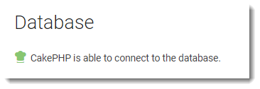

# Deploying a CakePHP application to Elastic Beanstalk

CakePHP is an open source, MVC framework for PHP. This tutorial walks you through the process of generating a CakePHP project, deploying it to an Elastic Beanstalk
environment, and configuring it to connect to an Amazon RDS database instance.

###### Sections

- [Prerequisites](#php-cakephp-tutorial-prereqs "#php-cakephp-tutorial-prereqs")
- [Launch an Elastic Beanstalk environment](#php-cakephp-tutorial-launch "#php-cakephp-tutorial-launch")
- [Install CakePHP and generate a website](#php-cakephp-tutorial-generate "#php-cakephp-tutorial-generate")
- [Deploy your application](#php-cakephp-tutorial-deploy "#php-cakephp-tutorial-deploy")
- [Add a database to your environment](#php-cakephp-tutorial-database "#php-cakephp-tutorial-database")
- [Cleanup](#php-cakephp-tutorial-cleanup "#php-cakephp-tutorial-cleanup")
- [Next steps](#php-cakephp-tutorial-nextsteps "#php-cakephp-tutorial-nextsteps")

## Prerequisites

This tutorial assumes you have knowledge of the basic Elastic Beanstalk operations and the Elastic Beanstalk console. If you haven't already, follow the instructions in [Learn how to get started with Elastic Beanstalk](GettingStarted.md "GettingStarted.md") to launch your first Elastic Beanstalk environment.

To follow the procedures in this guide, you will need a command line terminal or shell to run commands. Commands are shown in
listings preceded by a
prompt symbol ($) and the name of the current directory, when appropriate.

```
~/eb-project$ `this is a command`
this is output
```

On Linux and macOS, you can use your preferred shell and package manager. On Windows you can [install the Windows Subsystem for Linux](https://docs.microsoft.com/en-us/windows/wsl/install-win10 "https://docs.microsoft.com/en-us/windows/wsl/install-win10") to get a Windows-integrated version of
Ubuntu and Bash.

CakePHP 4 requires PHP 7.4 or later. It also requires the PHP extensions listed in the official [CakePHP installation](https://book.cakephp.org/4/en/installation.html "https://book.cakephp.org/4/en/installation.html") documentation. You must install both PHP and Composer.

## Launch an Elastic Beanstalk environment

Use the Elastic Beanstalk console to create an Elastic Beanstalk environment. Choose the **PHP** platform and accept the default settings and sample
code.

###### To launch an environment (console)

1. Open the Elastic Beanstalk console using this preconfigured link: [console.aws.amazon.com/elasticbeanstalk/home#/newApplication?applicationName=tutorials&environmentType=LoadBalanced](https://console.aws.amazon.com/elasticbeanstalk/home#/newApplication?applicationName=tutorials&environmentType=LoadBalanced "https://console.aws.amazon.com/elasticbeanstalk/home#/newApplication?applicationName=tutorials&environmentType=LoadBalanced")
2. For **Platform**, select the platform and platform branch that match the language used by your application.
3. For **Application code**, choose **Sample application**.
4. Choose **Review and launch**.
5. Review the available options. Choose the available option you want to use, and when you're ready, choose **Create app**.

Environment creation takes about 5 minutes and creates the following resources:

- **EC2 instance** – An Amazon Elastic Compute Cloud (Amazon EC2) virtual
  machine configured to run web apps on the platform that you choose.

Each platform runs a specific set of software, configuration files, and scripts to support a specific language version, framework, web container, or
combination of these. Most platforms use either Apache or NGINX as a reverse proxy that sits in front of your web app, forwards requests to it, serves
static assets, and generates access and error logs.

- **Instance security group** – An Amazon EC2 security group configured to allow inbound traffic on port 80. This
  resource lets HTTP traffic from the load balancer reach the EC2 instance running your web app. By default, traffic isn't allowed on other ports.
- **Load balancer** – An Elastic Load Balancing load balancer configured to distribute requests to the instances running your
  application. A load balancer also eliminates the need to expose your instances directly to the internet.
- **Load balancer security group** – An Amazon EC2 security group configured to allow inbound traffic on port 80. This
  resource lets HTTP traffic from the internet reach the load balancer. By default, traffic isn't allowed on other ports.
- **Auto Scaling group** – An Auto Scaling group configured to replace
  an instance if it is terminated or becomes unavailable.
- **Amazon S3 bucket** – A storage location for your source
  code, logs, and other artifacts that are created when you use Elastic Beanstalk.
- **Amazon CloudWatch alarms** – Two CloudWatch alarms that monitor the load on the instances in your environment and that are
  triggered if the load is too high or too low. When an alarm is triggered, your Auto Scaling group scales up or down in response.
- **AWS CloudFormation stack** – Elastic Beanstalk uses AWS CloudFormation to launch the
  resources in your environment and propagate configuration changes. The resources are defined
  in a template that you can view in the [AWS CloudFormation
  console](https://console.aws.amazon.com/cloudformation "https://console.aws.amazon.com/cloudformation").
- **Domain name** – A domain name that routes to your
  web app in the form
  _`subdomain`.`region`.elasticbeanstalk.com_.

###### Domain security

To augment the security of your Elastic Beanstalk applications, the _elasticbeanstalk.com_ domain is registered in the
[Public Suffix List (PSL)](https://publicsuffix.org/ "https://publicsuffix.org/").

If you ever need to set sensitive cookies in the default domain name for your Elastic Beanstalk applications, we recommend that you use cookies with a
`__Host-` prefix for increased security. This practice defends your domain against cross-site request forgery attempts (CSRF). For more
information see the [Set-Cookie](https://developer.mozilla.org/en-US/docs/Web/HTTP/Headers/Set-Cookie#cookie_prefixes "https://developer.mozilla.org/en-US/docs/Web/HTTP/Headers/Set-Cookie#cookie_prefixes") page in the Mozilla
Developer Network.

All of these resources are managed by Elastic Beanstalk. When you terminate your environment, Elastic Beanstalk terminates all the resources that it contains.

###### Note

The Amazon S3 bucket that Elastic Beanstalk creates is shared between environments and is not deleted during environment termination. For more information, see [Using Elastic Beanstalk with Amazon S3](AWSHowTo.md "AWSHowTo.md").

## Install CakePHP and generate a website

Composer can install CakePHP and create a working project with one command:

```
~$ `composer create-project --prefer-dist cakephp/app eb-cake`
```

Composer installs CakePHP and around 20 dependencies, and generates a default project.

If you run into any issues installing CakePHP, visit the installation topic in the official documentation: [http://book.cakephp.org/4.0/en/installation.html](http://book.cakephp.org/4.0/en/installation.html "http://book.cakephp.org/4.0/en/installation.html")

## Deploy your application

Create a [source bundle](applications-sourcebundle.md "applications-sourcebundle.md") containing the files created by Composer. The following command creates a
source bundle named `cake-default.zip`. It excludes files in the `vendor` folder, which take up a lot of space and
are not necessary for deploying your application to Elastic Beanstalk.

```
eb-cake `zip ../cake-default.zip -r * .[^.]* -x "vendor/*"`
```

Upload the source bundle to Elastic Beanstalk to deploy CakePHP to your environment.

###### To deploy a source bundle

1. Open the [Elastic Beanstalk console](https://console.aws.amazon.com/elasticbeanstalk "https://console.aws.amazon.com/elasticbeanstalk"),
   and in the **Regions** list, select your AWS Region.
2. In the navigation pane, choose **Environments**, and then choose the name of your environment from the list.
3. On the environment overview page, choose **Upload and deploy**.
4. Use the on-screen dialog box to upload the source bundle.
5. Choose **Deploy**.
6. When the deployment completes, you can choose the site URL to open your website in a new tab.

###### Note

To optimize the source bundle further, initialize a Git repository and use the [git
archive command](applications-sourcebundle.md#using-features.deployment.source.git "applications-sourcebundle.md#using-features.deployment.source.git") to create the source bundle. The default Symfony project includes a `.gitignore` file that tells
Git to exclude the `vendor` folder and other files that are not required for deployment.

When the process completes, click the URL to open your CakePHP application in the browser.

So far, so good. Next you'll add a database to your environment and configure CakePHP to connect to it.

## Add a database to your environment

Launch an Amazon RDS database instance in your Elastic Beanstalk environment. You can use MySQL, SQLServer, or PostgreSQL databases with CakePHP on Elastic Beanstalk. For this
example, we'll use PostgreSQL.

###### To add an Amazon RDS DB instance to your Elastic Beanstalk environment

1. Open the [Elastic Beanstalk console](https://console.aws.amazon.com/elasticbeanstalk "https://console.aws.amazon.com/elasticbeanstalk"),
   and in the **Regions** list, select your AWS Region.
2. In the navigation pane, choose **Environments**, and then choose the name of your environment from the list.
3. In the navigation pane, choose **Configuration**.
4. Under **Database**, choose **Edit**.
5. For **DB engine**, choose **postgres**.
6. Type a master **username** and **password**. Elastic Beanstalk will provide these values to your application using
   environment properties.
7. To save the changes choose **Apply** at the bottom of the page.

Creating a database instance takes about 10 minutes. In the meantime, you can update your source code to read connection information from the
environment. Elastic Beanstalk provides connection details using environment variables such as `RDS_HOSTNAME` that you can access from your
application.

CakePHP's database configuration is in a file named `app.php` in the `config` folder in your project code. Open
this file and add some code that reads the environment variables from `$_SERVER` and assigns them to local variables. Insert the highlighted
lines in the below example after the first line (`<?php`):

###### Example ~/Eb-cake/config/app.php

```
<?php
`if (!defined('RDS_HOSTNAME')) {
 define('RDS_HOSTNAME', $_SERVER['RDS_HOSTNAME']);
 define('RDS_USERNAME', $_SERVER['RDS_USERNAME']);
 define('RDS_PASSWORD', $_SERVER['RDS_PASSWORD']);
 define('RDS_DB_NAME', $_SERVER['RDS_DB_NAME']);
}`
return [
...
```

The database connection is configured further down in `app.php`. Find the following section and modify the default datasources
configuration with the name of the driver that matches your database engine (`Mysql`, `Sqlserver`, or `Postgres`), and
set the `host`, `username`, `password` and `database` variables to read the corresponding values from
Elastic Beanstalk:

###### Example ~/Eb-cake/config/app.php

```
...
     /**
     * Connection information used by the ORM to connect
     * to your application's datastores.
     * Drivers include Mysql Postgres Sqlite Sqlserver
     * See vendor\cakephp\cakephp\src\Database\Driver for complete list
     */
    'Datasources' => [
        'default' => [
            'className' => 'Cake\Database\Connection',
            'driver' => 'Cake\Database\Driver\`Postgres`',
            'persistent' => false,
            'host' => `RDS_HOSTNAME`,
            /*
             * CakePHP will use the default DB port based on the driver selected
             * MySQL on MAMP uses port 8889, MAMP users will want to uncomment
             * the following line and set the port accordingly
             */
            //'port' => 'non_standard_port_number',
            'username' => `RDS_USERNAME`,
            'password' => `RDS_PASSWORD`,
            'database' => `RDS_DB_NAME`,
            /*
             * You do not need to set this flag to use full utf-8 encoding (internal default since CakePHP 3.6).
             */
            //'encoding' => 'utf8mb4',
            'timezone' => 'UTC',
            'flags' => [],
            'cacheMetadata' => true,
            'log' => false,
...
```

When the DB instance has finished launching, bundle up and deploy the updated application to your environment:

###### To update your Elastic Beanstalk environment

1. Create a new source bundle:

```
~/eb-cake$ `zip ../cake-v2-rds.zip -r * .[^.]* -x "vendor/*"`
```

2. Open the [Elastic Beanstalk console](https://console.aws.amazon.com/elasticbeanstalk "https://console.aws.amazon.com/elasticbeanstalk"),
   and in the **Regions** list, select your AWS Region.
3. In the navigation pane, choose **Environments**, and then choose the name of your environment from the list.
4. Choose **Upload and Deploy**.
5. Choose **Browse** and upload `cake-v2-rds.zip`.
6. Choose **Deploy**.

Deploying a new version of your application takes less than a minute. When the deployment is complete, refresh the web page again to verify that the
database connection succeeded:



## Cleanup

After you finish working with the demo code, you can terminate your environment.
Elastic Beanstalk deletes all related AWS resources, such as
[Amazon EC2 instances](using-features.managing.md "using-features.managing.md"),
[database instances](using-features.managing.md "using-features.managing.md"),
[load balancers](using-features.managing.md "using-features.managing.md"),
security groups,
and [alarms](using-features.md#using-features.alarms.title "using-features.md#using-features.alarms.title").

Removing resources does not delete the Elastic Beanstalk application, so you can create new environments for your application at any time.

###### To terminate your Elastic Beanstalk environment from the console

1. Open the [Elastic Beanstalk console](https://console.aws.amazon.com/elasticbeanstalk "https://console.aws.amazon.com/elasticbeanstalk"),
   and in the **Regions** list, select your AWS Region.
2. In the navigation pane, choose **Environments**, and then choose the name of your environment from the list.
3. Choose **Actions**, and then choose **Terminate
   environment**.
4. Use the on-screen dialog box to confirm environment termination.

In addition, you can terminate database resources that you created outside of your Elastic Beanstalk
environment. When you terminate an Amazon RDS DB instance, you can take a snapshot and restore
the data to another instance later.

###### To terminate your RDS DB instance

1. Open the [Amazon RDS console](https://console.aws.amazon.com/rds "https://console.aws.amazon.com/rds").
2. Choose **Databases**.
3. Choose your DB instance.
4. Choose **Actions**, and then choose **Delete**.
5. Choose whether to create a snapshot, and then choose
   **Delete**.

## Next steps

For more information about CakePHP, read the book at [book.cakephp.org](http://book.cakephp.org/4.0/en/index.html "http://book.cakephp.org/4.0/en/index.html").

As you continue to develop your application, you'll probably want a way to manage environments and deploy your application without manually creating a
.zip file and uploading it to the Elastic Beanstalk console. The [Elastic Beanstalk Command Line Interface](eb-cli3.md "eb-cli3.md") (EB CLI) provides easy-to-use commands
for creating, configuring, and deploying applications to Elastic Beanstalk environments from the command line.

Running an Amazon RDS DB instance in your Elastic Beanstalk environment is great for development and testing, but it ties the lifecycle of your database to your
environment. See [Adding an Amazon RDS DB instance to your PHP Elastic Beanstalk environment](create_deploy_PHP.md "create_deploy_PHP.md") for instructions on connecting to a database running
outside of your environment.

Finally, if you plan on using your application in a production environment, you will want to [configure a custom domain
name](customdomains.md "customdomains.md") for your environment and [enable HTTPS](configuring-https.md "configuring-https.md") for secure connections.
