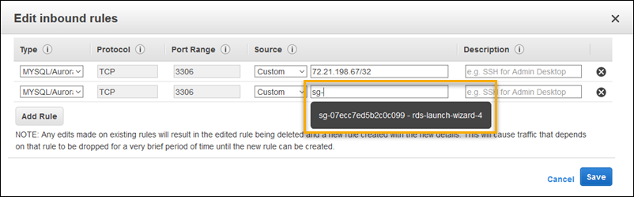
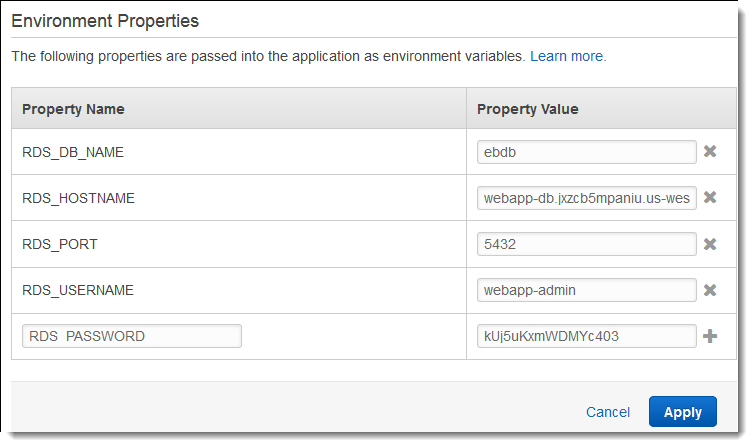
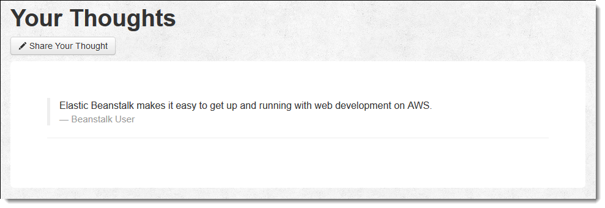

# Deploying a high-availability PHP application with an external Amazon RDS database to Elastic Beanstalk

This tutorial walks you through the process of [launching an RDS DB instance](AWSHowTo.md "AWSHowTo.md") external to AWS Elastic Beanstalk, and configuring a
high-availability environment running a PHP application to connect to it. Running a DB instance external to Elastic Beanstalk decouples the database from the lifecycle
of your environment. This lets you connect to the same database from multiple environments, swap out one database for another, or perform a blue/green
deployment without affecting your database.

The tutorial uses a [sample PHP application](https://github.com/awslabs/eb-demo-php-simple-app "https://github.com/awslabs/eb-demo-php-simple-app") that uses a MySQL database to store
user-provided text data. The sample application uses [configuration files](ebextensions.md "ebextensions.md") to configure [PHP
settings](create_deploy_PHP.md#php-namespaces "create_deploy_PHP.md#php-namespaces") and to create a table in the database for the application to use. It also shows how to use a [Composer file](create_deploy_PHP.md#php-configuration-composer "create_deploy_PHP.md#php-configuration-composer") to install packages during deployment.

###### Sections

- [Prerequisites](#php-hawrds-tutorial-prereqs "#php-hawrds-tutorial-prereqs")
- [Launch a DB instance in Amazon RDS](#php-hawrds-tutorial-database "#php-hawrds-tutorial-database")
- [Create an Elastic Beanstalk environment](#php-hawrds-tutorial-create "#php-hawrds-tutorial-create")
- [Configure security groups, environment properties, and scaling](#php-hawrds-tutorial-configure "#php-hawrds-tutorial-configure")
- [Deploy the sample application](#php-hawrds-tutorial-deploy "#php-hawrds-tutorial-deploy")
- [Cleanup](#php-hawrds-tutorial-cleanup "#php-hawrds-tutorial-cleanup")
- [Next steps](#php-hawrds-tutorial-nextsteps "#php-hawrds-tutorial-nextsteps")

## Prerequisites

Before you start, download the sample application source bundle from GitHub: [eb-demo-php-simple-app-1.3.zip](https://github.com/aws-samples/eb-demo-php-simple-app/releases/download/v1.3/eb-demo-php-simple-app-v1.3.zip "https://github.com/aws-samples/eb-demo-php-simple-app/releases/download/v1.3/eb-demo-php-simple-app-v1.3.zip")

The procedures in this tutorial for Amazon Relational Database Service (Amazon RDS) tasks assume that you are launching resources in a default [Amazon Virtual Private Cloud](../../../vpc/latest/userguide.md "../../../vpc/latest/userguide.md") (Amazon VPC). All new accounts include a default VPC in each region. If you don't have a default VPC, the procedures will vary. See [Using Elastic Beanstalk with Amazon RDS](AWSHowTo.md "AWSHowTo.md") for instructions for EC2-Classic and custom VPC platforms.

## Launch a DB instance in Amazon RDS

To use an external database with an application running in Elastic Beanstalk, first launch a DB instance with Amazon RDS. When you launch an instance with Amazon RDS, it is
completely independent of Elastic Beanstalk and your Elastic Beanstalk environments, and will not be terminated or monitored by Elastic Beanstalk.

Use the Amazon RDS console to launch a Multi-AZ **MySQL** DB instance. Choosing a Multi-AZ deployment ensures that your database will fail
over and continue to be available if the source DB instance goes out of service.

###### To launch an RDS DB instance in a default VPC

1. Open the [RDS console](https://console.aws.amazon.com/rds/home "https://console.aws.amazon.com/rds/home").
2. In the navigation pane, choose **Databases**.
3. Choose **Create database**.
4. Choose **Standard Create**.

###### Important

Do not choose **Easy Create**. If you choose it, you can't configure the necessary settings to launch this RDS DB. 5. Under **Additional configuration**, for **Initial database name**, type `ebdb`. 6. Review the default settings and adjust these settings according to your specific requirements. Pay attention to the following options:

    * **DB instance class** – Choose an instance size that has an appropriate amount of memory and CPU power for your
     workload.
    * **Multi-AZ deployment** – For high availability, set this to **Create an Aurora Replica/Reader node in a different
     AZ**.
    * **Master username** and **Master password** – The database username and password. Make a note of these
     settings because you will use them later.

7. Verify the default settings for the remaining options, and then choose **Create database**.

Next, modify the security group attached to your DB instance to allow inbound traffic on the appropriate port. This is the same security group that
you will attach to your Elastic Beanstalk environment later, so the rule that you add will grant ingress permission to other resources in the same security
group.

###### To modify the inbound rules on the security group that's attached to your RDS instance

1. Open the [Amazon RDS console](https://console.aws.amazon.com/rds/home "https://console.aws.amazon.com/rds/home").
2. Choose **Databases**.
3. Choose the name of your DB instance to view its details.
4. In the **Connectivity** section, make a note of the **Subnets**, **Security groups**, and
   **Endpoint** that are displayed on this page. This is so you can use this information later.
5. Under **Security**, you can see the security group that's associated with the DB instance. Open the link to view the security group
   in the Amazon EC2 console.
6. In the security group details, choose **Inbound**.
7. Choose **Edit**.
8. Choose **Add Rule**.
9. For **Type**, choose the DB engine that your application uses.
10. For **Source**, type `sg-` to view a list of available security groups. Choose the security group that's
    associated with the Auto Scaling group that's used with your Elastic Beanstalk environment. This is so that Amazon EC2 instances in the environment can have access to the
    database.

 11. Choose **Save**.

Creating a DB instance takes about 10 minutes. In the meantime, create your Elastic Beanstalk environment.

## Create an Elastic Beanstalk environment

Use the Elastic Beanstalk console to create an Elastic Beanstalk environment. Choose the **PHP** platform and accept the default settings and sample code.
After you launch the environment, you can configure the environment to connect to the database, then deploy the sample application that you downloaded
from GitHub.

###### To launch an environment (console)

1. Open the Elastic Beanstalk console using this preconfigured link: [console.aws.amazon.com/elasticbeanstalk/home#/newApplication?applicationName=tutorials&environmentType=LoadBalanced](https://console.aws.amazon.com/elasticbeanstalk/home#/newApplication?applicationName=tutorials&environmentType=LoadBalanced "https://console.aws.amazon.com/elasticbeanstalk/home#/newApplication?applicationName=tutorials&environmentType=LoadBalanced")
2. For **Platform**, select the platform and platform branch that match the language used by your application.
3. For **Application code**, choose **Sample application**.
4. Choose **Review and launch**.
5. Review the available options. Choose the available option you want to use, and when you're ready, choose **Create app**.

Environment creation takes about 5 minutes and creates the following resources:

- **EC2 instance** – An Amazon Elastic Compute Cloud (Amazon EC2) virtual
  machine configured to run web apps on the platform that you choose.

Each platform runs a specific set of software, configuration files, and scripts to support a specific language version, framework, web container, or
combination of these. Most platforms use either Apache or NGINX as a reverse proxy that sits in front of your web app, forwards requests to it, serves
static assets, and generates access and error logs.

- **Instance security group** – An Amazon EC2 security group configured to allow inbound traffic on port 80. This
  resource lets HTTP traffic from the load balancer reach the EC2 instance running your web app. By default, traffic isn't allowed on other ports.
- **Load balancer** – An Elastic Load Balancing load balancer configured to distribute requests to the instances running your
  application. A load balancer also eliminates the need to expose your instances directly to the internet.
- **Load balancer security group** – An Amazon EC2 security group configured to allow inbound traffic on port 80. This
  resource lets HTTP traffic from the internet reach the load balancer. By default, traffic isn't allowed on other ports.
- **Auto Scaling group** – An Auto Scaling group configured to replace
  an instance if it is terminated or becomes unavailable.
- **Amazon S3 bucket** – A storage location for your source
  code, logs, and other artifacts that are created when you use Elastic Beanstalk.
- **Amazon CloudWatch alarms** – Two CloudWatch alarms that monitor the load on the instances in your environment and that are
  triggered if the load is too high or too low. When an alarm is triggered, your Auto Scaling group scales up or down in response.
- **AWS CloudFormation stack** – Elastic Beanstalk uses AWS CloudFormation to launch the
  resources in your environment and propagate configuration changes. The resources are defined
  in a template that you can view in the [AWS CloudFormation
  console](https://console.aws.amazon.com/cloudformation "https://console.aws.amazon.com/cloudformation").
- **Domain name** – A domain name that routes to your
  web app in the form
  _`subdomain`.`region`.elasticbeanstalk.com_.

###### Domain security

To augment the security of your Elastic Beanstalk applications, the _elasticbeanstalk.com_ domain is registered in the
[Public Suffix List (PSL)](https://publicsuffix.org/ "https://publicsuffix.org/").

If you ever need to set sensitive cookies in the default domain name for your Elastic Beanstalk applications, we recommend that you use cookies with a
`__Host-` prefix for increased security. This practice defends your domain against cross-site request forgery attempts (CSRF). For more
information see the [Set-Cookie](https://developer.mozilla.org/en-US/docs/Web/HTTP/Headers/Set-Cookie#cookie_prefixes "https://developer.mozilla.org/en-US/docs/Web/HTTP/Headers/Set-Cookie#cookie_prefixes") page in the Mozilla
Developer Network.

All of these resources are managed by Elastic Beanstalk. When you terminate your environment, Elastic Beanstalk terminates all the resources that it contains. The RDS DB
instance that you launched is outside of your environment, so you are responsible for managing its lifecycle.

###### Note

The Amazon S3 bucket that Elastic Beanstalk creates is shared between environments and is not deleted during environment termination. For more information, see [Using Elastic Beanstalk with Amazon S3](AWSHowTo.md "AWSHowTo.md").

## Configure security groups, environment properties, and scaling

Add the security group of your DB instance to your running environment. This procedure causes Elastic Beanstalk to reprovision all instances in your environment
with the additional security group attached.

###### To add a security group to your environment

- Do one of the following:
  - To add a security group using the Elastic Beanstalk console
    1. Open the [Elastic Beanstalk console](https://console.aws.amazon.com/elasticbeanstalk "https://console.aws.amazon.com/elasticbeanstalk"),
       and in the **Regions** list, select your AWS Region.
    2. In the navigation pane, choose **Environments**, and then choose the name of your environment from the list.
    3. In the navigation pane, choose **Configuration**.
    4. In the **Instances** configuration category, choose **Edit**.
    5. Under **EC2 security groups**, choose the security group to attach to the instances, in addition to the instance security group that
       Elastic Beanstalk creates.
    6. To save the changes choose **Apply** at the bottom of the page.
    7. Read the warning, and then choose **Confirm**.

  - To add a security group using a [configuration file](ebextensions.md "ebextensions.md"), use the [`securitygroup-addexisting.config`](https://github.com/awsdocs/elastic-beanstalk-samples/tree/main/configuration-files/aws-provided/security-configuration/securitygroup-addexisting.config "https://github.com/awsdocs/elastic-beanstalk-samples/tree/main/configuration-files/aws-provided/security-configuration/securitygroup-addexisting.config") example file.

Next, use environment properties to pass the connection information to your environment. The sample application uses a default set of properties that
match the ones that Elastic Beanstalk configures when you provision a database within your environment.

###### To configure environment properties for an Amazon RDS DB instance

1. Open the [Elastic Beanstalk console](https://console.aws.amazon.com/elasticbeanstalk "https://console.aws.amazon.com/elasticbeanstalk"),
   and in the **Regions** list, select your AWS Region.
2. In the navigation pane, choose **Environments**, and then choose the name of your environment from the list.
3. In the navigation pane, choose **Configuration**.
4. In the **Updates, monitoring, and logging** configuration category, choose **Edit**.
5. In the **Environment properties** section, define the variables that your application reads to construct a connection string. For
   compatibility with environments that have an integrated RDS DB instance, use the following names and values. You can find all values, except for your
   password, in the [RDS console](https://console.aws.amazon.com/rds/home "https://console.aws.amazon.com/rds/home").

| Property name  | Description                                                                                    | Property value                                                                         |
| -------------- | ---------------------------------------------------------------------------------------------- | -------------------------------------------------------------------------------------- |
| `RDS_HOSTNAME` | The hostname of the DB instance.                                                               | On the **Connectivity & security\* • tab on the Amazon RDS console: **Endpoint\*\*. |
| `RDS_PORT`     | The port where the DB instance accepts connections. The default value varies among DB engines. | On the **Connectivity & security\* • tab on the Amazon RDS console: **Port\*\*.     |
| `RDS_DB_NAME`  | The database name, `ebdb`.                                                                     | On the **Configuration\* • tab on the Amazon RDS console: **DB Name\*\*.            |
| `RDS_USERNAME` | The username that you configured for your database.                                            | On the **Configuration\* • tab on the Amazon RDS console: **Master username\*\*.    |
| `RDS_PASSWORD` | The password that you configured for your database.                                            | Not available for reference in the Amazon RDS console.                                 |

 6. To save the changes choose **Apply** at the bottom of the page.

Finally, configure your environment's Auto Scaling group with a higher minimum instance count. Run at least two instances at all times to prevent the web
servers in your environment from being a single point of failure, and to allow you to deploy changes without taking your site out of service.

###### To configure your environment's Auto Scaling group for high availability

1. Open the [Elastic Beanstalk console](https://console.aws.amazon.com/elasticbeanstalk "https://console.aws.amazon.com/elasticbeanstalk"),
   and in the **Regions** list, select your AWS Region.
2. In the navigation pane, choose **Environments**, and then choose the name of your environment from the list.
3. In the navigation pane, choose **Configuration**.
4. In the **Capacity** configuration category, choose **Edit**.
5. In the **Auto Scaling group** section, set **Min instances** to `2`.
6. To save the changes choose **Apply** at the bottom of the page.

## Deploy the sample application

Now your environment is ready to run the sample application and connect to Amazon RDS. Deploy the sample application to your environment.

###### Note

Download the source bundle from GitHub, if you haven't already: [eb-demo-php-simple-app-1.3.zip](https://github.com/aws-samples/eb-demo-php-simple-app/releases/download/v1.3/eb-demo-php-simple-app-v1.3.zip "https://github.com/aws-samples/eb-demo-php-simple-app/releases/download/v1.3/eb-demo-php-simple-app-v1.3.zip")

###### To deploy a source bundle

1. Open the [Elastic Beanstalk console](https://console.aws.amazon.com/elasticbeanstalk "https://console.aws.amazon.com/elasticbeanstalk"),
   and in the **Regions** list, select your AWS Region.
2. In the navigation pane, choose **Environments**, and then choose the name of your environment from the list.
3. On the environment overview page, choose **Upload and deploy**.
4. Use the on-screen dialog box to upload the source bundle.
5. Choose **Deploy**.
6. When the deployment completes, you can choose the site URL to open your website in a new tab.

The site collects user comments and uses a MySQL database to store the data. To add a comment, choose **Share Your Thought**, enter a
comment, and then choose **Submit Your Thought**. The web app writes the comment to the database so that any instance in the environment
can read it, and it won't be lost if instances go out of service.

## Cleanup

After you finish working with the demo code, you can terminate your environment.
Elastic Beanstalk deletes all related AWS resources, such as
[Amazon EC2 instances](using-features.managing.md "using-features.managing.md"),
[database instances](using-features.managing.md "using-features.managing.md"),
[load balancers](using-features.managing.md "using-features.managing.md"),
security groups,
and [alarms](using-features.md#using-features.alarms.title "using-features.md#using-features.alarms.title").

Removing resources does not delete the Elastic Beanstalk application, so you can create new environments for your application at any time.

###### To terminate your Elastic Beanstalk environment from the console

1. Open the [Elastic Beanstalk console](https://console.aws.amazon.com/elasticbeanstalk "https://console.aws.amazon.com/elasticbeanstalk"),
   and in the **Regions** list, select your AWS Region.
2. In the navigation pane, choose **Environments**, and then choose the name of your environment from the list.
3. Choose **Actions**, and then choose **Terminate
   environment**.
4. Use the on-screen dialog box to confirm environment termination.

In addition, you can terminate database resources that you created outside of your Elastic Beanstalk
environment. When you terminate an Amazon RDS DB instance, you can take a snapshot and restore
the data to another instance later.

###### To terminate your RDS DB instance

1. Open the [Amazon RDS console](https://console.aws.amazon.com/rds "https://console.aws.amazon.com/rds").
2. Choose **Databases**.
3. Choose your DB instance.
4. Choose **Actions**, and then choose **Delete**.
5. Choose whether to create a snapshot, and then choose
   **Delete**.

## Next steps

As you continue to develop your application, you'll probably want a way to manage environments and deploy your application without manually creating a
.zip file and uploading it to the Elastic Beanstalk console. The [Elastic Beanstalk Command Line Interface](eb-cli3.md "eb-cli3.md") (EB CLI) provides easy-to-use commands
for creating, configuring, and deploying applications to Elastic Beanstalk environments from the command line.

The sample application uses configuration files to configure PHP settings and create a table in the database if it doesn't already exist. You can also
use a configuration file to configure the security group settings of your instances during environment creation to avoid time-consuming configuration
updates. See [Advanced environment customization with configuration files (.ebextensions)](ebextensions.md "ebextensions.md") for more information.

For development and testing, you might want to use the Elastic Beanstalk functionality for adding a managed DB instance directly to your environment. For
instructions on setting up a database inside your environment, see [Adding a database to your Elastic Beanstalk environment](using-features.managing.md "using-features.managing.md").

If you need a high-performance database, consider using [Amazon Aurora](https://aws.amazon.com/rds/aurora/ "https://aws.amazon.com/rds/aurora/").
Amazon Aurora is a
MySQL-compatible database engine that offers commercial database features at low cost. To connect your application to a different database, repeat the
[security group configuration](#php-hawrds-tutorial-database "#php-hawrds-tutorial-database") steps and [update the
RDS-related environment properties](#php-hawrds-tutorial-configure "#php-hawrds-tutorial-configure").

Finally, if you plan on using your application in a production environment, you will want to [configure a custom domain
name](customdomains.md "customdomains.md") for your environment and [enable HTTPS](configuring-https.md "configuring-https.md") for secure connections.
