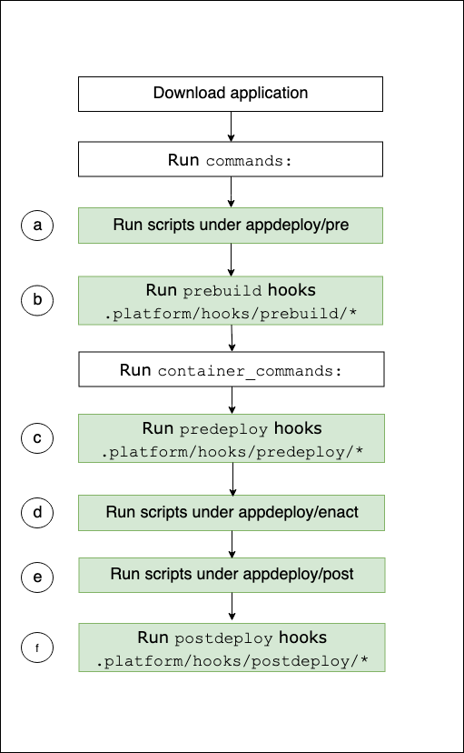

# Instance deployment workflow for ECS running on Amazon Linux 2 and later

The previous section describes the supported extensibility features throughout the phases of the application deployment workflow. There are some
differences for the Docker platform branches [ECS running on Amazon Linux 2 and later](create_deploy_docker_ecs.md "create_deploy_docker_ecs.md"). This section
explains how those concepts apply to this specific platform branch.

With many ways to extend your environment's platform, it's useful to know what happens whenever Elastic Beanstalk provisions an instance or runs a deployment to
an instance. The following diagram shows this entire deployment workflow for an environment based on the _ECS running on Amazon Linux 2_ and
_ECS running on Amazon Linux 2023_ platform branches. It depicts the different phases in a deployment and the steps that Elastic Beanstalk takes in
each phase.

Unlike the workflow described in the prior section, the deployment Configuration phase doesn't support the following extensibility features:
`Buildfile` commands, `Procfile` commands, reverse proxy configuration.

###### Notes

- The diagram doesn't represent the complete set of steps that Elastic Beanstalk takes on environment instances during deployment. We provide this diagram for
  illustration, to provide you with the order and context for the execution of your customizations.
- For simplicity, the diagram mentions only the `.platform/hooks/*` hook subdirectories (for application deployments), and not
  the `.platform/confighooks/*` hook subdirectories (for configuration deployments). Hooks in the latter subdirectories run during
  exactly the same steps as hooks in corresponding subdirectories shown in the diagram.


The following list details the deployment workflow steps.

1. Runs any executable files found in the `appdeploy/pre` directory under `EBhooksDir`.
2. Runs any executable files found in the `.platform/hooks/prebuild` directory of your source bundle
   (`.platform/confighooks/prebuild` for a configuration deployment).
3. Runs any executable files found in the `.platform/hooks/predeploy` directory of your source bundle
   (`.platform/confighooks/predeploy` for a configuration deployment).
4. Runs any executable files found in the `appdeploy/enact` directory under `EBhooksDir`.
5. Runs any executable files found in the `appdeploy/post` directory under `EBhooksDir`.
6. Runs any executable files found in the `.platform/hooks/postdeploy` directory of your source bundle
   (`.platform/confighooks/postdeploy` for a configuration deployment).
   The reference to `EBhooksDir` represents the path of the platform hooks directory. To retrieve directory path name use the [get-config](custom-platforms-scripts.md#custom-platforms-scripts.get-config "custom-platforms-scripts.md#custom-platforms-scripts.get-config") script tool on the command line of your environment instance as shown:

```
$ `/opt/elasticbeanstalk/bin/get-config platformconfig -k EBhooksDir`
```
