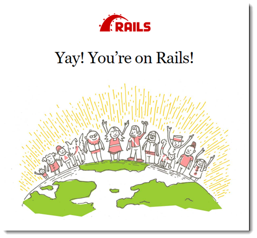

# Deploying a rails application to Elastic Beanstalk

Rails is an open source, model-view-controller (MVC) framework for Ruby. This tutorial walks you through the process of generating a Rails application
and deploying it to an AWS Elastic Beanstalk environment.

###### Sections

- [Prerequisites](#ruby-rails-tutorial-prereqs "#ruby-rails-tutorial-prereqs")
- [Basic Elastic Beanstalk knowledge](#ruby-rails-tutorial-prereqs-basic "#ruby-rails-tutorial-prereqs-basic")
- [Launch an Elastic Beanstalk environment](#ruby-rails-tutorial-launch "#ruby-rails-tutorial-launch")
- [Install rails and generate a website](#ruby-rails-tutorial-generate "#ruby-rails-tutorial-generate")
- [Configure rails settings](#ruby-rails-tutorial-configure "#ruby-rails-tutorial-configure")
- [Deploy your application](#ruby-rails-tutorial-deploy "#ruby-rails-tutorial-deploy")
- [Cleanup](#ruby-rails-tutorial-cleanup "#ruby-rails-tutorial-cleanup")
- [Next steps](#ruby-rails-tutorial-nextsteps "#ruby-rails-tutorial-nextsteps")

## Prerequisites

## Basic Elastic Beanstalk knowledge

This tutorial assumes you have knowledge of the basic Elastic Beanstalk operations and the Elastic Beanstalk console. If you haven't already, follow the instructions in [Learn how to get started with Elastic Beanstalk](GettingStarted.md "GettingStarted.md") to launch your first Elastic Beanstalk environment.

### Command line

To follow the procedures in this guide, you will need a command line terminal or shell to run commands. Commands are shown in
listings preceded by a
prompt symbol ($) and the name of the current directory, when appropriate.

```
~/eb-project$ `this is a command`
this is output
```

On Linux and macOS, you can use your preferred shell and package manager. On Windows you can [install the Windows Subsystem for Linux](https://docs.microsoft.com/en-us/windows/wsl/install-win10 "https://docs.microsoft.com/en-us/windows/wsl/install-win10") to get a Windows-integrated version of
Ubuntu and Bash.

### Rails dependencies

The Rails framework 6.1.4.1 has the following dependencies. Be sure you have all of them installed.

- **Ruby 2.5.0 or newer** – For installation instructions, see [Setting up your Ruby development environment for Elastic Beanstalk](ruby-development-environment.md "ruby-development-environment.md").

In this tutorial we use Ruby 3.0.2 and the corresponding Elastic Beanstalk platform version.

- **Node.js** – For installation instructions, see [Installing Node.js via package manager](https://nodejs.org/en/download/package-manager/ "https://nodejs.org/en/download/package-manager/").
- **Yarn** – For installation instructions, see [Installation](https://yarnpkg.com/lang/en/docs/install/ "https://yarnpkg.com/lang/en/docs/install/") on the _Yarn_ website.

## Launch an Elastic Beanstalk environment

Use the Elastic Beanstalk console to create an Elastic Beanstalk environment. Choose the **Ruby** platform and accept the default settings and sample
code.

###### To launch an environment (console)

1. Open the Elastic Beanstalk console using this preconfigured link: [console.aws.amazon.com/elasticbeanstalk/home#/newApplication?applicationName=tutorials&environmentType=LoadBalanced](https://console.aws.amazon.com/elasticbeanstalk/home#/newApplication?applicationName=tutorials&environmentType=LoadBalanced "https://console.aws.amazon.com/elasticbeanstalk/home#/newApplication?applicationName=tutorials&environmentType=LoadBalanced")
2. For **Platform**, select the platform and platform branch that match the language used by your application.
3. For **Application code**, choose **Sample application**.
4. Choose **Review and launch**.
5. Review the available options. Choose the available option you want to use, and when you're ready, choose **Create app**.

Environment creation takes about 5 minutes and creates the following resources:

- **EC2 instance** – An Amazon Elastic Compute Cloud (Amazon EC2) virtual
  machine configured to run web apps on the platform that you choose.

Each platform runs a specific set of software, configuration files, and scripts to support a specific language version, framework, web container, or
combination of these. Most platforms use either Apache or NGINX as a reverse proxy that sits in front of your web app, forwards requests to it, serves
static assets, and generates access and error logs.

- **Instance security group** – An Amazon EC2 security group configured to allow inbound traffic on port 80. This
  resource lets HTTP traffic from the load balancer reach the EC2 instance running your web app. By default, traffic isn't allowed on other ports.
- **Load balancer** – An ELB load balancer configured to distribute requests to the instances running your
  application. A load balancer also eliminates the need to expose your instances directly to the internet.
- **Load balancer security group** – An Amazon EC2 security group configured to allow inbound traffic on port 80. This
  resource lets HTTP traffic from the internet reach the load balancer. By default, traffic isn't allowed on other ports.
- **Auto Scaling group** – An Auto Scaling group configured to replace
  an instance if it is terminated or becomes unavailable.
- **Amazon S3 bucket** – A storage location for your source
  code, logs, and other artifacts that are created when you use Elastic Beanstalk.
- **Amazon CloudWatch alarms** – Two CloudWatch alarms that monitor the load on the instances in your environment and that are
  triggered if the load is too high or too low. When an alarm is triggered, your Auto Scaling group scales up or down in response.
- **CloudFormation stack** – Elastic Beanstalk uses CloudFormation to launch the
  resources in your environment and propagate configuration changes. The resources are defined
  in a template that you can view in the [CloudFormation
  console](https://console.aws.amazon.com/cloudformation "https://console.aws.amazon.com/cloudformation").
- **Domain name** – A domain name that routes to your
  web app in the form
  _`subdomain`.`region`.elasticbeanstalk.com_.

###### Domain security

To augment the security of your Elastic Beanstalk applications, the _elasticbeanstalk.com_ domain is registered in the
[Public Suffix List (PSL)](https://publicsuffix.org/ "https://publicsuffix.org/").

If you ever need to set sensitive cookies in the default domain name for your Elastic Beanstalk applications, we recommend that you use cookies with a
`__Host-` prefix for increased security. This practice defends your domain against cross-site request forgery attempts (CSRF). For more
information see the [Set-Cookie](https://developer.mozilla.org/en-US/docs/Web/HTTP/Headers/Set-Cookie#cookie_prefixes "https://developer.mozilla.org/en-US/docs/Web/HTTP/Headers/Set-Cookie#cookie_prefixes") page in the Mozilla
Developer Network.

All of these resources are managed by Elastic Beanstalk. When you terminate your environment, Elastic Beanstalk terminates all the resources that it contains.

###### Note

The Amazon S3 bucket that Elastic Beanstalk creates is shared between environments and is not deleted during environment termination. For more information, see [Using Elastic Beanstalk with Amazon S3](AWSHowTo.md "AWSHowTo.md").

## Install rails and generate a website

Install Rails and its dependencies with the `gem` command.

```
~$ `gem install rails`
Fetching: concurrent-ruby-1.1.9.gem
Successfully installed concurrent-ruby-1.1.9
Fetching: rack-2.2.3.gem
Successfully installed rack-2.2.3
...
```

Test your Rails installation.

```
~$ `rails --version`
Rails 6.1.4.1
```

Use `rails new` with the name of the application to create a new Rails project.

```
~$ `rails new ~/eb-rails`
```

Rails creates a directory with the name specified, generates all of the files needed to run a sample project locally, and then runs bundler to install
all of the dependencies (Gems) defined in the project's Gemfile.

###### Note

This process installs the latest Puma version for the project. This version might be different from the version that Elastic Beanstalk provides on the Ruby
platform version of your environment. To see the Puma versions provided by Elastic Beanstalk, see [Ruby Platform History](../platforms/platform-history-ruby.md "../platforms/platform-history-ruby.md") in the _AWS Elastic Beanstalk Platforms guide_. For more
information about the latest Puma version, see the [Puma.io](http://puma.io "http://puma.io") website. If there’s a mismatch between the two Puma
versions, use one of the following options:

- Use the Puma version installed by the prior `rails new` command.
  In this case you must add a `Procfile` for the platform to use your own provided Puma server version.
  For more information, see [Configuring the application process with a Procfile on Elastic Beanstalk.](ruby-platform-procfile.md "ruby-platform-procfile.md").
- Update the Puma version to be consistent with the version pre-installed on your environment’s Ruby platform version.
  To do so, modify the Puma version in the [Gemfile](ruby-platform-gemfile.md#ruby-platform-gemfile.title "ruby-platform-gemfile.md#ruby-platform-gemfile.title")
  located in the root of your project source directory. Then run `bundle update`.
  For more information see the [bundle update](https://bundler.io/man/bundle-update.1.html "https://bundler.io/man/bundle-update.1.html") page on the Bundler.io website.

Test your Rails installation by running the default project locally.

```
~$ `cd eb-rails`
~/eb-rails$ `rails server`
=> Booting Puma
=> Rails 6.1.4.1 application starting in development
=> Run `bin/rails server --help` for more startup options
Puma starting in single mode...
* Puma version: 5.5.2 (ruby 3.0.2-p107) ("Zawgyi")
*  Min threads: 5
*  Max threads: 5
*  Environment: development
*          PID: 77857
* Listening on http://127.0.0.1:3000
* Listening on http://[::1]:3000
Use Ctrl-C to stop
...
```

Open `http://localhost:3000` in a web browser to see the default project in action.



This page is only visible in development mode. Add some content to the front page of the application to support production deployment to Elastic Beanstalk. Use
`rails generate` to create a controller, route, and view for your welcome page.

```
~/eb-rails$ `rails generate controller WelcomePage welcome`
      create  app/controllers/welcome_page_controller.rb
       route  get 'welcome_page/welcome'
      invoke  erb
      create    app/views/welcome_page
      create    app/views/welcome_page/welcome.html.erb
      invoke  test_unit
      create    test/controllers/welcome_page_controller_test.rb
      invoke  helper
      create    app/helpers/welcome_page_helper.rb
      invoke    test_unit
      invoke  assets
      invoke    coffee
      create      app/assets/javascripts/welcome_page.coffee
      invoke    scss
      create      app/assets/stylesheets/welcome_page.scss.
```

This gives you all you need to access the page at `/welcome_page/welcome`. Before you publish the changes, however, change the content in
the view and add a route to make this page appear at the top level of the site.

Use a text editor to edit the content in `app/views/welcome_page/welcome.html.erb`. For this example, you'll use `cat`
to simply overwrite the content of the existing file.

###### Example app/views/welcome_page/welcome.html.erb

```
<h1>Welcome!</h1>
<p>This is the front page of my first Rails application on Elastic Beanstalk.</p>
```

Finally, add the following route to `config/routes.rb`:

###### Example config/routes.rb

```
Rails.application.routes.draw do
  get 'welcome_page/welcome'
  `root 'welcome_page#welcome'`
```

This tells Rails to route requests to the root of the website to the welcome page controller's welcome method, which renders the content in the
welcome view (`welcome.html.erb`).

In order for Elastic Beanstalk to successfully deploy the application on the Ruby platform, we need to update `Gemfile.lock`. Some dependencies
of `Gemfile.lock` might be platform specific. Therefore, we need to add `platform ruby` to
`Gemfile.lock` so that all required dependencies are installed with the deployment.

```
~/eb-rails$ `bundle lock --add-platform ruby`
Fetching gem metadata from https://rubygems.org/............
Resolving dependencies...
Writing lockfile to /Users/janedoe/EBDPT/RubyApps/eb-rails-doc-app/Gemfile.lock
```

## Configure rails settings

Use the Elastic Beanstalk console to configure Rails with environment properties. Set the `SECRET_KEY_BASE` environment property to a string of up to
256 alphanumeric characters.

Rails uses this property to create keys. Therefore you should keep it a secret and not store it in source control in plain text. Instead, you provide
it to Rails code on your environment through an environment property.

###### To configure environment variables in the Elastic Beanstalk console

1. Open the [Elastic Beanstalk console](https://console.aws.amazon.com/elasticbeanstalk "https://console.aws.amazon.com/elasticbeanstalk"),
   and in the **Regions** list, select your AWS Region.
2. In the navigation pane, choose **Environments**, and then choose the name of your environment from the list.
3. In the navigation pane, choose **Configuration**.
4. In the **Updates, monitoring, and logging** configuration category, choose **Edit**.
5. Scroll down to **Runtime environment variables**.
6. Select **Add environment variable**.
7. For **Source** select **Plain text**.

###### Note

The **Secrets Manager** and **SSM Parameter Store** values in the drop-down are for configuring environment
variables as secrets to store sensitive data, such as credentials and API keys. For more information, see [Using Elastic Beanstalk with AWS Secrets Manager and AWS Systems Manager Parameter Store](AWSHowTo.md "AWSHowTo.md"). 8. Enter the **Environment variable name** and **Environment variable value** pairs. 9. If you need to add more variables repeat **Step 6** through **Step 8**. 10. To save the changes choose **Apply** at the bottom of the page.

Now you're ready to deploy the site to your environment.

## Deploy your application

Create a [source bundle](applications-sourcebundle.md "applications-sourcebundle.md") containing the files created by Rails. The following command creates a source
bundle named `rails-default.zip`.

```
~/eb-rails$ `zip ../rails-default.zip -r * .[^.]*`
```

Upload the source bundle to Elastic Beanstalk to deploy Rails to your environment.

###### To deploy a source bundle

1. Open the [Elastic Beanstalk console](https://console.aws.amazon.com/elasticbeanstalk "https://console.aws.amazon.com/elasticbeanstalk"),
   and in the **Regions** list, select your AWS Region.
2. In the navigation pane, choose **Environments**, and then choose the name of your environment from the list.
3. On the environment overview page, choose **Upload and deploy**.
4. Use the on-screen dialog box to upload the source bundle.
5. Choose **Deploy**.
6. When the deployment completes, you can choose the site URL to open your website in a new tab.

## Cleanup

After you finish working with the demo code, you can terminate your environment.
Elastic Beanstalk deletes all related AWS resources, such as
[Amazon EC2 instances](using-features.managing.md "using-features.managing.md"),
[database instances](using-features.managing.md "using-features.managing.md"),
[load balancers](using-features.managing.md "using-features.managing.md"),
security groups,
and [alarms](using-features.md#using-features.alarms.title "using-features.md#using-features.alarms.title").

Removing resources does not delete the Elastic Beanstalk application, so you can create new environments for your application at any time.

###### To terminate your Elastic Beanstalk environment from the console

1. Open the [Elastic Beanstalk console](https://console.aws.amazon.com/elasticbeanstalk "https://console.aws.amazon.com/elasticbeanstalk"),
   and in the **Regions** list, select your AWS Region.
2. In the navigation pane, choose **Environments**, and then choose the name of your environment from the list.
3. Choose **Actions**, and then choose **Terminate
   environment**.
4. Use the on-screen dialog box to confirm environment termination.

## Next steps

For more information about Rails, visit [rubyonrails.org](https://rubyonrails.org/ "https://rubyonrails.org/").

As you continue to develop your application, you'll probably want a way to manage environments and deploy your application without manually creating a
.zip file and uploading it to the Elastic Beanstalk console. The [Elastic Beanstalk Command Line Interface](eb-cli3.md "eb-cli3.md") (EB CLI) provides easy-to-use commands
for creating, configuring, and deploying applications to Elastic Beanstalk environments from the command line.

Finally, if you plan on using your application in a production environment, you will want to [configure a custom domain
name](customdomains.md "customdomains.md") for your environment and [enable HTTPS](configuring-https.md "configuring-https.md") for secure connections.
