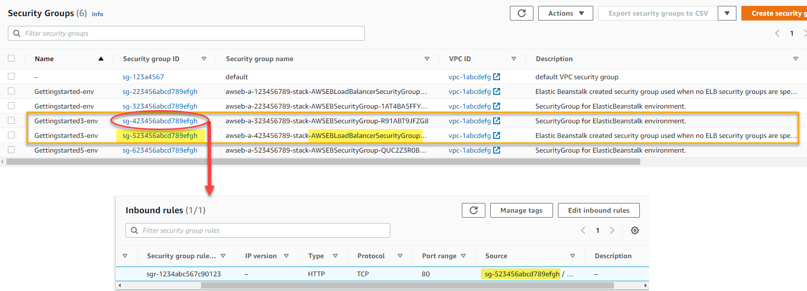

# Managing EC2 security groups

When Elastic Beanstalk creates an environment, it assigns a default security group to the EC2 instances
that are launched with it. The security groups that are attached to your instances determine
which traffic is allowed to reach and exit the instances.

The default EC2 security group that Elastic Beanstalk creates allows all incoming traffic from the
internet or load balancers on the standard ports for HTTP (80) and SSH(22). You may also define
your own custom security groups to designate firewall rules for the EC2 instances. The security
groups can allow traffic on other ports or from other sources. For example, you can create a
security group for SSH access that allows inbound traffic on port 22 from a restricted IP
address range. Or for additional security, you can create one that allows traffic from a bastion
host that only you can access.

You can select to opt out your environment from the default EC2 security group by setting
the `DisableDefaultEC2SecurityGroup` option in the [aws:autoscaling:launchconfiguration](command-options-general.md#command-options-general-autoscalinglaunchconfiguration "command-options-general.md#command-options-general-autoscalinglaunchconfiguration") namespace to
`true`. Use the [AWS CLI](using-features.managing.ec2.md "using-features.managing.ec2.md") or
configuration files to apply this option to your environment and to attach custom security
groups to the EC2 instances.

## Managing EC2

security groups in multi-instance environments

If you create a custom EC2 security group in a multi-instance environment you must also
consider how the load balancers and incoming traffic rules keep your instances secure and
accessible.

Inbound traffic to an environment with multiple EC2 instances is managed by the [load balancer](using-features.managing.md "using-features.managing.md"), which directs incoming traffic
among all of the EC2 instances. When Elastic Beanstalk creates a default EC2 security group, it also
defines inbound rules that allow incoming traffic from the load balancer. Without this inbound
rule in the security group, the incoming traffic will not be allowed to enter the instances.
This condition would essentially block the instances from external requests.

If you disable the default EC2 security group for a load balanced environment, Elastic Beanstalk
validates some configuration rules. If the configuration doesn't meet the validation checks,
it issues messages instructing you to provide the required configuration. The validation
checks are the following:

- At least one security group must be assigned to the load balancer using the `SecurityGroups`
  option of the
  [aws:elbv2:loadbalancer](command-options-general.md#command-options-general-elbv2 "command-options-general.md#command-options-general-elbv2")
  or
  [aws:elb:loadbalancer](command-options-general.md#command-options-general-elbloadbalancer "command-options-general.md#command-options-general-elbloadbalancer"),
  depending on whether it's an application load balancer or classic load balancer, respectively.
  For AWS CLI examples see
  [Configuring with the
  AWS CLI](using-features.managing.ec2.md "using-features.managing.ec2.md").
- Inbound traffic rules must exist that allow your EC2 instances to receive traffic from
  the load balancer. Both your EC2 security groups and your load balancer security groups
  must reference these inbound rules. For more information, see the
  [Inbound rules for traffic](#using-features.managing.ec2.instances.sg.load-balancer-security.rules "#using-features.managing.ec2.instances.sg.load-balancer-security.rules") section that follows.

### Inbound rules for traffic

The EC2 security group(s) for a multi-instance environment, must include an inbound rule
that references the load balancer security group. This applies to environments with any type
of load balancer, dedicated or shared, and with either custom or default load balancer
security groups.

You can view all of the security groups that are attached to your environment components
in the EC2 console. The following image shows the EC2 console listing of security groups
that Elastic Beanstalk creates by default during the create environment operation.

The **Security Groups** screen shows environments and their associated
security groups. Both _GettingStarted-env_ and
_GettingStarted3-env_ are multi-instance environments with dedicated
load balancers. Each of these environments has two security groups listed, one for the EC2
instances and another for the load balancer. Elastic Beanstalk creates these security groups when it
creates the environments. _GettingStarted5-env_ doesn't have a load
balancer security group, because it only has one EC2 instance, and thus no load
balancer.

The **Inbound rules** screen drills down into the EC2 security group
for the instances of _GettingStarted3-env_. This example defines the
inbound rules for the EC2 security group. Note that the _Source_ column
in the _Inbound rules_ lists the security group id of the load balancer
security group listed in the prior image. This rule allows the EC2 instances of
_GettingStarted3-env_ to receive inbound traffic from that specific
load balancer on port 80.

For more information, see [Change security groups for
your instance](../../../AWSEC2/latest/UserGuide/changing-security-group.md "../../../AWSEC2/latest/UserGuide/changing-security-group.md") and [Elastic
Load Balancing rules](../../../AWSEC2/latest/UserGuide/security-group-rules-reference.md#sg-rules-elb "../../../AWSEC2/latest/UserGuide/security-group-rules-reference.md#sg-rules-elb") in the _Amazon EC2 User Guide_.
