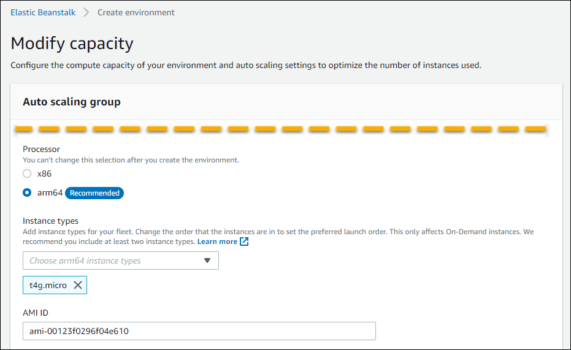
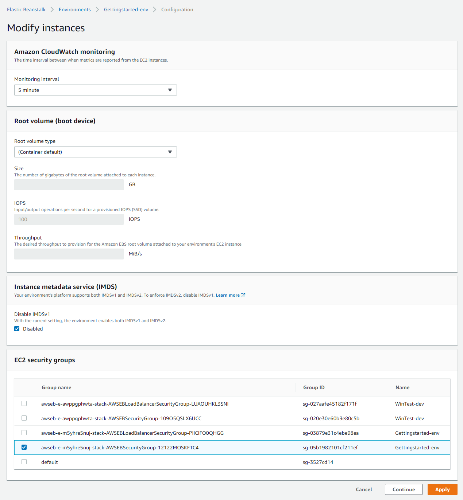
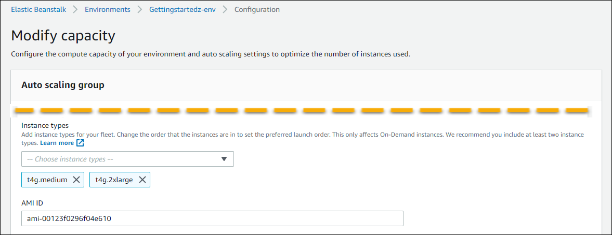

# Configuring Amazon EC2 instances using the Elastic Beanstalk console

You can create or modify your Elastic Beanstalk environment's Amazon EC2 instance configuration in the Elastic Beanstalk console.

###### Note

Although the Elastic Beanstalk console doesn't provide the option to change the processor architecture of an existing environment, you can do so with the AWS CLI.
For example commands, see
[Configuring Amazon EC2 security groups and instance types using the
AWS CLI](using-features.managing.ec2.md "using-features.managing.ec2.md").

###### To configure Amazon EC2 instances in the Elastic Beanstalk console during environment creation

1. Open the [Elastic Beanstalk console](https://console.aws.amazon.com/elasticbeanstalk "https://console.aws.amazon.com/elasticbeanstalk"),
   and in the **Regions** list, select your AWS Region.
2. In the navigation pane, choose **Environments**.
3. Choose [Create a new environment](environments-create-wizard.md "environments-create-wizard.md") to start creating your environment.
4. On the wizard's main page, before choosing **Create environment**, choose **Configure more options**.
5. In the **Instances** configuration category, choose **Edit**. Make changes to settings in this category, and
   then choose **Apply**. For setting descriptions, see the section [Instances category settings](#using-features.managing.ec2.console.instances "#using-features.managing.ec2.console.instances") on
   this page.
6. In the **Capacity** configuration category, choose **Edit**. Make changes to settings in this category, and then
   choose **Continue**. For setting descriptions, see the section [Capacity category settings](#using-features.managing.ec2.console.capacity "#using-features.managing.ec2.console.capacity") on this
   page.

###### Selecting processor architecture

Scroll down to **Processor** to select a processor architecture for your EC2 instances. The console lists processor
architectures that are supported by the platform that you chose earlier in the **Create environment** panel.

If you don't see the processor architecture that you need, return to the configuration category list to select a platform that supports it. From
the **Modify Capacity** panel, choose **Cancel**. Then, choose **Change platform version** to
choose new platform settings. Next, in the **Capacity** configuration category choose **Edit** tot see the
processor architecture choices again.

 7. Choose **Save**, and then make any other configuration changes that your environment requires. 8. Choose **Create environment**.

###### To configure a running environment’s Amazon EC2 instances in the Elastic Beanstalk console

1. Open the [Elastic Beanstalk console](https://console.aws.amazon.com/elasticbeanstalk "https://console.aws.amazon.com/elasticbeanstalk"),
   and in the **Regions** list, select your AWS Region.
2. In the navigation pane, choose **Environments**, and then choose the name of your environment from the list.
3. In the navigation pane, choose **Configuration**.
4. In the **Instances** configuration category, choose **Edit**. Make changes to settings in this category, and
   then choose **Apply**. For setting descriptions, see the section [Instances category settings](#using-features.managing.ec2.console.instances "#using-features.managing.ec2.console.instances") on
   this page.
5. In the **Capacity** configuration category, choose **Edit**. Make changes to settings in this category, and then
   choose **Continue**. For setting descriptions, see the section [Capacity category settings](#using-features.managing.ec2.console.capacity "#using-features.managing.ec2.console.capacity") on this
   page.

## Instances category settings

The following settings related to Amazon EC2 instances are available in the **Instances** configuration category.

###### Options

- [Monitoring interval](#using-features.managing.ec2.monitoring-interval "#using-features.managing.ec2.monitoring-interval")
- [Root volume (boot device)](#using-features.managing.ec2.rootvolume "#using-features.managing.ec2.rootvolume")
- [Instance metadata service](#using-features.managing.ec2.imds "#using-features.managing.ec2.imds")
- [EC2 security groups](#using-features.managing.ec2.securitygroups "#using-features.managing.ec2.securitygroups")

### Monitoring interval

By default, the instances in your environment publish [basic health metrics](using-features.md "using-features.md") to Amazon CloudWatch at
five-minute intervals at no additional cost.

For more detailed reporting, you can set the **Monitoring interval** to **1 minute** to increase the frequency
that the resources in your environment publish [basic health metrics](using-features.md#monitoring-basic-cloudwatch "using-features.md#monitoring-basic-cloudwatch") to CloudWatch at. CloudWatch service
charges apply for one-minute interval metrics. For more information, see [Amazon CloudWatch](https://aws.amazon.com/cloudwatch/ "https://aws.amazon.com/cloudwatch/").

### Root volume (boot device)

Each instance in your environment is configured with a root volume. The root volume is the Amazon EBS block device attached to the instance to store
the operating system, libraries, scripts, and your application source code. By default, all platforms use general-purpose SSD block devices for
storage.

You can modify **Root volume type** to use magnetic storage or provisioned IOPS SSD volume types and, if needed, increase the
volume size. For provisioned IOPS volumes, you must also select the number of **IOPS** to provision.
**Throughput** is only applicable to gp3 SSD volume types. You might enter the desired throughput to provision. It can range between
125 and 1000 mebibytes per second (MiB/s). Select the volume type that meets your performance and price requirements.

###### Important

The `RootVolumeType`
option setting can cause Elastic Beanstalk to migrate an existing environment with launch configurations to launch
templates. Doing so requires the necessary permissions to manage launch templates. These permissions are included in our managed policy. If you use custom
policies instead of our managed policies, environment creation or updates might fail when you update your environment
configuration. For more information
and other considerations, see [Migrating your Elastic Beanstalk
environment to launch templates](environments-cfg-autoscaling-launch-templates.md "environments-cfg-autoscaling-launch-templates.md") .

For more information, see [Amazon EBS Volume Types](../../../AWSEC2/latest/UserGuide/EBSVolumeTypes.md "../../../AWSEC2/latest/UserGuide/EBSVolumeTypes.md") in the _Amazon EC2 User Guide_
and [Amazon EBS Product Details](https://aws.amazon.com/ebs/details/ "https://aws.amazon.com/ebs/details/").

### Instance metadata service

The instance metadata service (IMDS) is an on-instance component that code on the instance uses to securely access instance metadata. Code can
access instance metadata from a running instance using one of two methods. They are Instance Metadata Service Version 1 (IMDSv1) or Instance Metadata
Service Version 2 (IMDSv2). IMDSv2 is more secure. Disable IMDSv1 to enforce IMDSv2. For more information, see [Configuring the IMDS on your Elastic Beanstalk environment's instances](environments-cfg-ec2-imds.md "environments-cfg-ec2-imds.md").

###### Note

The IMDS section on this configuration page appears only for platform versions that support IMDSv2.

### EC2 security groups

The security groups that are attached to your instances determine which traffic is
allowed to reach and exit the instances.

The default EC2 security group that Elastic Beanstalk creates allows all incoming traffic from the
internet or load balancers on the standard ports for HTTP (80) and SSH(22). You may also
define your own custom security groups to designate firewall rules for the EC2 instances.
The security groups can allow traffic on other ports or from other sources. For example, you
can create a security group for SSH access that allows inbound traffic on port 22 from a
restricted IP address range. Or for additional security, you can create one that allows
traffic from a bastion host that only you can access.

You can select to opt out your environment from the default EC2 security group by
setting the `DisableDefaultEC2SecurityGroup` option in the [aws:autoscaling:launchconfiguration](command-options-general.md#command-options-general-autoscalinglaunchconfiguration "command-options-general.md#command-options-general-autoscalinglaunchconfiguration") namespace to
`true`. This option is not available in the console, but you can set it with
the AWS CLI. For more information, see [Managing EC2 security
groups](using-features.managing.ec2.instances.md "using-features.managing.ec2.instances.md").

For more information about Amazon EC2 security groups, see [Amazon EC2 Security Groups](../../../AWSEC2/latest/UserGuide/using-network-security.md "../../../AWSEC2/latest/UserGuide/using-network-security.md") in the
_Amazon EC2 User Guide_.

###### Note

To allow traffic between environment A's instances and environment B's instances, you can add a rule to the security group that Elastic Beanstalk attached
to environment B. Then, you can specify the security group that Elastic Beanstalk attached to environment A. This allows inbound traffic from, or outbound
traffic to, environment A's instances. However, doing so creates a dependency between the two security groups. If you later try to terminate
environment A, Elastic Beanstalk can't delete the environment's security group, because environment B's security group is dependent on it.

Therefore, we recommend that you instead first create a separate security group. Then, attach it to environment A, and specify it in a rule of
environment B's security group.

## Capacity category settings

The following settings related to Amazon EC2 instances are available in the **Capacity** configuration category.

###### Options

- [Instance types](#using-features.managing.ec2.instancetypes "#using-features.managing.ec2.instancetypes")
- [AMI ID](#using-features.managing.ec2.customami "#using-features.managing.ec2.customami")

### Instance types

The **Instance types** setting determines the type of Amazon EC2 instance that's launched to run your application. This configuration
page shows a list of **Instance types**. You can select one
or more instance types. The Elastic Beanstalk console only displays the instance types based on the processor architecture that's configured for your environment.
Therefore, you can only add instance types of the same processor architecture.

###### Note

Although the Elastic Beanstalk console doesn't provide the option to change the processor architecture of an existing environment, you can do so with the AWS CLI.
For example commands, see
[Configuring Amazon EC2 security groups and instance types using the
AWS CLI](using-features.managing.ec2.md "using-features.managing.ec2.md").

Choose an instance that's powerful enough to run your application under load, but not so powerful that it's idle most of the time. For development
purposes, the t2 family of instances provides a moderate amount of power with the ability to burst for short periods of time. For large-scale,
high-availability applications, use a pool of instances to ensure that capacity isn't too strongly affected if any single instance goes down. Start
with an instance type that you can use to run five instances under moderate loads during normal hours. If any instance fails, the rest of the
instances can absorb the rest of the traffic. The capacity buffer also allows time for the environment to scale up as traffic begins to rise during
peak hours.

For more information about Amazon EC2 instance families and types, see
[Instance types](../../../AWSEC2/latest/UserGuide/instance-types.md "../../../AWSEC2/latest/UserGuide/instance-types.md")
in the _Amazon EC2 User Guide_. To determine which instance types meet your
requirements and their supported Regions, see
[Available instance types](../../../AWSEC2/latest/UserGuide/instance-types.md#AvailableInstanceTypes "../../../AWSEC2/latest/UserGuide/instance-types.md#AvailableInstanceTypes")
in the _Amazon EC2 User Guide_.

### AMI ID

The Amazon Machine Image (AMI) is the Amazon Linux or Windows Server machine image that Elastic Beanstalk uses to launch Amazon EC2 instances in your environment.
Elastic Beanstalk provides machine images that contain the tools and resources required to run your application.

Elastic Beanstalk selects a default AMI for your environment based on the Region, platform version and processor architecture that you choose. If you have
created a [custom AMI](using-features.md "using-features.md"), replace the default AMI ID with your own default custom one.
