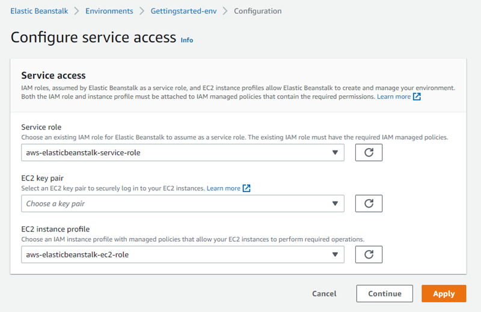

# Your AWS Elastic Beanstalk environment security

Elastic Beanstalk provides several options that control the service access (security) of your environment and of the Amazon EC2 instances in it. This topic discusses the
configuration of these options.

###### Sections

- [Configuring your environment security](#using-features.managing.security.console "#using-features.managing.security.console")
- [Environment security configuration namespaces](#using-features.managing.security.namespaces "#using-features.managing.security.namespaces")

## Configuring your environment security

You can modify your Elastic Beanstalk environment security configuration in the Elastic Beanstalk console.

###### To configure environment service access (security) in the Elastic Beanstalk console

1. Open the [Elastic Beanstalk console](https://console.aws.amazon.com/elasticbeanstalk "https://console.aws.amazon.com/elasticbeanstalk"),
   and in the **Regions** list, select your AWS Region.
2. In the navigation pane, choose **Environments**, and then choose the name of your environment from the list.
3. In the navigation pane, choose **Configuration**.
4. In the **Service access** configuration category, choose **Edit**.

The following settings are available.

###### Settings

- [Service role](#using-features.managing.security.servicerole "#using-features.managing.security.servicerole")
- [EC2 key pair](#using-features.managing.security.keypair "#using-features.managing.security.keypair")
- [IAM instance profile](#using-features.managing.security.profile "#using-features.managing.security.profile")

### Service role

Select a [service role](iam-servicerole.md "iam-servicerole.md") to associate with your Elastic Beanstalk environment. Elastic Beanstalk assumes the service role when it
accesses other AWS services on your behalf. For details, see [Managing Elastic Beanstalk service roles](iam-servicerole.md "iam-servicerole.md").

### EC2 key pair

You can securely log in to the Amazon Elastic Compute Cloud (Amazon EC2) instances provisioned for your Elastic Beanstalk application with an Amazon EC2 key pair. For instructions on
creating a key pair, see [Creating a Key Pair Using Amazon EC2](../../../AWSEC2/latest/UserGuide/ec2-key-pairs.md#having-ec2-create-your-key-pair "../../../AWSEC2/latest/UserGuide/ec2-key-pairs.md#having-ec2-create-your-key-pair") in
the _Amazon EC2 User Guide_.

###### Note

When you create a key pair, Amazon EC2 stores a copy of your public key. If you no longer need to use it to connect to any environment instances, you
can delete it from Amazon EC2. For details, see [Deleting Your Key Pair](../../../AWSEC2/latest/UserGuide/ec2-key-pairs.md#delete-key-pair "../../../AWSEC2/latest/UserGuide/ec2-key-pairs.md#delete-key-pair") in the
_Amazon EC2 User Guide_.

Choose an **EC2 key pair** from the drop-down menu to assign it to your environment's instances. When you assign a key pair, the
public key is stored on the instance to authenticate the private key, which you store locally. The private key is never stored on AWS.

For more information about connecting to Amazon EC2 instances, see [Connect to Your Instance](../../../AWSEC2/latest/UserGuide/AccessingInstances.md "../../../AWSEC2/latest/UserGuide/AccessingInstances.md")
and [Connecting to Linux/UNIX Instances from Windows using PuTTY](../../../AWSEC2/latest/UserGuide/putty.md "../../../AWSEC2/latest/UserGuide/putty.md") in the _Amazon EC2 User Guide_.

### IAM instance profile

An EC2 [instance profile](concepts-roles-instance.md "concepts-roles-instance.md") is an IAM role that is applied to instances launched in your Elastic Beanstalk
environment. Amazon EC2 instances assume the instance profile role to sign requests to AWS and access APIs, for example, to upload logs to Amazon S3.

The first time you create an environment in the Elastic Beanstalk console, Elastic Beanstalk prompts you to create an instance profile with a default set of permissions.
You can add permissions to this profile to provide your instances access to other AWS services. For details, see [Managing Elastic Beanstalk instance profiles](iam-instanceprofile.md "iam-instanceprofile.md").

###### Note

Previously Elastic Beanstalk created a default EC2 instance profile named `aws-elasticbeanstalk-ec2-role` the first time an AWS account
created an environment. This instance profile included default managed policies. If your account already has this instance profile,
it will remain available for you to assign to your environments.

However, recent AWS security guidelines don’t allow an AWS service to automatically create roles with trust policies to other AWS services, EC2 in
this case. Because of these security guidelines, Elastic Beanstalk no longer creates a default `aws-elasticbeanstalk-ec2-role` instance profile.

###### Note

There is another aspect of EC2 instance security that designates firewall rules for EC2 instances.
This is controlled by EC2 security groups.
For more information, see
[The Amazon EC2 instances for your Elastic Beanstalk environment](using-features.managing.md "using-features.managing.md").

## Environment security configuration namespaces

Elastic Beanstalk provides [configuration options](command-options.md "command-options.md") in the following namespaces to enable you to customize the security of
your environment:

- [aws:elasticbeanstalk:environment](command-options-general.md#command-options-general-elasticbeanstalkenvironment "command-options-general.md#command-options-general-elasticbeanstalkenvironment") – Configure the
  environment's service role using the `ServiceRole` option.
- [aws:autoscaling:launchconfiguration](command-options-general.md#command-options-general-autoscalinglaunchconfiguration "command-options-general.md#command-options-general-autoscalinglaunchconfiguration") – Configure
  permissions for the environment's Amazon EC2 instances using the
  `EC2KeyName`, `IamInstanceProfile`, `DisableDefaultEC2SecurityGroup`, and `SecurityGroups` options.

The EB CLI and Elastic Beanstalk console apply recommended values for the preceding options.
You must remove these settings if you want to use configuration files to configure the same. See
[Recommended values](command-options.md#configuration-options-recommendedvalues "command-options.md#configuration-options-recommendedvalues") for details.
