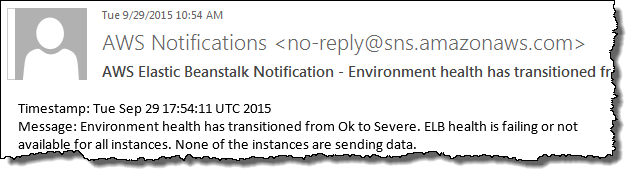

# Elastic Beanstalk environment notifications with Amazon SNS

You can configure your AWS Elastic Beanstalk environment to use Amazon Simple Notification Service (Amazon SNS) to notify you of important events that affect your application. To receive emails
from AWS whenever an error occurs or the health of your environment changes, specify an email address when you create an environment or later on.

###### Note

Elastic Beanstalk uses Amazon SNS for notifications. For information about Amazon SNS pricing, see [https://aws.amazon.com/sns/pricing/](https://aws.amazon.com/sns/pricing/ "https://aws.amazon.com/sns/pricing/").

When you configure notifications for your environment, Elastic Beanstalk creates an Amazon SNS topic for your environment on your behalf. To send messages to an Amazon SNS
topic, Elastic Beanstalk must have the required permission. For more information, see [Configuring permissions to send notifications](#configuration-notifications-permissions "#configuration-notifications-permissions").

When a notable [event](using-features.md "using-features.md") occurs, Elastic Beanstalk sends a message to the topic. Then, Amazon SNS relays the messages that it
receives to the topic's subscribers. Notable events include environment creation errors and all changes in [environment and
instance health](health-enhanced.md "health-enhanced.md"). Events for Amazon EC2 Auto Scaling operations (like adding and removing instances from the environment) and other informational events don't
trigger notifications.


You can enter an email address in the Elastic Beanstalk console when you create an environment or sometime afterwards. This will create an Amazon SNS topic and subscribe
to it. Elastic Beanstalk manages the lifecycle of the topic, and deletes it when your environment is terminated or when you remove your email address in the [environment management console](environments-console.md "environments-console.md").

The `aws:elasticbeanstalk:sns:topics` namespace provides options for configuring an Amazon SNS topic by using configuration files, a CLI, or an
SDK. By using one of these methods, you can configure the type of subscriber and the endpoint. For type of subscriber, you can choose an Amazon SQS queue or HTTP
URL.

You can only turn Amazon SNS notifications on or off. The frequency of notifications sent to the topic can be high, depending on the size and composition of
your environment. For configuring notifications to be sent on specific circumstances, you have other options. You can [set up event-driven rules](AWSHowTo.md "AWSHowTo.md") with Amazon EventBridge that notify you when Elastic Beanstalk emits events that meet specific criteria. Or, alternatively, you can [configure your environment to publish custom metrics](health-enhanced-cloudwatch.md "health-enhanced-cloudwatch.md") and [set Amazon CloudWatch
alarms](using-features.md "using-features.md") to notify you when those metrics reach an unhealthy threshold.

## Configuring notifications using the Elastic Beanstalk console

You can enter an email address in the Elastic Beanstalk console to create an Amazon SNS topic for your environment.

###### To configure notifications in the Elastic Beanstalk console

1. Open the [Elastic Beanstalk console](https://console.aws.amazon.com/elasticbeanstalk "https://console.aws.amazon.com/elasticbeanstalk"),
   and in the **Regions** list, select your AWS Region.
2. In the navigation pane, choose **Environments**, and then choose the name of your environment from the list.
3. In the navigation pane, choose **Configuration**.
4. In the **Updates, monitoring, and logging** configuration category, choose **Edit**.
5. Scroll down to the **Email notifications** section.
6. Enter an email address.
7. To save the changes choose **Apply** at the bottom of the page.

When you enter an email address for notifications, Elastic Beanstalk creates an Amazon SNS topic for your environment and adds a subscription. Amazon SNS sends an email to
the subscribed address to confirm the subscription. You must click the link in the confirmation email to activate the subscription and receive
notifications.

## Configuring notifications using configuration options

Use the options in the [aws:elasticbeanstalk:sns:topics namespace](command-options-general.md#command-options-general-elasticbeanstalksnstopics "command-options-general.md#command-options-general-elasticbeanstalksnstopics")
to configure Amazon SNS notifications for your environment. You can set these options by using [configuration files](ebextensions.md "ebextensions.md"), a CLI,
or an SDK.

- Notification Endpoint – The email address, Amazon SQS queue, or URL to send notifications to. If you set this
  option, then an SQS queue and a subscription for the specified endpoint are created. If the endpoint isn't an email address, you must also set the
  `Notification Protocol` option. SNS validates the value of `Notification Endpoint` based on the value of `Notification
Protocol`. Setting this option multiple times creates additional subscriptions to the topic. If you remove this option, the topic is
  deleted.
- Notification Protocol – The protocol that's used to send notifications to the `Notification
Endpoint`. This option defaults to `email`. Set this option to `email-json` to send JSON-formatted emails,
  `http` or `https` to post JSON-formatted notifications to an HTTP endpoint, or `sqs` to send notifications to an
  SQS queue.

###### Note

AWS Lambda notifications aren't supported.

- Notification Topic ARN – After setting a notification endpoint for your environment, read this setting to
  get the ARN of the SNS topic. You can also set this option to use an existing SNS topic for notifications. A topic that you attach to your environment
  though this option isn't deleted when you change this option or terminate the environment.

To configure Amazon SNS notifications, you need to have the required permissions. If your IAM user uses the Elastic Beanstalk **AdministratorAccess-AWSElasticBeanstalk**
[managed user policy](AWSHowTo.iam.md "AWSHowTo.iam.md"), then you should already have the required permissions to configure the
default Amazon SNS topic that Elastic Beanstalk creates for your environment. However, if you configure an Amazon SNS topic that Elastic Beanstalk doesn't manage, then you need to add
the following policy to your user role.

JSON

```
`{
 "Version":"2012-10-17",
 "Statement": [
 {
 "Effect": "Allow",
 "Action": [
 "sns:SetTopicAttributes",
 "sns:GetTopicAttributes",
 "sns:Subscribe",
 "sns:Unsubscribe",
 "sns:Publish"
 ],
 "Resource": [
 "arn:aws:sns:`us-east-2`:`123456789012`:`sns_topic_name`"
 ]
 }
 ]
}`

```

- Notification Topic Name – Set this option to customize the name of the Amazon SNS topic used for environment
  notifications. If a topic with the same name already exists, Elastic Beanstalk attaches that topic to the environment.

###### Warning

If you attach an existing SNS topic to an environment with `Notification Topic Name`, Elastic Beanstalk will delete the topic in the event that
you terminate the environment or change this setting sometime in the future.

If you change this option, the `Notification Topic ARN` is also changed. If a topic is already attached to the environment, Elastic Beanstalk
deletes the old topic and creates a new topic and subscription.

By using a custom topic name, you must also provide an ARN of an externally created custom topic. The managed user policy doesn't automatically
detect a topic with a custom name, so you must provide custom Amazon SNS permissions to your IAM users. Use a policy similar to the one that's used for a
custom topic ARN, but include the following additions:

    + Include two more actions in the `Actions` list, specifically: `sns:CreateTopic`, `sns:DeleteTopic`
    + If you're changing the `Notification Topic Name` from one custom topic name to another, you must also include the ARNs of both
     topics in the `Resource` list. Alternatively, include a regular expression that covers both topics. This way Elastic Beanstalk has permissions to
     delete the old topic and create the new one.

The EB CLI and Elastic Beanstalk console apply recommended values for the preceding options.
You must remove these settings if you want to use configuration files to configure the same. See
[Recommended values](command-options.md#configuration-options-recommendedvalues "command-options.md#configuration-options-recommendedvalues") for details.

## Configuring permissions to send notifications

This section discusses security considerations that are related to notifications that use Amazon SNS. There are two distinct cases:

- Use the default Amazon SNS topic that Elastic Beanstalk creates for your environment.
- Provide an external Amazon SNS topic through configuration options.

The default access policy for an Amazon SNS topic allows only the topic owner to publish or subscribe to it. However, through the proper policy
configuration, Elastic Beanstalk can be granted permission to publish to an Amazon SNS topic in either one of the two cases described in this section. The following
subsections provide more information.

### Permissions for a default topic

When you configure notifications for your environment, Elastic Beanstalk creates an Amazon SNS topic for your environment. To send messages to an Amazon SNS topic, Elastic Beanstalk
must have the required permission. If your environment uses the [service role](iam-servicerole.md "iam-servicerole.md") that the Elastic Beanstalk console or the EB CLI
generated for it, or your account's [monitoring service-linked role](using-service-linked-roles-monitoring.md "using-service-linked-roles-monitoring.md"), then you don't need to
do anything else. These managed roles include the necessary permission that allows Elastic Beanstalk to send messages to the Amazon SNS topic.

However, if you provided a custom service role when you created your environment, make sure that this custom service role includes the following
policy.

JSON

```
`{
 "Version":"2012-10-17",
 "Statement": [
 {
 "Effect": "Allow",
 "Action": [
 "sns:Publish"
 ],
 "Resource": [
 "arn:aws:sns:`us-east-2`:`123456789012`:ElasticBeanstalkNotifications*"
 ]
 }
 ]
}`

```

### Permissions for an external topic

[Configuring notifications using configuration options](#configuration-notifications-namespace "#configuration-notifications-namespace") explains how you can replace the Amazon SNS
topic that Elastic Beanstalk provides with another Amazon SNS topic. If you replaced the topic, Elastic Beanstalk must verify that you have permission to publish to this SNS topic
for you to be able to associate the SNS topic with the environment. You should have `sns:Publish`. The service role uses the same permission.
To verify that this is the case, Elastic Beanstalk sends a test notification to SNS as part of your action to create or update the environment. If this test fails,
then your attempt to create or update the environment also fails. Elastic Beanstalk displays a message that explains the reason for this failure.

If you provide a custom service role for your environment, make sure that your custom service role includes the following policy to allow Elastic Beanstalk to
send messages to the Amazon SNS topic. In the following code, replace `sns_topic_name` with the name of the Amazon SNS topic
that you provided in the configuration options.

JSON

```
`{
 "Version":"2012-10-17",
 "Statement": [
 {
 "Effect": "Allow",
 "Action": [
 "sns:Publish"
 ],
 "Resource": [
 "arn:aws:sns:`us-east-2`:`123456789012`:`sns_topic_name`"
 ]
 }
 ]
}`

```

For more information about Amazon SNS access control, see [Example cases
for Amazon SNS access control](../../../sns/latest/dg/sns-access-policy-use-cases.md "../../../sns/latest/dg/sns-access-policy-use-cases.md") in the _Amazon Simple Notification Service Developer Guide_.
