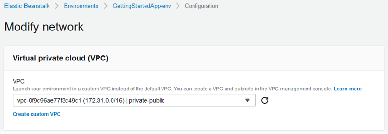
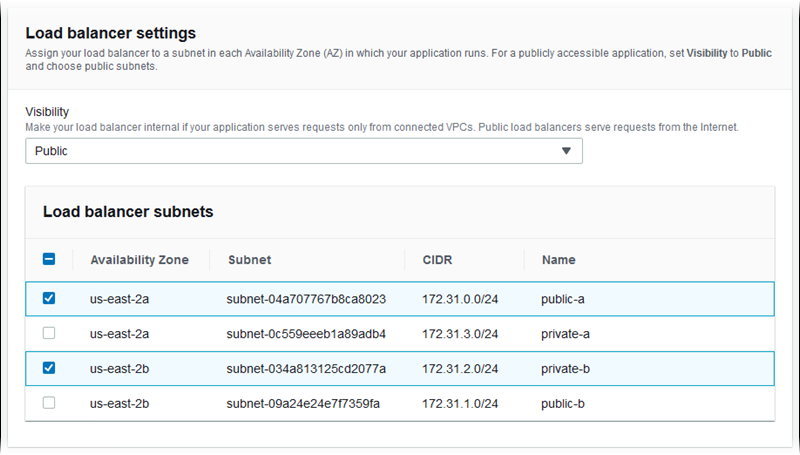
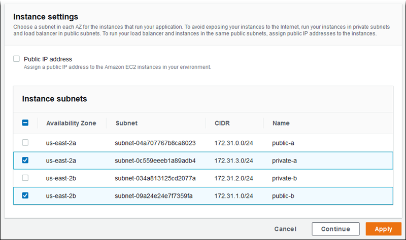

# Configuring Amazon Virtual Private Cloud (Amazon VPC) with Elastic Beanstalk

[Amazon Virtual Private Cloud](../../../vpc/latest/userguide.md "../../../vpc/latest/userguide.md") (Amazon VPC) is the networking service that routes traffic securely to the EC2 instances that run your
application in Elastic Beanstalk. If you don't configure a VPC when you launch your environment, Elastic Beanstalk uses the default VPC.

You can launch your environment in a custom VPC to customize networking and security settings. Elastic Beanstalk lets you choose which subnets to use for your
resources, and how to configure IP addresses for the instances and load balancer in your environment. An environment is locked to a VPC when you create it,
but you can change subnet and IP address settings on a running environment.

## Configuring VPC settings in the Elastic Beanstalk console

If you chose a custom VPC when you created your environment, you can modify its VPC settings in the Elastic Beanstalk console.

###### To configure your environment's VPC settings

1. Open the [Elastic Beanstalk console](https://console.aws.amazon.com/elasticbeanstalk "https://console.aws.amazon.com/elasticbeanstalk"),
   and in the **Regions** list, select your AWS Region.
2. In the navigation pane, choose **Environments**, and then choose the name of your environment from the list.
3. In the navigation pane, choose **Configuration**.
4. In the **Network** configuration category, choose **Edit**.

The following settings are available.

###### Options

- [VPC](#environments-cfg-vpc-console-vpc "#environments-cfg-vpc-console-vpc")
- [Load balancer visibility](#environments-cfg-vpc-console-lbvisibility "#environments-cfg-vpc-console-lbvisibility")
- [Load balancer subnets](#environments-cfg-vpc-console-lbsubnets "#environments-cfg-vpc-console-lbsubnets")
- [Instance public IP address](#environments-cfg-vpc-console-ec2ip "#environments-cfg-vpc-console-ec2ip")
- [Instance subnets](#environments-cfg-vpc-console-ec2subnets "#environments-cfg-vpc-console-ec2subnets")
- [Database subnets](#environments-cfg-vpc-console-dbsubnets "#environments-cfg-vpc-console-dbsubnets")

### VPC

Choose a VPC for your environment. You can only change this setting during environment creation.



### Load balancer visibility

For a load-balanced environment, choose the load balancer scheme. By default, the load balancer is public, with a public IP address and domain name.
If your application only serves traffic from within your VPC or a connected VPN, deselect this option and choose private subnets for your load balancer
to make the load balancer internal and disable access from the Internet.

### Load balancer subnets

For a load-balanced environment, choose the subnets that your load balancer uses to serve traffic. For a public application, choose public subnets.
Use subnets in multiple availability zones for high availability. For an internal application, choose private subnets and disable load balancer
visibility.



### Instance public IP address

If you choose public subnets for your application instances, enable public IP addresses to make them routable from the Internet.

### Instance subnets

Choose subnets for your application instances. Choose at least one subnet for each availability zone that your load balancer uses. If you choose
private subnets for your instances, your VPC must have a NAT gateway in a public subnet that the instances can use to access the Internet.



### Database subnets

When you run an Amazon RDS database attached to your Elastic Beanstalk environment, choose subnets for your database instances. For high availability, make the
database multi-AZ and choose a subnet for each availability zone. To ensure that your application can connect to your database, run both in the same
subnets.

## The aws:ec2:vpc namespace

You can use the configuration options in the `aws:ec2:vpc` namespace to configure
your environment's network settings.

The following [configuration file](ebextensions.md "ebextensions.md") uses options in this namespace to set the environment's VPC and subnets for a
public-private configuration. In order to set the VPC ID in a configuration file, the file must be included in the application source bundle during
environment creation. See [Setting configuration options during environment creation](environment-configuration-methods-during.md "environment-configuration-methods-during.md") for other
methods of configuring these settings during environment creation.

###### Example .ebextensions/vpc.config – Public-private

```
option_settings:
   aws:ec2:vpc:
      VPCId: vpc-087a68c03b9c50c84
      AssociatePublicIpAddress: 'false'
      ELBScheme: public
      ELBSubnets: subnet-0fe6b36bcb0ffc462,subnet-032fe3068297ac5b2
      Subnets: subnet-026c6117b178a9c45,subnet-0839e902f656e8bd1
```

This example shows a public-public configuration, where the load balancer and EC2 instances run in the same public subnets.

###### Example .ebextensions/vpc.config – Public-public

```
option_settings:
   aws:ec2:vpc:
      VPCId: vpc-087a68c03b9c50c84
      AssociatePublicIpAddress: 'true'
      ELBScheme: public
      ELBSubnets: subnet-0fe6b36bcb0ffc462,subnet-032fe3068297ac5b2
      Subnets: subnet-0fe6b36bcb0ffc462,subnet-032fe3068297ac5b2
```
