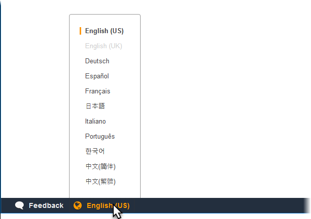

# Release: AWS Elastic Beanstalk console adds more languages on November 2, 2018

Elastic Beanstalk console added several new languages.

**Release date:** November 2, 2018

## Changes

Elastic Beanstalk added support for the following languages:

- German
- Spanish
- Italian
- Portuguese (Brazil)
- Chinese (Traditional)

To change the console language, open the language selection menu at the bottom bar, and then select the desired language.

