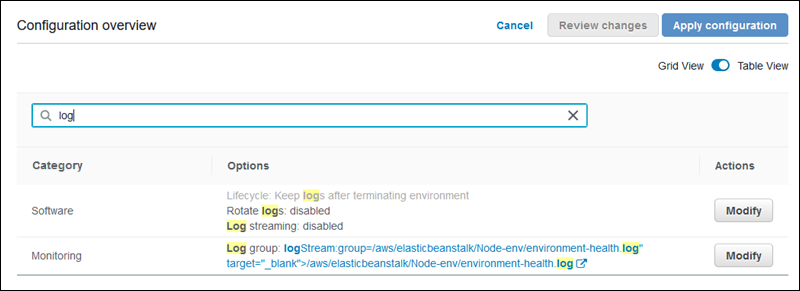

# Release: Elastic Beanstalk console adds environment configuration option search on June 18, 2019

The Elastic Beanstalk console adds a new table view to environment configuration. You can search for options by name or value.

**Release date:** June 18, 2019

## Changes

The environment configuration page in the Elastic Beanstalk console has several configuration categories, each with a group of options. Previously, the page showed
a summary for each category on a configuration card (the **Grid View**). Finding the right category to edit when you needed to change a
particular option was a challenge.

Starting with today's release, the Elastic Beanstalk console adds an alternative **Table View**, which shows all configuration options in a table,
grouped by category. You can search for an option by its name or value by entering search terms into a search box. As you type, the list gets shorter and
shows only options that match your search terms.

For more information about configuring environment options, see [AWS Elastic Beanstalk Environment
Configuration](../dg/customize-containers.md "../dg/customize-containers.md") in the _AWS Elastic Beanstalk Developer Guide_.
