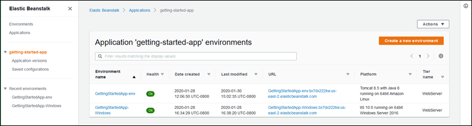
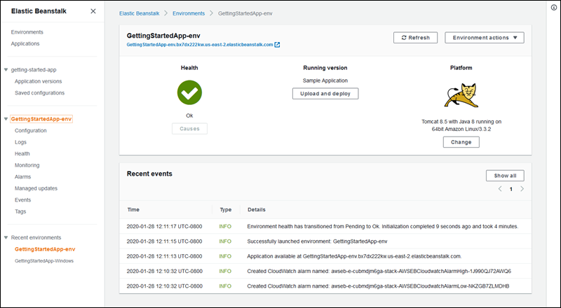

# Release: Elastic Beanstalk console gets a new design on April 8, 2020

The Elastic Beanstalk console gets an updated design and a new navigation user interface.

**Release date:** April 8, 2020

## Changes

Today we're introducing some significant design changes in the Elastic Beanstalk console. When you sign in to the console, you'll notice a new way to navigate to
the console's various pages. At the top level, you'll see two lists—all your environments and all your applications. These lists let you choose more
specific pages and manage different aspects of your Elastic Beanstalk solution.

In addition, you'll see a new visual design with cleaner looking panes, lists, forms and tables.

You can complete the same tasks as before using this new design. There's no change in the console's functionality.

###### Important

The new console version uses a new API action, [ListPlatformBranches](../api/API_ListPlatformBranches.md "../api/API_ListPlatformBranches.md"), for some of its
functionality. Therefore, if your environment uses a custom user policy, be sure to add the `elasticbeanstalk:ListPlatformBranches`
permission to your policy.

For details about user policies, see [Managing Elastic Beanstalk user policies](../dg/AWSHowTo.iam.md "../dg/AWSHowTo.iam.md").

To try out our new console design, open the [Elastic Beanstalk console](https://console.aws.amazon.com/elasticbeanstalk/home "https://console.aws.amazon.com/elasticbeanstalk/home").
