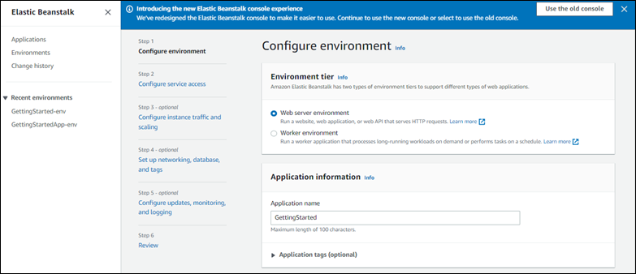
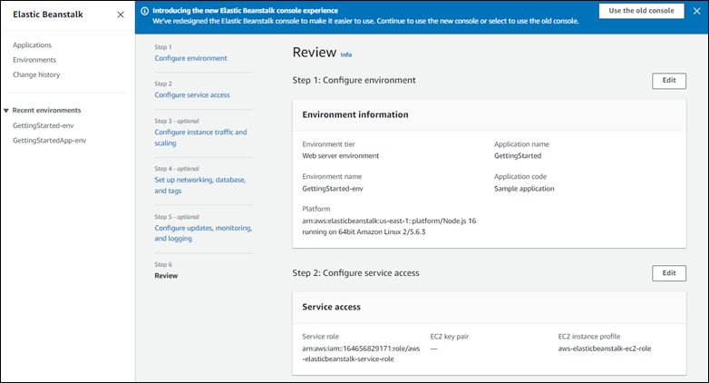
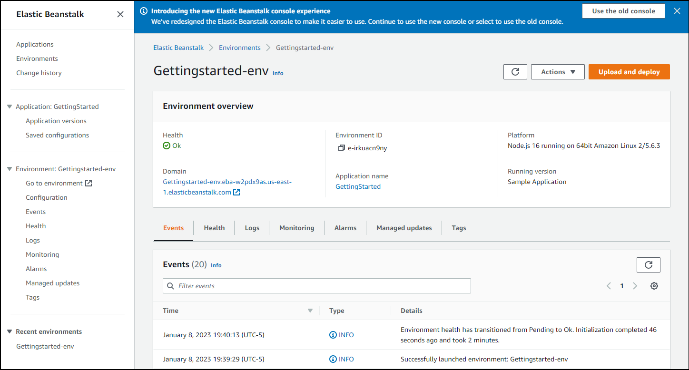
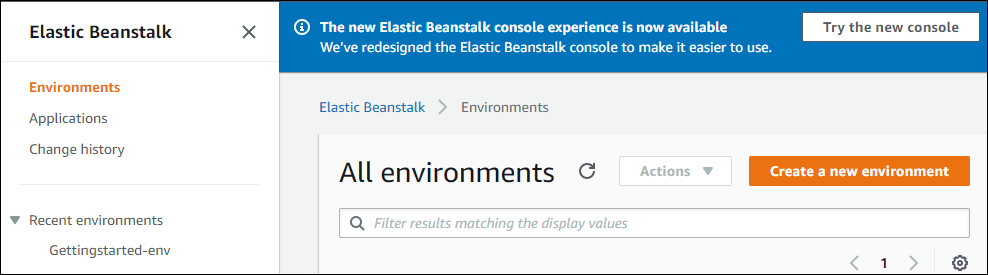

# Release: Elastic Beanstalk launches beta release of new console design on January 10, 2023

AWS Elastic Beanstalk launches beta release of new console design in AWS Region _US East (N. Virginia) – us-east-1_.

**Release date:** January 10, 2023

## Changes

Today we're starting a public beta release of the new Elastic Beanstalk console experience. The beta console is available in the AWS Region
_US East (N. Virginia) – us-east-1_ to any customers who would like to try it out.

The **Create environment** wizard has been redesigned to provide an intuitive flow with clear next steps. You can see the steps at a
high level and easily identify which ones are optional. After you complete all of the desired and required information, all of your choices are summarized
in a final review panel.

To manage and monitor the environments of your existing applications, the **Environment overview** page shows a tabbed view of main
environment details, including a list of recent environment-generated events, environment health, and monitoring metrics.

While using the new beta console, you always have the option to return to the old console by selecting the **Use the old console**
button on the console banner. This could be helpful if you should you run into issues when using the beta console. You can switch back and forth between
the old and new console with the banner buttons.

###### Notes

- This is a beta release, and we recommend that you not use the beta console for production environments.
- We might modify some of the visual design details before the General Availability (GA) release.

To try out our new console experience, open the [Elastic Beanstalk console](https://console.aws.amazon.com/elasticbeanstalk "https://console.aws.amazon.com/elasticbeanstalk"). In the
**Regions** list, select **US East (N. Virginia) – us-east-1**. Then select the **Try the new console** button on the
console banner to switch to the new console interface.

