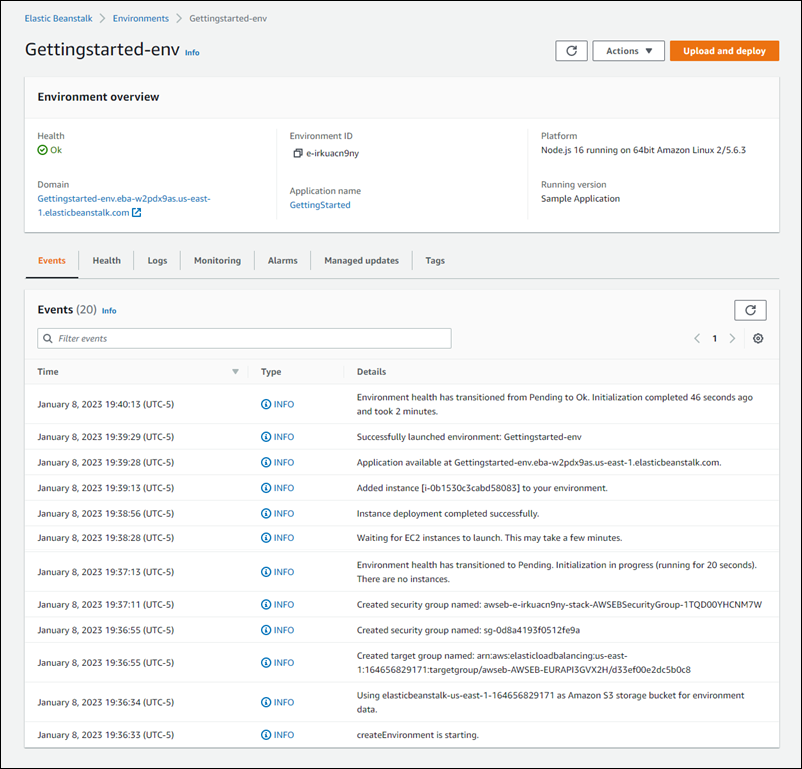

# Release: Elastic Beanstalk launches new console design in AWS Region Europe (Ireland) on March 15, 2023

AWS Elastic Beanstalk launches new console design in AWS Region _Europe (Ireland)_.

**Release date:** March 15, 2023

## Changes

Today we’re releasing a new console design in the AWS Region _Europe (Ireland) – eu-west-1_. This release introduces some significant design
changes in the Elastic Beanstalk console.

The **Create environment** wizard has been redesigned to provide an intuitive flow with clear next steps. You can see the steps at a
high level and easily identify which ones are optional. After you complete all of the desired and required information, all of your choices are summarized
in a final review panel.

To manage and monitor the environments of your existing applications, the **Environment overview** page shows a tabbed view of main
environment details, including a list of recent environment-generated events, environment health, and monitoring metrics.

To try out our new console experience in the AWS Region Europe (Ireland),
open the [Elastic Beanstalk
console](https://console.aws.amazon.com/elasticbeanstalk "https://console.aws.amazon.com/elasticbeanstalk"). In the **Regions** list, select _Europe (Ireland) – eu-west-1_.

###### Notes

- The new Elastic Beanstalk console design is being released in a phased rollout to all regions that Elastic Beanstalk supports.
- The new console design is presently available in the following AWS Regions:
  _Europe (Ireland)_,
  _Europe (Frankfurt)_,
  _Asia Pacific (Sydney)_,
  and beta release in _US East (N. Virginia)_.

To try out our new console experience in beta, open the [Elastic Beanstalk console](https://console.aws.amazon.com/elasticbeanstalk "https://console.aws.amazon.com/elasticbeanstalk"). In the
**Regions** list, select _US East (N. Virginia) – us-east-1_. Then select the **Try the new console** button on the
console banner to switch to the new console interface.
