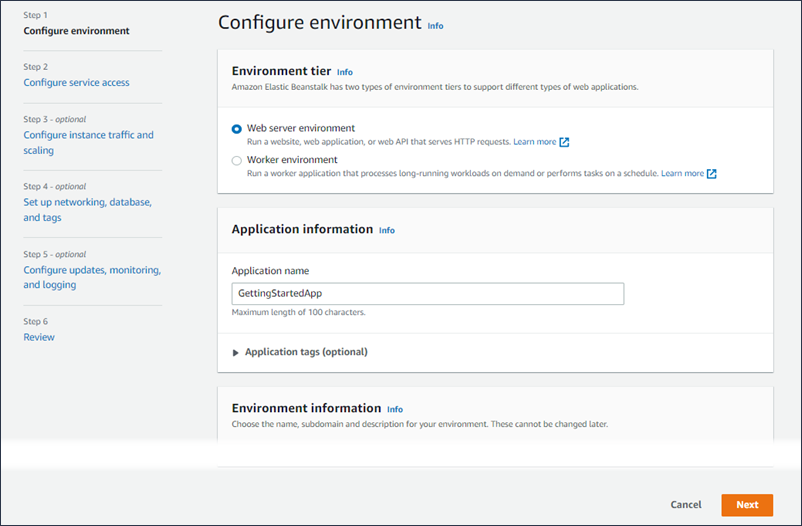
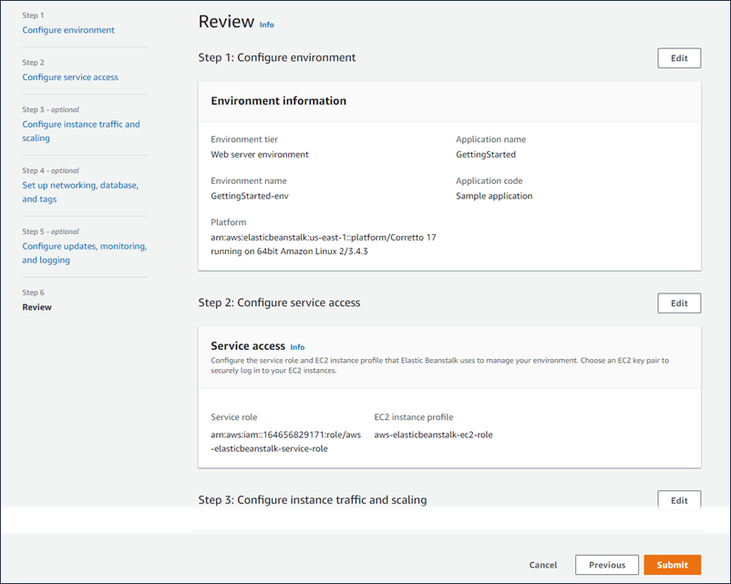
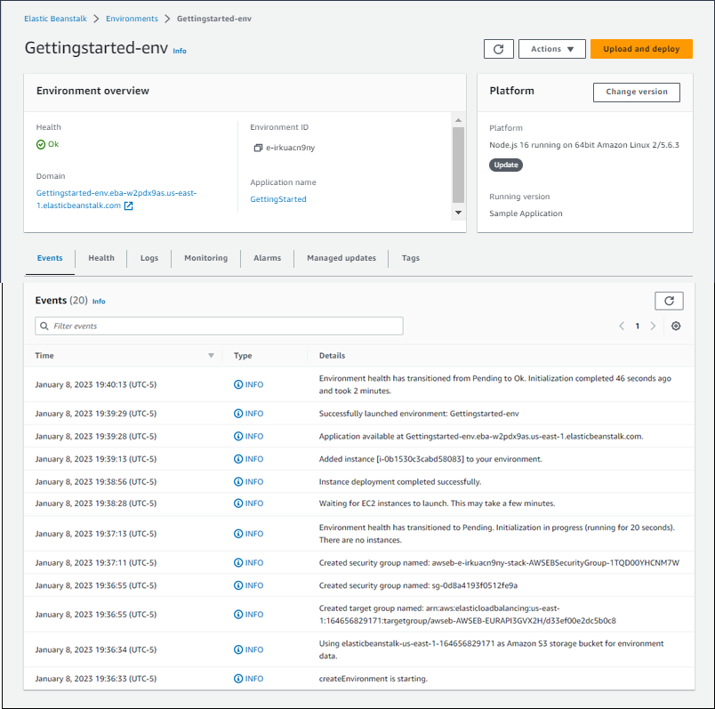

# Release: Elastic Beanstalk launches new console design in more AWS Regions on April 14, 2023

AWS Elastic Beanstalk launches new console design in AWS Regions: Africa (Cape Town), Asia Pacific (Hong Kong),
Asia Pacific (Jakarta), Europe (Milan), and Middle East (Bahrain).

**Release date:** April 14, 2023

## Changes

Today we’re releasing a new console design in the following AWS Regions:

- Africa (Cape Town) – af-south-1
- Asia Pacific (Hong Kong) – ap-east-1
- Asia Pacific (Jakarta) – ap-southeast-3
- Europe (Milan) – eu-south-1
- Middle East (Bahrain) – me-south-1

This release introduces some significant design changes in the Elastic Beanstalk console.

The **Create environment** wizard has been redesigned to provide an intuitive flow with clear next steps. You can see the steps at a
high level and easily identify which ones are optional. After you complete all of the desired and required information, all of your choices are summarized
in a final review panel.

To manage and monitor the environments of your existing applications, the **Environment overview** page shows a tabbed view of main
environment details, including a list of recent environment-generated events, environment health, and monitoring metrics.

To try out our new console experience in the regions where it's available open the [Elastic Beanstalk
console](https://console.aws.amazon.com/elasticbeanstalk "https://console.aws.amazon.com/elasticbeanstalk"). In the **Regions** list, select one of the regions listed on this page.

###### Note

The new Elastic Beanstalk console design is being released in a phased rollout to all regions that Elastic Beanstalk supports.

The new console design is presently available in the following AWS Regions:

- US East (N. Virginia) (in beta)
- Africa (Cape Town)
- Asia Pacific (Hong Kong)
- Asia Pacific (Jakarta)
- Asia Pacific (Sydney)
- Europe (Frankfurt)
- Europe (Ireland)
- Europe (Milan)
- Middle East (Bahrain)
- South America (São Paulo)

To try out our new console experience in beta, open the [Elastic Beanstalk console](https://console.aws.amazon.com/elasticbeanstalk "https://console.aws.amazon.com/elasticbeanstalk"). In the
**Regions** list, select _US East (N. Virginia) – us-east-1_. Then select the **Try the new console** button on the
console banner to switch to the new console interface.
