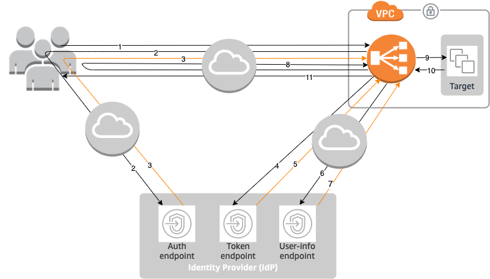

# Authenticate users using an Application Load Balancer

You can configure an Application Load Balancer to securely authenticate users as they access your
applications. This enables you to offload the work of authenticating users to your load
balancer so that your applications can focus on their business logic.

The following use cases are supported:

- Authenticate users through an identity provider (IdP) that is OpenID Connect
  (OIDC) compliant.
- Authenticate users through social IdPs, such as Amazon, Facebook, or Google,
  through the user pools supported by Amazon Cognito.
- Authenticate users through corporate identities, using SAML,
  OpenID Connect (OIDC), or OAuth, through the user pools supported by Amazon Cognito.

## Prepare to use an OIDC-compliant IdP

Do the following if you are using an OIDC-compliant IdP with your Application Load Balancer:

- Create a new OIDC app in your IdP. The IdP's DNS must be publicly
  resolvable.
- You must configure a client ID and a client secret.
- Get the following endpoints published by the IdP: authorization, token,
  and user info. You can locate this information in the config.
- The IdP endpoints certificates should be issued by a trusted public
  certificate authority.
- The DNS entries for the endpoints must be publicly resolvable, even if
  they resolve to private IP addresses.
- Allow one of the following redirect URLs in your IdP app, whichever your
  users will use, where DNS is the domain name of your load balancer and CNAME
  is the DNS alias for your application:
  - https://`DNS`/oauth2/idpresponse
  - https://`CNAME`/oauth2/idpresponse

## Prepare to use Amazon Cognito

Amazon Cognito integration for Application Load Balancers is available in the following regions:

- US East (N. Virginia)
- US East (Ohio)
- US West (N. California)
- US West (Oregon)
- Canada (Central)
- Canada West (Calgary)
- Europe (Stockholm)
- Europe (Milan)
- Europe (Frankfurt)
- Europe (Zurich)
- Europe (Ireland)
- Europe (London)
- Europe (Paris)
- Europe (Spain)
- South America (São Paulo)
- Asia Pacific (Hong Kong)
- Asia Pacific (Tokyo)
- Asia Pacific (Seoul)
- Asia Pacific (Osaka)
- Asia Pacific (Mumbai)
- Asia Pacific (Hyderabad)
- Asia Pacific (Singapore)
- Asia Pacific (Sydney)
- Asia Pacific (Jakarta)
- Asia Pacific (Melbourne)
- Middle East (UAE)
- Middle East (Bahrain)
- Africa (Cape Town)
- Israel (Tel Aviv)

Do the following if you are using Amazon Cognito user pools with your Application Load Balancer:

- Create a user pool. For more information, see [Amazon Cognito user
  pools](../../../cognito/latest/developerguide/cognito-user-pools.md "../../../cognito/latest/developerguide/cognito-user-pools.md") in the _Amazon Cognito Developer Guide_.
- Create a user pool client. You must configure the client to generate a
  client secret, use code grant flow, and support the same OAuth scopes that
  the load balancer uses. For more information, see [Configuring a
  user pool app client](../../../cognito/latest/developerguide/user-pool-settings-client-apps.md "../../../cognito/latest/developerguide/user-pool-settings-client-apps.md") in the
  _Amazon Cognito Developer Guide_.
- Create a user pool domain. For more information, see [Configure a
  user pool domain](../../../cognito/latest/developerguide/cognito-user-pools-assign-domain.md "../../../cognito/latest/developerguide/cognito-user-pools-assign-domain.md") in the
  _Amazon Cognito Developer Guide_.
- Verify that the requested scope returns an ID token. For example, the
  default scope, `openid` returns an ID token but the
  `aws.cognito.signin.user.admin` scope does not.
- To federate with a social or corporate IdP, enable the IdP in the
  federation section. For more information, see [User pool sign-in with a third party identity provider](../../../cognito/latest/developerguide/cognito-user-pools-identity-federation.md "../../../cognito/latest/developerguide/cognito-user-pools-identity-federation.md")
  in the _Amazon Cognito Developer Guide_.
- Allow the following redirect URLs in the callback URL field for Amazon Cognito,
  where DNS is the domain name of your load balancer, and CNAME is the DNS
  alias for your application (if you are using one):
  - https://`DNS`/oauth2/idpresponse
  - https://`CNAME`/oauth2/idpresponse

- Allow your user pool domain on your IdP app's callback URL. Use the format
  for your IdP. For example:
  - https://`domain-prefix`.auth.`region`.amazoncognito.com/saml2/idpresponse
  - https://`user-pool-domain`/saml2/idpresponse

The callback URL in the app client settings must use all lowercase letters.

To enable a user to configure a load balancer to use Amazon Cognito to authenticate
users, you must grant the user permission to call the
`cognito-idp:DescribeUserPoolClient` action.

## Prepare to use Amazon CloudFront

Enable the following settings if you are using a CloudFront distribution in front of
your Application Load Balancer:

- Forward request headers (all) — Ensures that CloudFront does not cache
  responses for authenticated requests. This prevents them from being served
  from the cache after the authentication session expires. Alternatively, to
  reduce this risk while caching is enabled, owners of a CloudFront distribution can
  set the time-to-live (TTL) value to expire before the authentication cookie
  expires.
- Query string forwarding and caching (all) — Ensures that the load
  balancer has access to the query string parameters required to authenticate
  the user with the IdP.
- Cookie forwarding (all) — Ensures that CloudFront forwards all
  authentication cookies to the load balancer.
- When configuring OpenID Connect (OIDC) authentication in conjunction with Amazon CloudFront,
  ensure that HTTPS port 443 is consistently used throughout the entire connection path.
  Otherwise, authentication failures can occur because the client OIDC redirect URLs
  do not match the port number of the originally generated URI.

## Configure user

authentication

You configure user authentication by creating an authenticate action for one or
more listener rules. The `authenticate-cognito` and
`authenticate-oidc` action types are supported only with HTTPS
listeners. For descriptions of the corresponding fields, see [AuthenticateCognitoActionConfig](../APIReference/API_AuthenticateCognitoActionConfig.md "../APIReference/API_AuthenticateCognitoActionConfig.md") and [AuthenticateOidcActionConfig](../APIReference/API_AuthenticateOidcActionConfig.md "../APIReference/API_AuthenticateOidcActionConfig.md") in the
_Elastic Load Balancing API Reference version 2015-12-01_.

The load balancer sends a session cookie to the client to maintain authentication
status. This cookie always contains the `secure` attribute, because user
authentication requires an HTTPS listener. This cookie contains the
`SameSite=None` attribute with CORS (cross-origin resource sharing)
requests.

For a load balancer supporting multiple applications that require independent
client authentication, each listener rule with an authenticate action should have a
unique cookie name. This ensures that clients are always authenticated with the IdP
before being routed to the target group specified in the rule.

Application Load Balancers do not support cookie values that are URL encoded.

By default, the `SessionTimeout` field is set to 7 days. If you want
shorter sessions, you can configure a session timeout as short as 1 second. For more
information, see [Session timeout](#session-timeout "#session-timeout").

Set the `OnUnauthenticatedRequest` field as appropriate for your
application. For example:

- Applications that require the user to log in using a
  social or corporate identity—This is supported by the
  default option, `authenticate`. If the user is not logged in, the
  load balancer redirects the request to the IdP authorization endpoint and
  the IdP prompts the user to log in using its user interface.
- Applications that provide a personalized view to a
  user that is logged in or a general view to a user that is not logged
  in—To support this type of application, use the
  `allow` option. If the user is logged in, the load balancer
  provides the user claims and the application can provide a personalized
  view. If the user is not logged in, the load balancer forwards the request
  without the user claims and the application can provide the general
  view.
- Single-page applications with JavaScript that loads
  every few seconds—If you use the `deny`
  option, the load balancer returns an HTTP 401 Unauthorized error to AJAX
  calls that have no authentication information. But if the user has expired
  authentication information, it redirects the client to the IdP authorization
  endpoint.

The load balancer must be able to communicate with the IdP token endpoint (`TokenEndpoint`)
and the IdP user info endpoint (`UserInfoEndpoint`). Application Load Balancers only support IPv4 when
communicating with these endpoints. If your IdP uses public addresses, ensure the security
groups for your load balancer and the network ACLs for your VPC allow access to the endpoints.
When using an internal load balancer or the **IP address type**
`dualstack-without-public-ipv4`, a NAT gateway can enable the load balancer to
communicate with the endpoints. For more information, see [NAT gateway basics](../../../vpc/latest/userguide/vpc-nat-gateway.md#nat-gateway-basics "../../../vpc/latest/userguide/vpc-nat-gateway.md#nat-gateway-basics")
in the _Amazon VPC User Guide_.

Use the following [create-rule](../../../cli/latest/reference/elbv2/create-rule.md "../../../cli/latest/reference/elbv2/create-rule.md") command to configure user authentication.

```
aws elbv2 create-rule \
    --listener-arn `listener-arn` \
    --priority `10` \
    --conditions Field=path-pattern,Values="`/login`" \
    --actions file://actions.json
```

The following is an example of the `actions.json` file that
specifies an `authenticate-oidc` action and a `forward`
action. `AuthenticationRequestExtraParams` allows you to pass extra
parameters to an IdP during authentication. Please follow documentation provided by
your identity provider to determine the fields that are supported

```
[{
    "Type": "authenticate-oidc",
    "AuthenticateOidcConfig": {
        "Issuer": "https://idp-issuer.com",
        "AuthorizationEndpoint": "https://authorization-endpoint.com",
        "TokenEndpoint": "https://token-endpoint.com",
        "UserInfoEndpoint": "https://user-info-endpoint.com",
        "ClientId": "abcdefghijklmnopqrstuvwxyz123456789",
        "ClientSecret": "123456789012345678901234567890",
        "SessionCookieName": "my-cookie",
        "SessionTimeout": 3600,
        "Scope": "email",
        "AuthenticationRequestExtraParams": {
            "display": "page",
            "prompt": "login"
        },
        "OnUnauthenticatedRequest": "deny"
    },
    "Order": 1
},
{
    "Type": "forward",
    "TargetGroupArn": "arn:aws:elasticloadbalancing:`region-code`:`account-id`:targetgroup/`target-group-nam`e/`target-group-id`",
    "Order": 2
}]
```

The following is an example of the `actions.json` file that
specifies an `authenticate-cognito` action and a `forward`
action.

```
[{
    "Type": "authenticate-cognito",
    "AuthenticateCognitoConfig": {
        "UserPoolArn": "arn:aws:cognito-idp:`region-code`:`account-id`:userpool/`user-pool-id`",
        "UserPoolClientId": "abcdefghijklmnopqrstuvwxyz123456789",
        "UserPoolDomain": "userPoolDomain1",
        "SessionCookieName": "my-cookie",
        "SessionTimeout": 3600,
        "Scope": "email",
        "AuthenticationRequestExtraParams": {
            "display": "page",
            "prompt": "login"
        },
        "OnUnauthenticatedRequest": "deny"
    },
    "Order": 1
},
{
    "Type": "forward",
    "TargetGroupArn": "arn:aws:elasticloadbalancing:`region-code`:`account-id`:targetgroup/`target-group-nam`e/`target-group-id`",
    "Order": 2
}]
```

For more information, see [Listener rules for your Application Load Balancer](listener-rules.md "listener-rules.md").

## Authentication flow

The following network diagram is a visual representation of how an Application Load Balancer uses OIDC
to authenticate users.



The numbered items below, highlight and explain elements shown in the preceding
network diagram.

1. User sends an HTTPS request to a website hosted behind an Application Load Balancer. When the
   conditions for a rule with an authenticate action are met, the load balancer
   checks for an authentication session cookie in the request headers.
2. If the cookie is not present, the load balancer redirects the user to the
   IdP authorization endpoint so that the IdP can authenticate the user.
3. After the user is authenticated, the IdP sends the user back to the load
   balancer with an authorization grant code.
4. The load balancer presents the authorization grant code to the IdP token
   endpoint.
5. Upon receiving a valid authorization grant code, the IdP provides the ID
   token and access token to the Application Load Balancer.
6. The Application Load Balancer then sends the access token to the user info endpoint.
7. The user info endpoint exchanges the access token for user claims.
8. The Application Load Balancer redirects the user with the `AWSELB` authentication
   session cookie to the original URI. Because most browsers limit the cookie
   size to 4K, the load balancer shards a cookie that is greater than 4K in
   size into multiple cookies. If the total size of the user claims and access
   token received from the IdP is greater than 11K bytes in size, the load
   balancer returns an HTTP 500 error to the client and increments the
   `ELBAuthUserClaimsSizeExceeded` metric.
9. The Application Load Balancer validates the cookie and forwards the user info to targets in
   the `X-AMZN-OIDC-*` HTTP headers set. For more information, see
   [User claims encoding and signature
   verification](#user-claims-encoding "#user-claims-encoding").
10. The target sends a response back to the Application Load Balancer.
11. The Application Load Balancer sends the final response to the user.

Every new request goes through steps 1 through 11, while subsequent requests go
through steps 9 through 11. That is, every subsequent request starts at step 9 as
long as the cookie has not expired.

The `AWSALBAuthNonce` cookie is added to the request header after the
user authenticates at the IdP. This does not change how the Application Load Balancer processes redirect
requests from the IdP.

If the IdP provides a valid refresh token in the ID token, the load balancer saves
the refresh token and uses it to refresh the user claims each time the access token
expires, until the session times out or the IdP refresh fails. If the user logs out,
the refresh fails and the load balancer redirects the user to the IdP authorization
endpoint. This enables the load balancer to drop sessions after the user logs out.
For more information, see [Session timeout](#session-timeout "#session-timeout").

###### Note

The cookie expiry is different from the authentication session expiry. The
cookie expiry is an attribute of the cookie, which is set to 7 days. The actual
length of the authentication session is determined by the session timeout
configured on the Application Load Balancer for the authentication feature. This session timeout is
included in the Auth cookie value, which is also encrypted.

## User claims encoding and signature

verification

After your load balancer authenticates a user successfully, it sends the user
claims received from the IdP to the target. The load balancer signs the user claim
so that applications can verify the signature and verify that the claims were sent
by the load balancer.

The load balancer adds the following HTTP headers:

`x-amzn-oidc-accesstoken`

The access token from the token endpoint, in plain text.

`x-amzn-oidc-identity`

The subject field (`sub`) from the user info endpoint, in
plain text.

**Note:** The sub claim is the best way to identify a given user.

`x-amzn-oidc-data`

The user claims, in JSON web tokens (JWT) format.

Access tokens and user claims are different from ID tokens. Access tokens and user
claims only allow access to server resources, while ID tokens carry additional
information to authenticate a user. The Application Load Balancer creates a new access token when
authenticating a user and only passes the access tokens and claims to the
backend, however it does not pass the ID token information.

These tokens follow the JWT format but are not ID tokens. The JWT format includes
a header, payload, and signature that are base64 URL encoded, and includes padding
characters at the end. An Application Load Balancer uses ES256 (ECDSA using P-256 and SHA256) to
generate the JWT signature.

The JWT header is a JSON object with the following fields:

```
{
   "alg": "`algorithm`",
   "kid": "`12345678`-`1234`-`1234`-`1234`-`123456789012`",
   "signer": "arn:aws:elasticloadbalancing:`region-code`:`account-id`:loadbalancer/app/`load-balancer-name`/`load-balancer-id`",
   "iss": "`url`",
   "client": "`client-id`",
   "exp": "`expiration`"
}
```

The JWT payload is a JSON object that contains the user claims received from the
IdP user info endpoint.

```
{
   "sub": "`1234567890`",
   "name": "`name`",
   "email": "`alias`@`example.com`",
   ...
}
```

If you want the load balancer to encrypt your user claims you must configure your target
group to use HTTPS. Also, as a security best practice we recommend you restrict your targets
to only receive traffic from your Application Load Balancer. You can achieve this by configuring your targets'
security group to reference the load balancer's security group ID.

To ensure security, you must verify the signature before doing any authorization based
on the claims and validate that the `signer` field in the JWT header contains
the expected Application Load Balancer ARN.

To get the public key, get the key ID from the JWT header and use it to look up the
public key from the endpoint. The endpoint for each AWS
Region is as follows:

```
https://public-keys.auth.elb.`region`.amazonaws.com/`key-id`
```

For AWS GovCloud (US), the endpoints are as follows:

```
https://s3-us-gov-west-1.amazonaws.com/aws-elb-public-keys-prod-us-gov-west-1/`key-id`
https://s3-us-gov-east-1.amazonaws.com/aws-elb-public-keys-prod-us-gov-east-1/`key-id`
```

AWS provides a library that you can use to verify JWTs signed by Amazon Cognito, Application Load Balancers, and other OIDC-compatible IDPs.
For more information, see [AWS JWT Verify](https://github.com/awslabs/aws-jwt-verify?tab=readme-ov-file "https://github.com/awslabs/aws-jwt-verify?tab=readme-ov-file").

## Timeout

### Session timeout

The refresh token and the session timeout work together as follows:

- If the session timeout is shorter than the access token expiration,
  the load balancer honors the session timeout. If the user has an active
  session with the IdP, the user might not be prompted to log in again.
  Otherwise, the user is redirected to log in.
  - If the IdP session timeout is longer than the Application Load Balancer session
    timeout, the user does not have to supply credentials to log in
    again. Instead, the IdP redirects back to the Application Load Balancer with a new
    authorization grant code. Authorization codes are single use,
    even if there is no re-login.
  - If the IdP session timeout is equal to or shorter than the
    Application Load Balancer session timeout, the user is asked to supply credentials
    to log in again. After the user logs in, IdP redirects back to
    the Application Load Balancer with a new authorization grant code, and the rest of
    the authentication flow continues until the request reaches the
    backend.

- If the session timeout is longer than the access token expiration and
  the IdP does not support refresh tokens, the load balancer keeps the
  authentication session until it times out. Then, it has the user log in
  again.
- If the session timeout is longer than the access token expiration and
  the IdP supports refresh tokens, the load balancer refreshes the user
  session each time the access token expires. The load balancer has the
  user log in again only after the authentication session times out or the
  refresh flow fails.

### Client login timeout

A client must initiate and complete the authentication process within 15
minutes. If a client fails to complete authentication within the 15-minute
limit, it receives an HTTP 401 error from the load balancer. This timeout can't
be changed or removed.

For example, if a user loads the login page through the Application Load Balancer, they must
complete the login process within 15 minutes. If the user waits and then
attempts to log in after the 15-minute timeout has expired, the load balancer
returns an HTTP 401 error. The user will have to refresh the page and attempt
logging in again.

## Authentication logout

When an application needs to log out an authenticated user, it should set the
expiration time of the authentication session cookie to -1 and redirect the client
to the IdP logout endpoint (if the IdP supports one). To prevent users from reusing
a deleted cookie, we recommend that you configure as short an expiration time for
the access token as is reasonable. If a client provides the load balancer with a
session cookie that has an expired access token with a non-NULL refresh token, the
load balancer contacts the IdP to determine whether the user is still logged
in.

Client logout landing pages are unauthenticated. This means that they
cannot be behind an Application Load Balancer rule that requires authentication.

- When a request is sent to the target, the application must set the expiry
  to -1 for all authentication cookies. Application Load Balancers support cookies up to 16K in
  size and can therefore create up to 4 shards to send to the client.
  - If the IdP has a logout endpoint, it should issue a redirect to
    the IdP logout endpoint, for example, the [LOGOUT Endpoint](../../../cognito/latest/developerguide/logout-endpoint.md "../../../cognito/latest/developerguide/logout-endpoint.md")
    documented in the _Amazon Cognito Developer Guide_.
  - If the IdP does not have a logout endpoint, the request goes back
    to the client logout landing page, and the login process is
    restarted.

- Assuming that the IdP has a logout endpoint, the IdP must expire access
  tokens and refresh tokens, and redirect the user back to the client logout
  landing page.
- Subsequent requests follow the original authentication flow.
