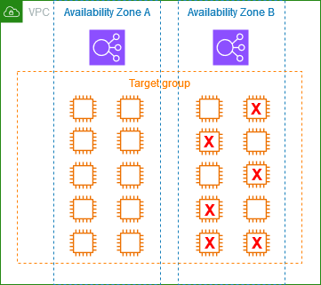

# Target groups for your Application Load Balancers

Target groups route requests to individual registered targets, such as EC2 instances,
using the protocol and port number that you specify. You can register a target with multiple
target groups. You can configure health checks on a per target group basis. Health checks are
performed on all targets registered to a target group that is specified in a listener rule for
your load balancer.

Each target group is used to route requests to one or more registered targets. When you
create each listener rule, you specify a target group and conditions. When a rule condition
is met, traffic is forwarded to the corresponding target group. You can create different
target groups for different types of requests. For example, create one target group for
general requests and other target groups for requests to the microservices for your
application. You can use each target group with only one load balancer. For more
information, see [Application Load Balancer components](introduction.md#application-load-balancer-components "introduction.md#application-load-balancer-components").

You define health check settings for your load balancer on a per target group basis. Each
target group uses the default health check settings, unless you override them when you
create the target group or modify them later on. After you specify a target group in a rule
for a listener, the load balancer continually monitors the health of all targets registered
with the target group that are in an Availability Zone enabled for the load balancer. The
load balancer routes requests to the registered targets that are healthy.

###### Contents

- [Routing configuration](#target-group-routing-configuration "#target-group-routing-configuration")
- [Target type](#target-type "#target-type")
- [IP address type](#target-group-ip-address-type "#target-group-ip-address-type")
- [Protocol version](#target-group-protocol-version "#target-group-protocol-version")
- [Registered targets](#registered-targets "#registered-targets")
- [Target group attributes](#target-group-attributes "#target-group-attributes")
- [Target group health](#target-group-health "#target-group-health")
- [Create a target group](create-target-group.md "create-target-group.md")
- [Configure health checks](target-group-health-checks.md "target-group-health-checks.md")
- [Edit target group attributes](edit-target-group-attributes.md "edit-target-group-attributes.md")
- [Register targets](target-group-register-targets.md "target-group-register-targets.md")
- [Use Lambda functions as targets](lambda-functions.md "lambda-functions.md")
- [Tag a target group](target-group-tags.md "target-group-tags.md")
- [Delete a target group](delete-target-group.md "delete-target-group.md")

## Routing configuration

By default, a load balancer routes requests to its targets using the protocol and port
number that you specified when you created the target group. Alternatively, you can
override the port used for routing traffic to a target when you register it with the
target group.

Target groups support the following protocols and ports:

- **Protocols**: HTTP, HTTPS
- **Ports**: 1-65535

When a target group is configured with the HTTPS protocol or uses HTTPS health checks,
if any HTTPS listener is using a TLS 1.3 security policy, the
`ELBSecurityPolicy-TLS13-1-0-2021-06` security policy will be used for target
connections. Otherwise, the `ELBSecurityPolicy-2016-08` security policy is used.
The load balancer establishes TLS connections with the targets using certificates that you
install on the targets. The load balancer does not validate these certificates. Therefore,
you can use self-signed certificates or certificates that have expired. Because the load
balancer, and its targets are in a virtual private cloud (VPC), traffic between the load
balancer and the targets is authenticated at the packet level, so it is not at risk of
man-in-the-middle attacks or spoofing even if the certificates on the targets are not
valid. Traffic that leaves AWS will not have these same protections, and additional
steps may be needed to secure traffic further.

## Target type

When you create a target group, you specify its target type, which determines the type
of target you specify when registering targets with this target group. After you create
a target group, you can't change its target type.

The following are the possible target types:

`instance`

The targets are specified by instance ID.

`ip`

The targets are IP addresses.

`lambda`

The target is a Lambda function.

When the target type is `ip`, you can specify IP addresses from one of the
following CIDR blocks:

- The subnets of the VPC for the target group
- 10.0.0.0/8 ([RFC
  1918](https://tools.ietf.org/html/rfc1918 "https://tools.ietf.org/html/rfc1918"))
- 100.64.0.0/10 ([RFC
  6598](https://tools.ietf.org/html/rfc6598 "https://tools.ietf.org/html/rfc6598"))
- 172.16.0.0/12 (RFC 1918)
- 192.168.0.0/16 (RFC 1918)

###### Important

You can't specify publicly routable IP addresses.

All of the supported CIDR blocks enable you to register the following targets with a target group:

- Instances in a VPC that is peered to the load balancer VPC (same Region or different Region).
- AWS resources that are addressable by IP address and port (for example,
  databases).
- On-premises resources linked to AWS through AWS Direct Connect or a Site-to-Site VPN
  connection.

###### Note

For Application Load Balancers deployed within a Local Zone, the `ip` targets must be in the same Local Zone to receive traffic.

For more information, see [What is AWS Local Zones?](../../../local-zones/latest/ug/getting-started.md "../../../local-zones/latest/ug/getting-started.md")

If you specify targets using an instance ID, traffic is routed to instances using the
primary private IP address specified in the primary network interface for the instance.
If you specify targets using IP addresses, you can route traffic to an instance using
any private IP address from one or more network interfaces. This enables multiple
applications on an instance to use the same port. Each network interface can have its
own security group.

If the target type of your target group is `lambda`, you can register a
single Lambda function. When the load balancer receives a request for the Lambda
function, it invokes the Lambda function. For more information, see [Use Lambda functions as targets of an Application Load Balancer](lambda-functions.md "lambda-functions.md").

You can configure Amazon Elastic Container Service (Amazon ECS) as a target of your Application Load Balancer. For more information,
see [Use an Application Load Balancer for Amazon ECS](../../../AmazonECS/latest/developerguide/alb.md "../../../AmazonECS/latest/developerguide/alb.md") in the _Amazon Elastic Container Service Developer Guide_.

## IP address type

When creating a new target group, you can select the IP address type of your target
group. This controls the IP version used to communicate with targets and check their
health status.

Target groups for your Application Load Balancers support the following IP address types:

**`ipv4`**

The load balancer communicates with targets using IPv4.

**`ipv6`**

The load balancer communicates with targets using IPv6.

###### Considerations

- The load balancer communicates with targets based on the IP address type of
  the target group. The targets of an IPv4 target group must accept IPv4
  traffic from the load balancer and the targets of an IPv6 target group must
  accept IPv6 traffic from the load balancer.
- You can't use an IPv6 target group with an `ipv4` load balancer.
- You can't register a Lambda function with an IPv6 target group.

## Protocol version

By default, Application Load Balancers send requests to targets using HTTP/1.1. You can use the protocol
version to send requests to targets using HTTP/2 or gRPC.

The following table summarizes the result for the combinations of request protocol and
target group protocol version.

| Request protocol | Protocol version | Result                          |
| ---------------- | ---------------- | ------------------------------- | ------------------------------------------------------------------------------------------------------------------------------------------------------------------------------------------------------------------------------------------------------------------------------------------------------------------------------------------------------------------------------------------------------------------------------------------------------------------------------------------------------------------------------------------------------------------------------------------------------------------------------------------------------------------------------------------------------------------------------------------------------------------------------------------------------------------------------------------------------------------------------------------------------------------------------------------------------------------------------------------------------------------------------------------------------------------------------------------------------------------------------------------------------------------------------------------------------------------------------------------------------------------------------------------------------------------------------------------------------------------------------------------------------------------------------------------------------------------------------------------------------------------------------------------------------------------------------------------------------------------------------------------------------------------------------------------------------------------------------------------------------------------------------------------------------------------------------------------------------------------------------------------------------------------------------------------------------------------------------------------------------------------------------------------------------------------------------------------------------------------------------------------------------------------------------------------------------------------------------------------------------------------------------------------------------------------------------------------------------------------------------------------------------------------------------------------------------------------------------------------------------------------------------------------------------------------------------------------------------------------------------------------------------------------------------------------------------------------------------------------------------------------------------------------------------------------------------------------------------------------------------------------------------------------------------------------------------------------------------------------------------------------------------------------------------------------------------------------------------------------------------------------------------------------------------------------------------------------------------------------------------------------------------------------------------------------------------------------------------------------------------------------------------------------------------------------------------------------------------------------------------------------------------------------------------------------------------------------------------------------------------------------------------------------------------------------------------------------------------------------------------------------------------------------------------------------------------------------------------------------------------------------------------------------------------------------------------------------------------------------------------------------------------------------------------------------------------------------------------------------------------------------------------------------------------------------------------------------------------------------------------------------------------------------------------------------------------------------------------------------------------------------------------------------------------------------------------------------------------------------------------------------------------------------------------------------------------------------------------------------------------------------------------------------------------------------------------------------------------------------------------------------------------------------------------------------------------------------------------------------------------------------------------------------------------------------------------------------------------------------------------------------------------------------------------------------------------------------------------------------------------------------------------------------------------------------------------------------------------------------------------------------------------------------------------------------------------------------------------------------------------------------------------------------------------------------------------------------------------------------------------------------------------------------------------------------------------------------------------------------------------------------------------------------------------------------------------------------------------------------------------------------------------------------------------------------------------------------------------------------------------------------------------------------------------------------------------------------------------------------------------------------------------------------------------------------------------------------------------------------------------------------------------------------------------------------------------------------------------------------------------------------------------------------------------------------------------------------------------------------------------------------------------------------------------------------------------------------------------------------------------------------------------------------------------------------------------------------------------------------------------------------------------------------------------------------------------------------------------------------------------------------------------------------------------------------------------------------------------------------------------------------------------------------------------------------------------------------------------------------------------------------------------------------------------------------------------------------------------------------------------------------------------------------------------------------------------------------------------------------------------------------------------------------------------------------------------------------------------------------------------------------------------------------------------------------------------------------------------------------------------------------------------------------------------------------------------------------------------------------------------------------------------------------------------------------------------------------------------------------------------------------------------------------------------------------------------------------------------------------------------------------------------------------------------------------------------------------------------------------------------------------------------------------------------------------------------------------------------------------------------------------------------------------------------------------------------------------------------------------------------------------------------------------------------------------------------------------------------------------------------------------------------------------------------------------------------------------------------------------------------------------------------------------------------------------------------------------------------------------------------------------------------------------------------------------------------------------------------------------------------------------------------------------------------------------------------------------------------------------------------------------------------------------------------------------------------------------------------------------------------------------------------------------------------------------------------------------------------------------------------------------------------------------------------------------------------------------------------------------------------------------------------------------------------------------------------------------------------------------------------------------------------------------------------------------------------------------------------------------------------------------------------------------------------------------------------------------------------------------------------------------------------------------------------------------------------------------------------------------------------------------------------------------------------------------------------------------------------------------------------------------------------------------------------------------------------------------------------------------------------------------------------------------------------------------------------------------------------------------------------------------------------------------------------------------------------------------------------------------------------------------------------------------------------------------------------------------------------------------------------------------------------------------------------------------------------------------------------------------------------------------------------------------------------------------------------------------------------------------------------------------------------------------------------------------------------------------------------------------------------------------------------------------------------------------------------------------------------------------------------------------------------------------------------------------------------------------------------------------------------------------------------------------------------------------------------------------------------------------------------------------------------------------------------------------------------------------------------------------------------------------------------------------------------------------------------------------------------------------------------------------------------------------------------------------------------------------------------------------------------------------------------------------------------------------------------------------------------------------------------------------------------------------------------------------------------------------------------------------------------------------------------------------------------------------------------------------------------------------------------------------------------------------------------------------------------------------------------------------------------------------------------------------------------------------------------------------------------------------------------------------------------------------------------------------------------------------------------------------------------------------------------------------------------------------------------------------------------------------------------------------------------------------------------------------------------------------------------------------------------------------------------------------------------------------------------------------------------------------------------------------------------------------------------------------------------------------------------------------------------------------------------------------------------------------------------------------------------------------------------------------------------------------------------------------------------------------------------------------------------------------------------------------------------------------------------------------------------------------------------------------------------------------------------------------------------------------------------------------------------------------------------------------------------------------------------------------------------------------------------------------------------------------------------------------------------------------------------------------------------------------------------------------------------------------------------------------------------------------------------------------------------------------------------------------------------------------------------------------------------------------------------------------------------------------------------------------------------------------------------------------------------------------------------------------------------------------------------------------------------------------------------------------------------------------------------------------------------------------------------------------------------------------------------------------------------------------------------------------------------------------------------------------------------------------------------------------------------------------------------------------------------------------------------------------------------------------------------------------------------------------------------------------------------------------------------------------------------------------------------------------------------------------------------------------------------------------------------------------------------------------------------------------------------------------------------------------------------------------------------------------------------------------------------------------------------------------------------------------------------------------------------------------------------------------------------------------------------------------------------------------------------------------------------------------------------------------------------------------------------------------------------------------------------------------------------------------------------------------------------------------------------------------------------------------------------------------------------------------------------------------------------------------------------------------------------------------------------------------------------------------------------------------------------------------------------------------------------------------------------------------------------------------------------------------------------------------------------------------------------------------------------------------------------------------------------------------------------------------------------------------------------------------------------------------------------------------------------------------------------------------------------------------------------------------------------------------------------------------------------------------------------------------------------------------------------------------------------------------------------------------------------------------------------------------------------------------------------------------------------------------------------------------------------------------------------------------------------------------------------------------------------------------------------------------------------------------------------------------------------------------------------------------------------------------------------------------------------------------------------------------------------------------------------------------------------------------------------------------------------------------------------------------------------------------------------------------------------------------------------------------------------------------------------------------------------------------------------------------------------------------------------------------------------------------------------------------------------------------------------------------------------------------------------------------------------------------------------------------------------------------------------------------------------------------------------------------------------------------------------------------------------------------------------------------------------------------------------------------------------------------------------------------------------------------------------------------------------------------------------------------------------------------------------------------------------------------------------------------------------------------------------------------------------------------------- |
| HTTP/1.1         | HTTP/1.1         | Success                         |
| HTTP/2           | HTTP/1.1         | Success                         |
| gRPC             | HTTP/1.1         | Error                           |
| HTTP/1.1         | HTTP/2           | Error                           |
| HTTP/2           | HTTP/2           | Success                         |
| gRPC             | HTTP/2           | Success if targets support gRPC |
| HTTP/1.1         | gRPC             | Error                           |
| HTTP/2           | gRPC             | Success if a POST request       |
| gRPC             | gRPC             | Success                         | ###### Considerations for the gRPC protocol version  • The only supported listener protocol is HTTPS.  • The only supported action type for listener rules is `forward`.  • The only supported target types are `instance` and `ip`.  • The load balancer parses gRPC requests and routes the gRPC calls to the appropriate target groups based on the package, service, and method.  • The load balancer supports unary, client-side streaming, server-side streaming, and bi-directional streaming.  • You must provide a custom health check method with the format `/package.service/method`.  • You must specify the gRPC status codes to use when checking for a successful response from a target.  • You can't use Lambda functions as targets. ###### Considerations for the HTTP/2 protocol version  • The only supported listener protocol is HTTPS.  • The only supported action type for listener rules is `forward`.  • The only supported target types are `instance` and `ip`.  • The load balancer supports unary, client-side streaming, server-side streaming, and bi-directional streaming. The maximum number of streams per client HTTP/2 connection is 128. ## Registered targets Your load balancer serves as a single point of contact for clients and distributes incoming traffic across its healthy registered targets. You can register each target with one or more target groups. If demand on your application increases, you can register additional targets with one or more target groups in order to handle the demand. The load balancer starts routing traffic to a newly registered target as soon as the registration process completes and the target passes the first initial health check, irrespective of the configured threshold. If demand on your application decreases, or you need to service your targets, you can deregister targets from your target groups. Deregistering a target removes it from your target group, but does not affect the target otherwise. The load balancer stops routing requests to a target as soon as it is deregistered. The target enters the `draining` state until in-flight requests have completed. You can register the target with the target group again when you are ready for it to resume receiving requests. If you are registering targets by instance ID, you can use your load balancer with an Auto Scaling group. After you attach a target group to an Auto Scaling group, Auto Scaling registers your targets with the target group for you when it launches them. For more information, see [Attaching a load balancer to your Auto Scaling group](../../../autoscaling/ec2/userguide/attach-load-balancer-asg.md "../../../autoscaling/ec2/userguide/attach-load-balancer-asg.md") in the _Amazon EC2 Auto Scaling User Guide_. ###### Limits  • You can't register the IP addresses of another Application Load Balancer in the same VPC. If the other Application Load Balancer is in a VPC that is peered to the load balancer VPC, you can register its IP addresses.  • You can't register instances by instance ID if they are in a VPC that is peered to the load balancer VPC (same Region or different Region). You can register these instances by IP address. ## Target group attributes You can configure a target group by editing its attributes. For more information, see [Edit target group attributes](edit-target-group-attributes.md "edit-target-group-attributes.md"). The following target group attributes are supported if the target group type is `instance` or `ip`: `deregistration_delay.timeout_seconds` The amount of time for Elastic Load Balancing to wait before deregistering a target. The range is 0–3600 seconds. The default value is 300 seconds. `load_balancing.algorithm.type` The routing algorithm determines how the load balancer selects targets when routing requests. The value is `round_robin`, `least_outstanding_requests`, or `weighted_random`. The default is `round_robin`. `load_balancing.algorithm.anomaly_mitigation` Only available when `load_balancing.algorithm.type` is `weighted_random`. Indicates whether anomaly mitigation is enabled. The value is `on` or `off`. The default is `off`. `load_balancing.cross_zone.enabled` Indicates whether cross zone load balancing is enabled. The value is `true`, `false` or `use_load_balancer_configuration`. The default is `use_load_balancer_configuration`. `slow_start.duration_seconds` The time period, in seconds, during which the load balancer sends a newly registered target a linearly increasing share of the traffic to the target group. The range is 30–900 seconds (15 minutes). The default is 0 seconds (disabled). `stickiness.enabled` Indicates whether sticky sessions are enabled. The value is `true` or `false`. The default is `false`. `stickiness.app_cookie.cookie_name` The name of the application cookie. The application cookie name can't have the following prefixes: `AWSALB`, `AWSALBAPP`, or `AWSALBTG`; they're reserved for use by the load balancer. `stickiness.app_cookie.duration_seconds` The application-based cookie expiration period, in seconds. After this period, the cookie is considered stale. The minimum value is 1 second and the maximum value is 7 days (604800 seconds). The default value is 1 day (86400 seconds). `stickiness.lb_cookie.duration_seconds` The duration-based cookie expiration period, in seconds. After this period, the cookie is considered stale. The minimum value is 1 second and the maximum value is 7 days (604800 seconds). The default value is 1 day (86400 seconds). `stickiness.type` The type of stickiness. The possible values are `lb_cookie` and `app_cookie`. `target_group_health.dns_failover.minimum_healthy_targets.count` The minimum number of targets that must be healthy. If the number of healthy targets is below this value, mark the node as unhealthy in DNS, so that traffic is routed only to healthy nodes. The possible values are `off` or an integer from 1 to the maximum number of targets. When `off`, DNS fail away is disabled, meaning that even if all targets in the target group are unhealthy, the node is not removed from DNS. The default is 1. `target_group_health.dns_failover.minimum_healthy_targets.percentage` The minimum percentage of targets that must be healthy. If the percentage of healthy targets is below this value, mark the node as unhealthy in DNS, so that traffic is routed only to healthy nodes. The possible values are `off` or an integer from 1 to 100. When `off`, DNS fail away is disabled, meaning that even if all targets in the target group are unhealthy, the node is not removed from DNS. The default is `off`. `target_group_health.unhealthy_state_routing.minimum_healthy_targets.count` The minimum number of targets that must be healthy. If the number of healthy targets is below this value, send traffic to all targets, including unhealthy targets. The range is 1 to the maximum number of targets. The default is 1. `target_group_health.unhealthy_state_routing.minimum_healthy_targets.percentage` The minimum percentage of targets that must be healthy. If the percentage of healthy targets is below this value, send traffic to all targets, including unhealthy targets. The possible values are `off` or an integer from 1 to 100. The default is `off`. The following target group attribute is supported if the target group type is `lambda`: `lambda.multi_value_headers.enabled` Indicates whether the request and response headers exchanged between the load balancer and the Lambda function include arrays of values or strings. The possible values are `true` or `false`. The default value is `false`. For more information, see [Multi-value headers](lambda-functions.md#multi-value-headers "lambda-functions.md#multi-value-headers"). ## Target group health By default, a target group is considered healthy as long as it has at least one healthy target. If you have a large fleet, having only one healthy target serving traffic is not sufficient. Instead, you can specify a minimum count or percentage of targets that must be healthy, and what actions the load balancer takes when the healthy targets fall below the specified threshold. This improves the availability of your application. ###### Contents  • [Unhealthy state actions](#unhealthy-state-actions "#unhealthy-state-actions")  • [Requirements and considerations](#target-group-health-considerations "#target-group-health-considerations")  • [Monitoring](#target-group-health-monitoring "#target-group-health-monitoring")  • [Example](#target-group-health-examples "#target-group-health-examples")  • [Using Route 53 DNS failover for your load balancer](#r53-dns-failover "#r53-dns-failover") ### Unhealthy state actions You can configure healthy thresholds for the following actions:  • DNS failover – When the healthy targets in a zone fall below the threshold, we mark the IP addresses of the load balancer node for the zone as unhealthy in DNS. Therefore, when clients resolve the load balancer DNS name, the traffic is routed only to healthy zones.  • Routing failover – When the healthy targets in a zone fall below the threshold, the load balancer sends traffic to all targets that are available to the load balancer node, including unhealthy targets. This increases the chances that a client connection succeeds, especially when targets temporarily fail to pass health checks, and reduces the risk of overloading the healthy targets. ### Requirements and considerations  • You can't use this feature with target groups where the target is a Lambda function. If the Application Load Balancer is the target of a Network Load Balancer or Global Accelerator, do not configure a threshold for DNS failover.  • If you specify both types of thresholds for an action (count and percentage), the load balancer takes the action when either threshold is breached.  • If you specify thresholds for both actions, the threshold for DNS failover must be greater than or equal to the threshold for routing failover, so that DNS failover occurs either with or before routing failover.  • If you specify the threshold as a percentage, we calculate the value dynamically, based on the total number of targets that are registered with the target groups.  • The total number of targets is based on whether cross-zone load balancing is off or on. If cross-zone load balancing is off, each node sends traffic only to the targets in its own zone, which means that the thresholds apply to the number of targets in each enabled zone separately. If cross-zone load balancing is on, each node sends traffic to all targets in all enabled zones, which means that the specified thresholds apply to the total number targets in all enabled zones. For more information, see [Cross-zone load balancing](edit-target-group-attributes.md#modify-cross-zone "edit-target-group-attributes.md#modify-cross-zone").  • When DNS failover occurs, it impacts all target groups associated with the load balancer. Ensure that you have enough capacity in your remaining zones to handle this additional traffic, especially if cross-zone load balancing is off.  • With DNS failover, we remove the IP addresses of the unhealthy zones from the DNS hostname for the load balancer. However, the local client DNS cache might contain these IP addresses until the time-to-live (TTL) in the DNS record expires (60 seconds).  • With DNS failover, if there are multiple target groups attached to an Application Load Balancer and one target group is unhealthy in a zone, DNS health checks succeed if at least one other target group is healthy in that zone.  • With DNS failover, if all load balancer zones are considered unhealthy, the load balancer sends traffic to all zones, including the unhealthy zones.  • There are factors other than whether there are enough healthy targets that might lead to DNS failover, such as the health of the zone. ### Monitoring To monitor the health of your target groups, see [CloudWatch metrics for target group health](load-balancer-cloudwatch-metrics.md#target-group-health-metric-table "load-balancer-cloudwatch-metrics.md#target-group-health-metric-table"). ### Example The following example demonstrates how target group health settings are applied. ###### Scenario  • A load balancer that supports two Availability Zones, A and B  • Each Availability Zone contains 10 registered targets  • The target group has the following target group health settings: + DNS failover - 50% + Routing failover - 50%  • Six targets fail in Availability Zone B  ###### If cross-zone load balancing is off  • The load balancer node in each Availability Zone can send traffic only to the 10 targets in its Availability Zone.  • There are 10 healthy targets in Availability Zone A, which meets the required percentage of healthy targets. The load balancer continues to distribute traffic between the 10 healthy targets.  • There are only 4 healthy targets in Availability Zone B, which is 40% of the targets for the load balancer node in Availability Zone B. Because this is less than the required percentage of healthy targets, the load balancer takes the following actions: + DNS failover - Availability Zone B is marked as unhealthy in DNS. Because clients can't resolve the load balancer name to the load balancer node in Availability Zone B, and Availability Zone A is healthy, clients send new connections to Availability Zone A. + Routing failover - When new connections are sent explicitly to Availability Zone B, the load balancer distributes traffic to all targets in Availability Zone B, including the unhealthy targets. This prevents outages among the remaining healthy targets. ###### If cross-zone load balancing is on  • Each load balancer node can send traffic to all 20 registered targets across both Availability Zones.  • There are 10 healthy targets in Availability Zone A and 4 healthy targets in Availability Zone B, for a total of 14 healthy targets. This is 70% of the targets for the load balancer nodes in both Availability Zones, which meets the required percentage of healthy targets.  • The load balancer distributes traffic between the 14 healthy targets in both Availability Zones. ### Using Route 53 DNS failover for your load balancer If you use Route 53 to route DNS queries to your load balancer, you can also configure DNS failover for your load balancer using Route 53. In a failover configuration, Route 53 checks the health of the target group targets for the load balancer to determine whether they are available. If there are no healthy targets registered with the load balancer, or if the load balancer itself is unhealthy, Route 53 routes traffic to another available resource, such as a healthy load balancer or a static website in Amazon S3. For example, suppose that you have a web application for `www.example.com`, and you want redundant instances running behind two load balancers residing in different Regions. You want the traffic to be primarily routed to the load balancer in one Region, and you want to use the load balancer in the other Region as a backup during failures. If you configure DNS failover, you can specify your primary and secondary (backup) load balancers. Route 53 directs traffic to the primary load balancer if it is available, or to the secondary load balancer otherwise. ###### How evaluate target health works  • If evaluate target health is set to `Yes` on an alias record for an Application Load Balancer, Route 53 evaluates the health of the resource specified by the `alias target` value. Route 53 uses the target group health checks.  • If all target groups attached to an Application Load Balancer are healthy, Route 53 marks the alias record as healthy. If you configured a threshold for a target group and it meets its threshold, it passes health checks. Otherwise, if a target group contains at least one healthy target, it passes health checks. If health checks pass, Route 53 returns records according to your routing policy. If a failover routing policy is used, Route 53 returns the primary record.  • If any of the target groups attached to an Application Load Balancer are unhealthy, the alias record fails the Route 53 health check (fail-open). If using evaluate target health, the failover routing policy redirects traffic to the secondary resource.  • If all target groups attached to an Application Load Balancer are empty (no targets), Route 53 considers the record unhealthy (fail-open). If using evaluate target health, the failover routing policy redirects traffic to the secondary resource. For more information, see [Using load balancer target group health thresholds to improve availability](https://aws.amazon.com/blogs/networking-and-content-delivery/using-load-balancer-target-group-health-thresholds-to-improve-availability/ "https://aws.amazon.com/blogs/networking-and-content-delivery/using-load-balancer-target-group-health-thresholds-to-improve-availability/") in the AWS Blog and [Configuring DNS failover](../../../Route53/latest/DeveloperGuide/dns-failover-configuring.md "../../../Route53/latest/DeveloperGuide/dns-failover-configuring.md") in the _Amazon Route 53 Developer Guide_. |
