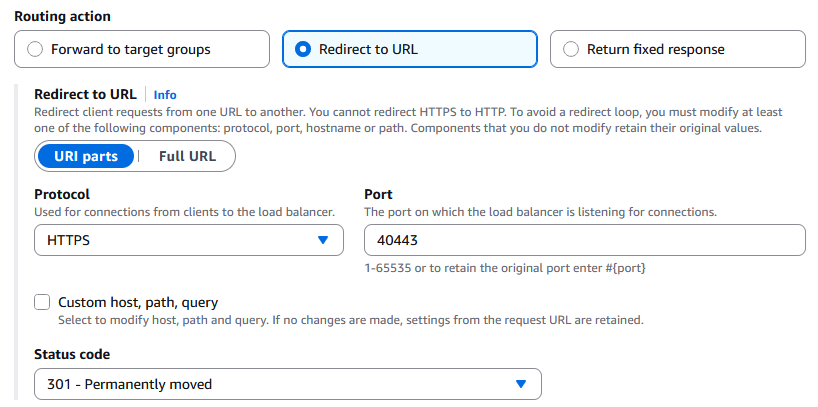
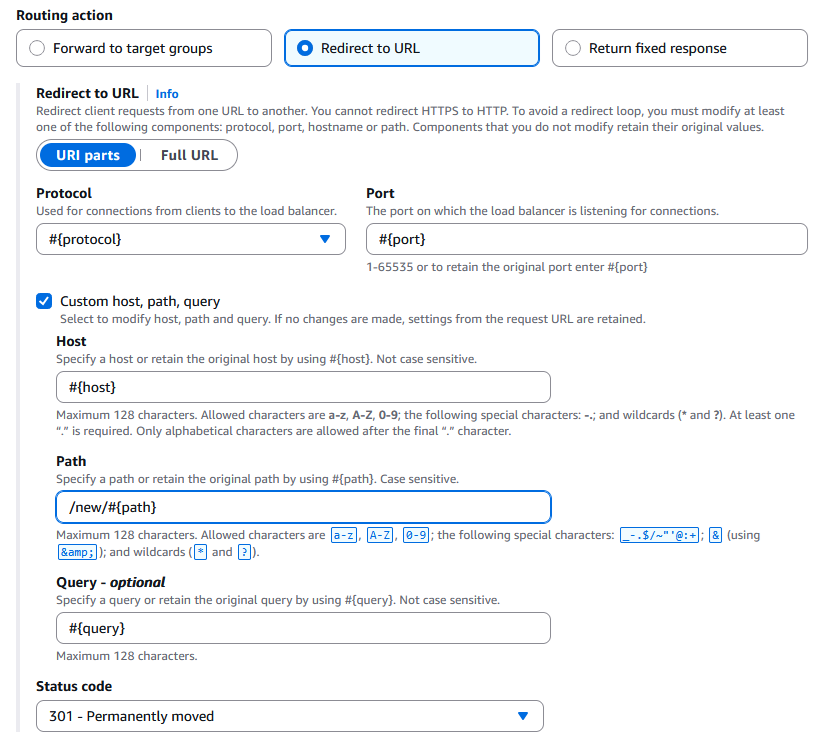

# Action types for listener rules

Actions determine how a load balancer handles requests when the conditions for a
listener rule are satisfied. Each rule must have at least one action that specifies how
to handle the matching requests. Each rule action has a type and configuration
information. Application Load Balancers support the following action types for listener rules.

###### Action types

`authenticate-cognito`

[HTTPS listeners] Use Amazon Cognito to authenticate users. For more
information, see [User authentication](listener-authenticate-users.md "listener-authenticate-users.md").

`authenticate-oidc`

[HTTPS listeners] Use an identity provider that is compliant with
OpenID Connect (OIDC) to authenticate users. For more information,
see [User authentication](listener-authenticate-users.md "listener-authenticate-users.md").

`fixed-response`

Return a custom HTTP response. For more information, see [Fixed-response actions](#fixed-response-actions "#fixed-response-actions").

`forward`

Forward requests to the specified target groups. For more information, see
[Forward actions](#forward-actions "#forward-actions").

`jwt-validation`

Validate JWT access tokens in client requests. For more information,
see [JWT verification](listener-verify-jwt.md "listener-verify-jwt.md").

`redirect`

Redirect requests from one URL to another. For more information, see [Redirect actions](#redirect-actions "#redirect-actions").

###### Action basics

- Each rule must include exactly one of the following routing actions:
  `forward`, `redirect`, or `fixed-response`,
  and it must be the last action to be performed.
- An HTTPS listener can have a rule with a user authentication action and
  a routing action.
- When there are multiple actions, the action with the lowest priority is
  performed first.
- If the protocol version is gRPC or HTTP/2, the only supported actions are
  `forward` actions.

## Fixed-response actions

A `fixed-response` action drops client requests and returns a custom
HTTP response. You can use this action to return a 2XX, 4XX, or 5XX response code
and an optional message.

When a `fixed-response` action is taken, the action and the URL of the
redirect target are recorded in the access logs. For more information, see [Access log entries](load-balancer-access-logs.md#access-log-entry-format "load-balancer-access-logs.md#access-log-entry-format"). The
count of successful `fixed-response` actions is reported in the
`HTTP_Fixed_Response_Count` metric. For more information, see [Application Load Balancer metrics](load-balancer-cloudwatch-metrics.md#load-balancer-metrics-alb "load-balancer-cloudwatch-metrics.md#load-balancer-metrics-alb").

###### Example fixed response action

You can specify an action when you create or modify a rule. For more
information, see the [create-rule](../../../cli/latest/reference/elbv2/create-rule.md "../../../cli/latest/reference/elbv2/create-rule.md") and [modify-rule](../../../cli/latest/reference/elbv2/modify-rule.md "../../../cli/latest/reference/elbv2/modify-rule.md") commands. The following action sends a fixed response
with the specified status code and message body.

```
[
  {
      "Type": "fixed-response",
      "FixedResponseConfig": {
          "StatusCode": "200",
          "ContentType": "text/plain",
          "MessageBody": "Hello world"
      }
  }
]
```

## Forward actions

A `forward` action routes requests to its target group. Before you add
a `forward` action, create the target group and add targets to it. For
more information, see [Create a target group](create-target-group.md "create-target-group.md").

###### Distribute traffic to multiple target groups

If you specify multiple target groups for a `forward` action, you must
specify a weight for each target group. Each target group weight is a value from 0
to 999. Requests that match a listener rule with weighted target groups are
distributed to these target groups based on their weights. For example, if you
specify two target groups, each with a weight of 10, each target group receives half
the requests. If you specify two target groups, one with a weight of 10 and the
other with a weight of 20, the target group with a weight of 20 receives twice as
many requests as the other target group.

If you configure a rule to distribute traffic between weighted target groups and
one of the target groups is empty or has only unhealthy targets, the load balancer
does not automatically fail over to a target group with healthy targets.

###### Sticky sessions and weighted target groups

By default, configuring a rule to distribute traffic between weighted target
groups does not guarantee that sticky sessions are honored. To ensure that sticky
sessions are honored, enable target group stickiness for the rule. When the load
balancer first routes a request to a weighted target group, it generates a cookie
named AWSALBTG that encodes information about the selected target group, encrypts
the cookie, and includes the cookie in the response to the client. The client should
include the cookie that it receives in subsequent requests to the load balancer.
When the load balancer receives a request that matches a rule with target group
stickiness enabled and contains the cookie, the request is routed to the target
group specified in the cookie.

Application Load Balancers do not support cookie values that are URL encoded.

With CORS (cross-origin resource sharing) requests, some browsers require
`SameSite=None; Secure` to enable stickiness. In this case, ELB
generates a second cookie, AWSALBTGCORS, which includes the same information as the
original stickiness cookie plus this `SameSite` attribute. Clients
receive both cookies.

You can specify an action when you create or modify a rule. For more
information, see the [create-rule](../../../cli/latest/reference/elbv2/create-rule.md "../../../cli/latest/reference/elbv2/create-rule.md") and [modify-rule](../../../cli/latest/reference/elbv2/modify-rule.md "../../../cli/latest/reference/elbv2/modify-rule.md") commands. The following action forwards requests to the
specified target group.

```
[
  {
      "Type": "forward",
      "ForwardConfig": {
          "TargetGroups": [
              {
                  "TargetGroupArn": "arn:aws:elasticloadbalancing:`us-west-2`:`123456789012`:targetgroup/`my-targets`/`73e2d6bc24d8a067`"
              }
          ]
      }
  }
]
```

The following action forwards requests to the two specified target groups,
based on the weight of each target group.

```
[
  {
      "Type": "forward",
      "ForwardConfig": {
          "TargetGroups": [
              {
                  "TargetGroupArn": "arn:aws:elasticloadbalancing:`us-west-2`:`123456789012`:targetgroup/`blue-targets`/`73e2d6bc24d8a067`",
                  "Weight": 10
              },
              {
                  "TargetGroupArn": "arn:aws:elasticloadbalancing:`us-west-2`:`123456789012`:targetgroup/`green-targets`/`09966783158cda59`",
                  "Weight": 20
              }
          ]
      }
  }
]
```

If you have a forward action with multiple target groups and one or more of
the target groups has [sticky sessions](edit-target-group-attributes.md#sticky-sessions "edit-target-group-attributes.md#sticky-sessions")
enabled, you must enable target group stickiness.

The following action forwards requests to the two specified target groups,
with target group stickiness enabled. Requests that do not contain the
stickiness cookies are routed based on the weight of each target group.

```
[
  {
      "Type": "forward",
      "ForwardConfig": {
          "TargetGroups": [
              {
                  "TargetGroupArn": "arn:aws:elasticloadbalancing:`us-west-2`:`123456789012`:targetgroup/`blue-targets`/`73e2d6bc24d8a067`",
                  "Weight": 10
              },
              {
                  "TargetGroupArn": "arn:aws:elasticloadbalancing:`us-west-2`:`123456789012`:targetgroup/`green-targets`/`09966783158cda59`",
                  "Weight": 20
              }
          ],
          "TargetGroupStickinessConfig": {
              "Enabled": true,
              "DurationSeconds": 1000
          }
      }
  }
]
```

## Redirect actions

A `redirect` action redirects client requests from one URL to another.
You can configure redirects as either temporary (HTTP 302) or permanent (HTTP 301)
based on your needs.

A URI consists of the following components:

```
`protocol`://`hostname`:`port`/`path`?`query`
```

You must modify at least one of the following components to avoid a redirect loop:
protocol, hostname, port, or path. Any components that you do not modify retain
their original values.

_protocol_

The protocol (HTTP or HTTPS). You can redirect HTTP to HTTP, HTTP to
HTTPS, and HTTPS to HTTPS. You cannot redirect HTTPS to HTTP.

_hostname_

The hostname. A hostname is not case-sensitive, can be up to 128
characters in length, and consists of alpha-numeric characters,
wildcards (\* and ?), and hyphens (-).

_port_

The port (1 to 65535).

_path_

The absolute path, starting with the leading "/". A path is
case-sensitive, can be up to 128 characters in length, and consists of
alpha-numeric characters, wildcards (\* and ?), & (using &amp;),
and the following special characters: \_-.$/~"'@:+.

_query_

The query parameters. The maximum length is 128 characters.

You can reuse URI components of the original URL in the target URL using the
following reserved keywords:

- `#{protocol}` - Retains the protocol. Use in the protocol and
  query components.
- `#{host}` - Retains the domain. Use in the hostname, path, and
  query components.
- `#{port}` - Retains the port. Use in the port, path, and query
  components.
- `#{path}` - Retains the path. Use in the path and query
  components.
- `#{query}` - Retains the query parameters. Use in the query
  component.

When a `redirect` action is taken, the action is recorded in the access
logs. For more information, see [Access log entries](load-balancer-access-logs.md#access-log-entry-format "load-balancer-access-logs.md#access-log-entry-format"). The count of successful
`redirect` actions is reported in the
`HTTP_Redirect_Count` metric. For more information, see [Application Load Balancer metrics](load-balancer-cloudwatch-metrics.md#load-balancer-metrics-alb "load-balancer-cloudwatch-metrics.md#load-balancer-metrics-alb").

###### Redirect using HTTPS and port 40443

The following rule sets up a permanent redirect to a URL that uses the HTTPS
protocol and the specified port (40443), but retains the original hostname,
path, and query parameters. This screen is equivalent to
"https://#{host}:40443/#{path}?#{query}".



###### Redirect using a modified path

The following rule sets up a permanent redirect to a URL that retains the
original protocol, port, hostname, and query parameters, and uses the
`#{path}` keyword to create a modified path. This screen is
equivalent to "#{protocol}://#{host}:#{port}/new/#{path}?#{query}".



###### Redirect using HTTPS and port 40443

You can specify an action when you create or modify a rule. For more
information, see the [create-rule](../../../cli/latest/reference/elbv2/create-rule.md "../../../cli/latest/reference/elbv2/create-rule.md") and [modify-rule](../../../cli/latest/reference/elbv2/modify-rule.md "../../../cli/latest/reference/elbv2/modify-rule.md") commands. The following action redirects an HTTP
request to an HTTPS request on port 443, with the same host name, path, and
query string as the HTTP request.

```
  --actions '[{
      "Type": "redirect",
      "RedirectConfig": {
          "Protocol": "HTTPS",
          "Port": "443",
          "Host": "#{host}",
          "Path": "/#{path}",
          "Query": "#{query}",
          "StatusCode": "HTTP_301"
      }
  }]'
```
