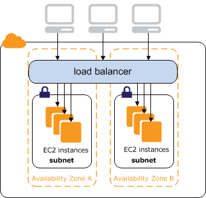

# Internet-facing Classic Load Balancers

When you create a Classic Load Balancer, you can make it an internal load balancer or an internet-facing load balancer.
An internet-facing load balancer has a publicly resolvable DNS name, so it can route requests
from clients over the internet to the EC2 instances that are registered with the load balancer.


The DNS name of an internal load balancer is publicly resolvable to the private IP addresses of the nodes.
Therefore, internal load balancers can only route requests from clients with access to the
VPC for the load balancer. For more information, see [Internal Classic Load Balancers](elb-internal-load-balancers.md "elb-internal-load-balancers.md").

###### Contents

- [Public DNS names for your load balancer](#internet-facing-ip-addresses "#internet-facing-ip-addresses")
- [Create an internet-facing Classic Load Balancer](elb-getting-started.md "elb-getting-started.md")

## Public DNS names for your load balancer

When your load balancer is created, it receives a public DNS name that clients can use
to send requests. The DNS servers resolve the DNS name of your load balancer to the
public IP addresses of the load balancer nodes for your load balancer. Each load
balancer node is connected to the back-end instances using private IP addresses.

The console displays a public DNS name with the following form:

```
`name`-`1234567890`.`region`.elb.amazonaws.com
```
