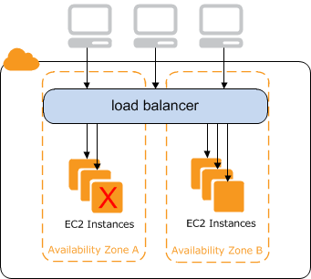

# What is a Classic Load Balancer?

###### Note

Classic Load Balancers are the previous generation of load balancers from Elastic Load Balancing. We recommend that
you migrate to a current generation load balancer. For more information, see [Migrate your Classic Load Balancer](../userguide/migrate-classic-load-balancer.md "../userguide/migrate-classic-load-balancer.md").

Elastic Load Balancing automatically distributes your incoming traffic across multiple targets, such as
EC2 instances, containers, and IP addresses, in one or more Availability Zones. It
monitors the health of its registered targets, and routes traffic only to the healthy
targets. Elastic Load Balancing scales your load balancer as your incoming traffic changes over time. It can
automatically scale to the vast majority of workloads.

## Classic Load Balancer overview

A load balancer distributes incoming application traffic across multiple EC2 instances in
multiple Availability Zones. This increases the fault tolerance of your applications.
Elastic Load Balancing detects unhealthy instances and routes traffic only to healthy instances.

Your load balancer serves as a single point of contact for clients.
This increases the availability of your application. You can add and remove instances
from your load balancer as your needs change, without disrupting the overall flow of
requests to your application. Elastic Load Balancing scales your load balancer as traffic to your
application changes over time. Elastic Load Balancing can scale to the vast majority of workloads
automatically.

A _listener_ checks for connection requests from clients, using the
protocol and port that you configure, and forwards requests to one or more registered
instances using the protocol and port number that you configure. You add one or more
listeners to your load balancer.

You can configure _health checks_, which are used to monitor the health
of the registered instances so that the load balancer only sends requests to the healthy
instances.

To ensure that your registered instances are able to handle the request load in each
Availability Zone, it is important to keep approximately the same number of instances
in each Availability Zone registered with the load balancer. For example,
if you have ten instances in Availability Zone us-west-2a and two instances in
us-west-2b, the requests are distributed evenly between the two Availability Zones.
As a result, the two instances in us-west-2b serve the same amount of traffic as the
ten instances in us-west-2a. Instead, you should have six instances in each Availability Zone.

By default, the load balancer distributes traffic evenly across the Availability Zones
that you enable for your load balancer. To distribute traffic evenly across all registered
instances in all enabled Availability Zones, enable _cross-zone load balancing_
on your load balancer. However, we still recommend that you maintain approximately equivalent
numbers of instances in each Availability Zone for better fault tolerance.

For more information, see [How Elastic Load Balancing works](../userguide/how-elastic-load-balancing-works.md "../userguide/how-elastic-load-balancing-works.md")
in the _Elastic Load Balancing User Guide_.

## Benefits

Using a Classic Load Balancer instead of an Application Load Balancer has the following benefits:

- Support for TCP and SSL listeners
- Support for sticky sessions using application-generated cookies

For more information about the features supported by each load balancer type, see
[Product comparisons](https://aws.amazon.com/elasticloadbalancing/features/#Product_comparisons "https://aws.amazon.com/elasticloadbalancing/features/#Product_comparisons") for Elastic Load Balancing.

## How to get started

- To learn how to create a Classic Load Balancer and register EC2 instances with it,
  see [Create an internet-facing Classic Load Balancer](elb-getting-started.md "elb-getting-started.md").
- To learn how to create an HTTPS load balancer and register EC2 instances with it,
  see [Create a Classic Load Balancer with an HTTPS listener](elb-create-https-ssl-load-balancer.md "elb-create-https-ssl-load-balancer.md").
- To learn how to use the various features supported by Classic Load Balancers, see
  [Configure your Classic Load Balancer](elb-configure-load-balancer.md "elb-configure-load-balancer.md").

## Pricing

With your load balancer, you pay only for what you use. For more information, see [Elastic Load Balancing Pricing](https://aws.amazon.com/elasticloadbalancing/pricing/ "https://aws.amazon.com/elasticloadbalancing/pricing/").
