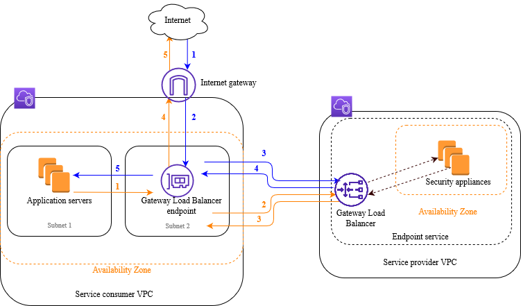

# Getting started with Gateway Load Balancers using the AWS CLI

Gateway Load Balancers make it easy to deploy, scale, and manage third-party virtual appliances, such as
security appliances.

In this tutorial, we'll implement an inspection system using a Gateway Load Balancer and a Gateway Load Balancer endpoint.

###### Contents

- [Overview](#overview-cli "#overview-cli")
- [Prerequisites](#prerequisites-aws-cli "#prerequisites-aws-cli")
- [Step 1: Create a Gateway Load Balancer and register targets](#create-load-balancer-aws-cli "#create-load-balancer-aws-cli")
- [Step 2: Create a Gateway Load Balancer endpoint](#create-endpoint-aws-cli "#create-endpoint-aws-cli")
- [Step 3: Configure routing](#configure-routing-aws-cli "#configure-routing-aws-cli")

## Overview

A Gateway Load Balancer endpoint is a VPC endpoint that provides private connectivity between virtual appliances in
the service provider VPC, and application servers in the service consumer VPC. The Gateway Load Balancer is
deployed in the same VPC as that of the virtual appliances. These appliances are registered as a
target group of the Gateway Load Balancer.

The application servers run in one subnet (destination subnet) in the service consumer VPC,
while the Gateway Load Balancer endpoint is in another subnet of the same VPC. All traffic entering the service consumer
VPC through the internet gateway is first routed to the Gateway Load Balancer endpoint and then routed to the destination
subnet.

Similarly, all traffic leaving the application servers (destination subnet) is routed to the
Gateway Load Balancer endpoint before it is routed back to the internet. The following network diagram is a visual
representation of how a Gateway Load Balancer endpoint is used to access an endpoint service.



The numbered items that follow, highlight and explain elements shown in the preceding image.

###### Traffic from the internet to the application (blue arrows):

1. Traffic enters the service consumer VPC through the internet gateway.
2. Traffic is sent to the Gateway Load Balancer endpoint, as a result of ingress
   routing.
3. Traffic is sent to the Gateway Load Balancer, which distributes the traffic to one of the security
   appliances.
4. Traffic is sent back to the Gateway Load Balancer endpoint after it is inspected by the security appliance.
5. Traffic is sent to the application servers (destination subnet).

###### Traffic from the application to the internet (orange arrows):

1. Traffic is sent to the
   Gateway Load Balancer endpoint as a result of the default route configured on the application
   server subnet.
2. Traffic is sent to the Gateway Load Balancer, which distributes the traffic to one of the security
   appliances.
3. Traffic is sent back to the Gateway Load Balancer endpoint after it is inspected by the security appliance.
4. Traffic is sent to the internet gateway based on the route table configuration.
5. Traffic is routed back to the internet.

### Routing

The route table for the internet gateway must have an entry that routes traffic destined
for the application servers to the Gateway Load Balancer endpoint. To specify the Gateway Load Balancer endpoint, use the ID of the VPC
endpoint. The following example shows the routes for a dualstack configuration.

| Destination          | Target            |
| -------------------- | ----------------- |
| `VPC IPv4 CIDR`      | Local             |
| `VPC IPv6 CIDR`      | Local             |
| `Subnet 1 IPv4 CIDR` | `vpc-endpoint-id` |
| `Subnet 1 IPv6 CIDR` | `vpc-endpoint-id` |

The route table for the subnet with the application servers must have entries that route
all traffic from the application servers to the Gateway Load Balancer endpoint.

| Destination     | Target            |
| --------------- | ----------------- |
| `VPC IPv4 CIDR` | Local             |
| `VPC IPv6 CIDR` | Local             |
| 0.0.0.0/0       | `vpc-endpoint-id` |
| ::/0            | `vpc-endpoint-id` |

The route table for the subnet with the Gateway Load Balancer endpoint must route traffic that returns from
inspection to its final destination. For traffic that originated from the internet, the local
route ensures that it reaches the application servers. For traffic that originated from the
application servers, add entries that route all traffic to the internet gateway.

| Destination     | Target                |
| --------------- | --------------------- |
| `VPC IPv4 CIDR` | Local                 |
| `VPC IPv6 CIDR` | Local                 |
| 0.0.0.0/0       | `internet-gateway-id` |
| ::/0            | `internet-gateway-id` |

## Prerequisites

- Install the AWS CLI or update to the current version of the AWS CLI if you are using
  a version that does not support Gateway Load Balancers. For more information, see
  [Installing the AWS CLI](../../../cli/latest/userguide/getting-started-install.md "../../../cli/latest/userguide/getting-started-install.md")
  in the _AWS Command Line Interface User Guide_.
- Ensure that the service consumer VPC has at least two subnets for each Availability Zone
  that contains application servers. One subnet is for the Gateway Load Balancer endpoint, and the other is for the
  application servers.
- Ensure that the service provider VPC has at least two subnets for each Availability Zone
  that contains security appliance instances. One subnet is for the Gateway Load Balancer, and the other is for
  the instances.
- Launch at least one security appliance instance in each security appliance subnet in the
  service provider VPC. The security groups for these instances must allow UDP traffic on port 6081.

## Step 1: Create a Gateway Load Balancer and register targets

Use the following procedure to create your load balancer, listener, and target groups, and
to register your security appliance instances as targets.

###### To create a Gateway Load Balancer and register targets

1. Use the [create-load-balancer](../../../cli/latest/reference/elbv2/create-load-balancer.md "../../../cli/latest/reference/elbv2/create-load-balancer.md") command to create a load balancer of type `gateway`.
   You can specify one subnet for each Availability Zone in which you launched security appliance
   instances.

```
`aws elbv2 create-load-balancer --name `my-load-balancer` --type gateway --subnets `provider-subnet-id``
```

The default is to support IPv4 addresses only. To support both IPv4 and IPv6 addresses, add the
`--ip-address-type dualstack` option.

The output includes the Amazon Resource Name (ARN) of the load balancer, with the format
shown in the following example.

```
arn:aws:elasticloadbalancing:`us-east-2`:`123456789012`:loadbalancer/gwy/`my-load-balancer`/`1234567890123456`
```

2. Use the [create-target-group](../../../cli/latest/reference/elbv2/create-target-group.md "../../../cli/latest/reference/elbv2/create-target-group.md") command to create a target group, specifying the service provider
   VPC in which you launched your instances.

```
`aws elbv2 create-target-group --name `my-targets` --protocol GENEVE --port 6081 --vpc-id `provider-vpc-id``
```

The output includes the ARN of the target group, with the following format.

```
`arn:aws:elasticloadbalancing:`us-east-2`:`123456789012`:targetgroup/`my-targets`/`0123456789012345``
```

3. Use the [register-targets](../../../cli/latest/reference/elbv2/register-targets.md "../../../cli/latest/reference/elbv2/register-targets.md")
   command to register your instances with your target group.

```
`aws elbv2 register-targets --target-group-arn `targetgroup-arn` --targets Id=i-`1234567890abcdef0` Id=i-`0abcdef1234567890``
```

4. Use the [create-listener](../../../cli/latest/reference/elbv2/create-listener.md "../../../cli/latest/reference/elbv2/create-listener.md")
   command to create a listener for your load balancer with a default rule that forwards requests
   to your target group.

```
`aws elbv2 create-listener --load-balancer-arn `loadbalancer-arn` --default-actions Type=forward,TargetGroupArn=`targetgroup-arn``
```

The output contains the ARN of the listener, with the following format.

```
arn:aws:elasticloadbalancing:`us-east-2`:`123456789012`:listener/gwy/`my-load-balancer`/`1234567890123456`/`abc1234567890123`
```

5. (Optional) You can verify the health of the registered targets for your target group using
   the following [describe-target-health](../../../cli/latest/reference/elbv2/describe-target-health.md "../../../cli/latest/reference/elbv2/describe-target-health.md") command.

```
`aws elbv2 describe-target-health --target-group-arn `targetgroup-arn``
```

## Step 2: Create a Gateway Load Balancer endpoint

Use the following procedure to create a Gateway Load Balancer endpoint. Gateway Load Balancer endpoints are zonal.
We recommend that you create one Gateway Load Balancer endpoint per zone. For more information, see
[Access virtual appliances through
AWS PrivateLink](../../../vpc/latest/privatelink/vpce-gateway-load-balancer.md "../../../vpc/latest/privatelink/vpce-gateway-load-balancer.md").

###### To create a Gateway Load Balancer endpoint

1. Use the [create-vpc-endpoint-service-configuration](../../../cli/latest/reference/ec2/create-vpc-endpoint-service-configuration.md "../../../cli/latest/reference/ec2/create-vpc-endpoint-service-configuration.md") command to create an endpoint service
   configuration using your Gateway Load Balancer.

```
`aws ec2 create-vpc-endpoint-service-configuration --gateway-load-balancer-arns `loadbalancer-arn` --no-acceptance-required`
```

To support both IPv4 and IPv6 addresses, add the `--supported-ip-address-types ipv4 ipv6`
option.

The output contains the service ID (for example, vpce-svc-12345678901234567) and the
service name (for example, com.amazonaws.vpce.us-east-2.vpce-svc-12345678901234567). 2. Use the [modify-vpc-endpoint-service-permissions](../../../cli/latest/reference/ec2/modify-vpc-endpoint-service-permissions.md "../../../cli/latest/reference/ec2/modify-vpc-endpoint-service-permissions.md") command to allow service consumers to create
an endpoint to your service. A service consumer can be a user, IAM role, or AWS account.
The following example adds permission for the specified AWS account.

```
`aws ec2 modify-vpc-endpoint-service-permissions --service-id `vpce-svc-12345678901234567` --add-allowed-principals `arn:aws:iam::123456789012:root``
```

3. Use the [create-vpc-endpoint](../../../cli/latest/reference/ec2/create-vpc-endpoint.md "../../../cli/latest/reference/ec2/create-vpc-endpoint.md") command to create
   the Gateway Load Balancer endpoint for your service.

```
`aws ec2 create-vpc-endpoint --vpc-endpoint-type GatewayLoadBalancer --service-name `com.amazonaws.vpce.us-east-2.vpce-svc-12345678901234567` --vpc-id `consumer-vpc-id` --subnet-ids `consumer-subnet-id``
```

To support both IPv4 and IPv6 addresses, add the `--ip-address-type dualstack` option.

The output contains the ID of the Gateway Load Balancer endpoint (for example, vpce-01234567890abcdef).

## Step 3: Configure routing

Configure the route tables for the service consumer VPC as follows. This allows the security
appliances to perform security inspection on inbound traffic that's destined for the application
servers.

###### To configure routing

1. Use the [create-route](../../../cli/latest/reference/ec2/create-route.md "../../../cli/latest/reference/ec2/create-route.md") command to
   add entries to the route table for the internet gateway that routes traffic that's destined for
   the application servers to the Gateway Load Balancer endpoint.

```
`aws ec2 create-route --route-table-id `gateway-rtb` --destination-cidr-block `Subnet 1 IPv4 CIDR` --vpc-endpoint-id `vpce-01234567890abcdef``
```

If you support IPv6, add the following route.

```
`aws ec2 create-route --route-table-id `gateway-rtb` --destination-cidr-block `Subnet 1 IPv6 CIDR` --vpc-endpoint-id `vpce-01234567890abcdef``
```

2. Use the [create-route](../../../cli/latest/reference/ec2/create-route.md "../../../cli/latest/reference/ec2/create-route.md") command to
   add an entry to the route table for the subnet with the application servers that routes all
   traffic from the application servers to the Gateway Load Balancer endpoint.

```
`aws ec2 create-route --route-table-id `application-rtb` --destination-cidr-block 0.0.0.0/0 --vpc-endpoint-id `vpce-01234567890abcdef``
```

If you support IPv6, add the following route.

```
`aws ec2 create-route --route-table-id `application-rtb` --destination-cidr-block ::/0 --vpc-endpoint-id `vpce-01234567890abcdef``
```

3. Use the [create-route](../../../cli/latest/reference/ec2/create-route.md "../../../cli/latest/reference/ec2/create-route.md") command to
   add an entry to the route table for the subnet with the Gateway Load Balancer endpoint that routes all traffic that
   originated from the application servers to the internet gateway.

```
`aws ec2 create-route --route-table-id `endpoint-rtb` --destination-cidr-block 0.0.0.0/0 --gateway-id `igw-01234567890abcdef``
```

If you support IPv6, add the following route.

```
`aws ec2 create-route --route-table-id `endpoint-rtb` --destination-cidr-block ::/0 --gateway-id `igw-01234567890abcdef``
```

4. Repeat for each application subnet route table in each zone.
