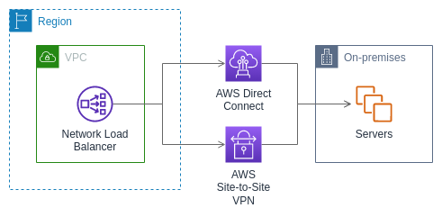

# Target groups for your Network Load Balancers

Each _target group_ is used to route requests to one or more registered
targets. When you create a listener, you specify a target group for its default action.
Traffic is forwarded to the target group specified in the listener rule. You can create
different target groups for different types of requests. For example, create one target
group for general requests and other target groups for requests to the microservices for
your application. For more information, see [Network Load Balancer components](introduction.md#network-load-balancer-components "introduction.md#network-load-balancer-components").

You define health check settings for your load balancer on a per target group basis. Each
target group uses the default health check settings, unless you override them when you
create the target group or modify them later on. After you specify a target group in a rule
for a listener, the load balancer continually monitors the health of all targets registered
with the target group that are in an Availability Zone enabled for the load balancer. The
load balancer routes requests to the registered targets that are healthy. For more
information, see [Health checks for Network Load Balancer target groups](target-group-health-checks.md "target-group-health-checks.md").

###### Contents

- [Routing configuration](#target-group-routing-configuration "#target-group-routing-configuration")
- [Target type](#target-type "#target-type")
- [IP address type](#target-group-ip-address-type "#target-group-ip-address-type")
- [Registered targets](#registered-targets "#registered-targets")
- [Target group attributes](#target-group-attributes "#target-group-attributes")
- [Target group health](#target-group-health "#target-group-health")
- [Create a target group](create-target-group.md "create-target-group.md")
- [Update health settings](modify-target-group-health-settings.md "modify-target-group-health-settings.md")
- [Configure health checks](target-group-health-checks.md "target-group-health-checks.md")
- [Edit target group attributes](edit-target-group-attributes.md "edit-target-group-attributes.md")
- [Register targets](target-group-register-targets.md "target-group-register-targets.md")
- [Use Application Load Balancers as targets](application-load-balancer-target.md "application-load-balancer-target.md")
- [Tag a target group](target-group-tags.md "target-group-tags.md")
- [Delete a target group](delete-target-group.md "delete-target-group.md")

## Routing configuration

By default, a load balancer routes requests to its targets using the protocol and port
number that you specified when you created the target group. Alternatively, you can
override the port used for routing traffic to a target when you register it with the
target group.

Target groups for Network Load Balancers support the following protocols and ports:

- **Protocols**: TCP, TLS, UDP, TCP_UDP, QUIC, TCP_QUIC
- **Ports**: 1-65535

If a target group is configured with the TLS protocol, the load balancer establishes
TLS connections with the targets using certificates that you install on the targets. The
load balancer does not validate these certificates. Therefore, you can use self-signed
certificates or certificates that have expired. Because the load balancer is in a
virtual private cloud (VPC), traffic between the load balancer and the targets is
authenticated at the packet level, so it is not at risk of man-in-the-middle attacks or
spoofing even if the certificates on the targets are not valid.

The following table summarizes the supported combinations of listener protocol and
target group settings.

| Listener protocol | Target group protocol | Target group type | Health check protocol |
| ----------------- | --------------------- | ----------------- | --------------------- | -------- | ----- | ----- | ----- | --- |
| TCP               | TCP                   | TCP_UDP           | TCP_QUIC              | instance | ip    | HTTP  | HTTPS | TCP |
| TCP               | TCP                   | alb               | HTTP                  | HTTPS    |
| TLS               | TCP                   | TLS               | instance              | ip       | HTTP  | HTTPS | TCP   |
| UDP               | UDP                   | TCP_UDP           | instance              | ip       | HTTP  | HTTPS | TCP   |
| TCP_UDP           | TCP_UDP               | instance          | ip                    | HTTP     | HTTPS | TCP   |
| QUIC              | QUIC                  | TCP_QUIC          | instance              | ip       | HTTP  | HTTPS | TCP   |
| TCP_QUIC          | TCP_QUIC              | instance          | ip                    | HTTP     | HTTPS | TCP   |

## Target type

When you create a target group, you specify its target type, which determines how you
specify its targets. After you create a target group, you can't change its target
type.

The following are the possible target types:

`instance`

The targets are specified by instance ID.

`ip`

The targets are specified by IP address.

`alb`

The target is an Application Load Balancer.

When the target type is `ip`, you can specify IP addresses from one of the
following CIDR blocks:

- The subnets of the target group VPC
- 10.0.0.0/8 ([RFC
  1918](https://tools.ietf.org/html/rfc1918 "https://tools.ietf.org/html/rfc1918"))
- 100.64.0.0/10 ([RFC
  6598](https://tools.ietf.org/html/rfc6598 "https://tools.ietf.org/html/rfc6598"))
- 172.16.0.0/12 (RFC 1918)
- 192.168.0.0/16 (RFC 1918)

###### Important

You can't specify publicly routable IP addresses.

All of the supported CIDR blocks enable you to register the following targets with a
target group:

- AWS resources that are addressable by IP address and port (for example,
  databases).
- On-premises resources linked to AWS through Direct Connect or a Site-to-Site VPN
  connection.

When client IP preservation is disabled for your target groups, the load balancer can
support about 55,000 connections per minute for each combination of Network Load Balancer IP address and
unique target (IP address and port). If you exceed these connections, there is an
increased chance of port allocation errors. If you get port allocation errors, add more
targets to the target group.

When launching a Network Load Balancer in a shared VPC (as a participant), you can only register
targets in subnets that have been shared with you.

When the target type is `alb`, you can register a single Application Load Balancer as a target.
For more information, see [Use an Application Load Balancer as a target of a Network Load Balancer](application-load-balancer-target.md "application-load-balancer-target.md").

Network Load Balancers do not support the `lambda` target type. Application Load Balancers are the only load
balancers that support the `lambda` target type. For more information, see
[Lambda functions as targets](../application/lambda-functions.md "../application/lambda-functions.md")
in the _User Guide for Application Load Balancers_.

If you have microservices on instances that are registered with a Network Load Balancer, you can't
use the load balancer to provide communication between them unless the load balancer is
internet-facing or the instances are registered by IP address. For more information, see
[Connections time out for requests from a target to
its load balancer](load-balancer-troubleshooting.md#loopback-timeout "load-balancer-troubleshooting.md#loopback-timeout").

### Request routing and IP

addresses

If you specify targets using an instance ID, traffic is routed to instances using
the primary private IP address that is specified in the primary network interface
for the instance. The load balancer rewrites the destination IP address from the
data packet before forwarding it to the target instance.

If you specify targets using IP addresses, you can route traffic to an instance
using any private IP address from one or more network interfaces. This enables
multiple applications on an instance to use the same port. Note that each network
interface can have its own security group. The load balancer rewrites the
destination IP address before forwarding it to the target.

For more information about allowing traffic to your instances, see [Target security groups](target-group-register-targets.md#target-security-groups "target-group-register-targets.md#target-security-groups").

### On premises resources as targets

On premises resources linked through Direct Connect or a Site-to-Site VPN connection can serve
as a target, when the target type is `ip`.

When using on premises resources, the IP addresses of these targets must still
come from one of the following CIDR blocks:

- 10.0.0.0/8 ([RFC
  1918](https://tools.ietf.org/html/rfc1918 "https://tools.ietf.org/html/rfc1918"))
- 100.64.0.0/10 ([RFC
  6598](https://tools.ietf.org/html/rfc6598 "https://tools.ietf.org/html/rfc6598"))
- 172.16.0.0/12 (RFC 1918)
- 192.168.0.0/16 (RFC 1918)

For more information about Direct Connect, see [What is Direct Connect?](../../../directconnect/latest/UserGuide.md "../../../directconnect/latest/UserGuide.md")

For more information about AWS Site-to-Site VPN, see [What is AWS Site-to-Site VPN?](../../../vpn/latest/s2svpn.md "../../../vpn/latest/s2svpn.md")

## IP address type

When creating a new target group, you can select the IP address type of your target
group. This controls the IP version used to communicate with targets and check their
health status.

Target groups for your Network Load Balancers support the following IP address types:

**`ipv4`**

The load balancer communicates with targets using IPv4.

**`ipv6`**

The load balancer communicates with targets using IPv6.

###### Considerations

- The load balancer communicates with targets based on the IP address type of
  the target group. The targets of an IPv4 target group must accept IPv4
  traffic from the load balancer and the targets of an IPv6 target group must
  accept IPv6 traffic from the load balancer.
- You can't use an IPv6 target group with an `ipv4` load balancer.
- You can't use an IPv4 target group with a UDP listener for a
  `dualstack` load balancer.
- You can't register an Application Load Balancer with an IPv6 target group.
- You can't use an IPv6 target group with QUIC or TCP_QUIC protocols.

## Registered targets

Your load balancer serves as a single point of contact for clients and distributes
incoming traffic across its healthy registered targets. Each target group must have at
least one registered target in each Availability Zone that is enabled for the load
balancer. You can register each target with one or more target groups.

If demand on your application increases, you can register additional targets with one
or more target groups in order to handle the demand. The load balancer starts routing
traffic to a newly registered target as soon as the registration process completes and
the target passes the first initial health check, irrespective of the configured threshold.

If demand on your application decreases, or if you need to service your targets, you
can deregister targets from your target groups. Deregistering a target removes it from
your target group, but does not affect the target otherwise. The load balancer stops
routing traffic to a target as soon as it is deregistered. The target enters the
`draining` state until in-flight requests have completed. You can
register the target with the target group again when you are ready for it to resume
receiving traffic.

If you are registering targets by instance ID, you can use your load balancer with an
Amazon EC2 Auto Scaling group. After you attach a target group to an Amazon EC2 Auto Scaling group, Amazon EC2 Auto Scaling registers your
targets with the target group for you when it launches them. For more information, see
[Attaching a load balancer to
your Amazon EC2 Auto Scaling group](../../../autoscaling/ec2/userguide/attach-load-balancer-asg.md "../../../autoscaling/ec2/userguide/attach-load-balancer-asg.md") in the _Amazon EC2 Auto Scaling User Guide_.

###### Requirements and considerations

- You can't register instances by instance ID if they use one of the following
  instance types: C1, CC1, CC2, CG1, CG2, CR1, G1, G2, HI1, HS1, M1, M2, M3, or
  T1.
- When registering targets by instance ID for a IPv6 target group, the targets
  must have an assigned primary IPv6 address. To learn more, see [IPv6 addresses](../../../AWSEC2/latest/UserGuide/using-instance-addressing.md#ipv6-addressing "../../../AWSEC2/latest/UserGuide/using-instance-addressing.md#ipv6-addressing") in the _Amazon EC2 User Guide_
- When registering targets by instance ID, instances must be in the same VPC
  as the Network Load Balancer. You can't register instances by instance ID if they are in an VPC
  that is peered to the load balancer VPC (same Region or different Region). You
  can register these instances by IP address.
- If you register a target by IP address and the IP address is in the same VPC
  as the load balancer, the load balancer verifies that it is from a subnet that
  it can reach.
- The load balancer routes traffic to targets only in Availability Zones that
  are enabled. Targets in zones that are not enabled are unused.
- For UDP, TCP_UDP, QUIC, and TCP_QUIC target groups, do not register instances by IP address if
  they reside outside of the load balancer VPC or if they use one of the following
  instance types: C1, CC1, CC2, CG1, CG2, CR1, G1, G2, HI1, HS1, M1, M2, M3, or
  T1. Targets that reside outside the load balancer VPC or use an unsupported
  instance type might be able to receive traffic from the load balancer but then
  be unable to respond.

## Target group attributes

You can configure a target group by editing its attributes. For more
information, see [Edit target group attributes](edit-target-group-attributes.md "edit-target-group-attributes.md").

The following target group attributes are supported. You can modify these attributes
only if the target group type is `instance` or `ip`. If the target
group type is `alb`, these attributes always use their default values.

`deregistration_delay.timeout_seconds`

The amount of time for ELB to wait before changing the state of a
deregistering target from `draining` to `unused`. The
range is 0-3600 seconds. The default value is 300 seconds. For QUIC traffic, the value is always 300 seconds.

`deregistration_delay.connection_termination.enabled`

Indicates whether the load balancer terminates connections at the end of
the deregistration timeout. The value is `true` or `false`.
For new UDP/TCP_UDP target groups the default is `true`. Otherwise,
the default is `false`. This attribute does not apply to QUIC traffic.

`load_balancing.cross_zone.enabled`

Indicates whether cross zone load balancing is enabled. The value is
`true`, `false` or `use_load_balancer_configuration`.
The default is `use_load_balancer_configuration`.

`preserve_client_ip.enabled`

Indicates whether client IP preservation is enabled. The value is
`true` or `false`. The default is disabled if the
target group type is IP address and the target group protocol is TCP or TLS.
Otherwise, the default is enabled. Client IP preservation can't be disabled
for UDP, TCP_UDP, QUIC, and TCP_QUIC target groups.

`proxy_protocol_v2.enabled`

Indicates whether proxy protocol version 2 is enabled. By default, proxy
protocol is disabled.

`stickiness.enabled`

Indicates whether sticky sessions are enabled. The value is
`true` or `false`. The default is `false`. This attribute does not apply to QUIC traffic.

`stickiness.type`

The type of stickiness. The possible value is
`source_ip`.

`target_group_health.dns_failover.minimum_healthy_targets.count`

The minimum number of targets that must be healthy.
If the number of healthy targets is below this value, mark the zone as
unhealthy in DNS, so that traffic is routed only to healthy zones.
The possible values are `off` or an integer from 1 to the
maximum number of targets. When `off`, DNS fail away is
disabled, meaning that even if all targets in the target group are
unhealthy, the zone is not removed from DNS. The default is 1.

`target_group_health.dns_failover.minimum_healthy_targets.percentage`

The minimum percentage of targets that must be healthy.
If the percentage of healthy targets is below this value, mark the zone as
unhealthy in DNS, so that traffic is routed only to healthy zones.
The possible values are `off` or an integer from 1 to 100.
When `off`, DNS fail away is disabled, meaning that even if all
targets in the target group are unhealthy, the zone is not removed from DNS.
The default is `off`.

`target_group_health.unhealthy_state_routing.minimum_healthy_targets.count`

The minimum number of targets that must be healthy.
If the number of healthy targets is below this value, send traffic to all targets,
including unhealthy targets.
The possible values are 1 to the maximum number of targets. The default is 1.

`target_group_health.unhealthy_state_routing.minimum_healthy_targets.percentage`

The minimum percentage of targets that must be healthy.
If the percentage of healthy targets is below this value, send traffic to all targets,
including unhealthy targets. The possible values are `off` or an integer from 1 to 100.
The default is `off`.

`target_health_state.unhealthy.connection_termination.enabled`

Indicates whether the load balancer terminates connections to unhealthy targets.
The value is `true` or `false`. The default is
`true`.

`target_health_state.unhealthy.draining_interval_seconds`

The amount of time for ELB to wait before changing the
state of an unhealthy target from `unhealthy.draining` to
`unhealthy`. The range is 0-360000 seconds. The default value is 0 seconds.

**Note:** This attribute can only be configured when
`target_health_state.unhealthy.connection_termination.enabled` is `false`.

## Target group health

By default, a target group is considered healthy as long as it has at least one
healthy target. If you have a large fleet, having only one healthy target serving
traffic is not sufficient. Instead, you can specify a minimum count or percentage of
targets that must be healthy, and what actions the load balancer takes when the healthy
targets fall below the specified threshold. This improves the availability of your
application.

###### Contents

- [Unhealthy state actions](#unhealthy-state-actions "#unhealthy-state-actions")
- [Requirements and considerations](#target-group-health-considerations "#target-group-health-considerations")
- [Example](#target-group-health-examples "#target-group-health-examples")
- [Using Route 53 DNS failover for your load
  balancer](#r53-dns-failover "#r53-dns-failover")

### Unhealthy state actions

You can configure healthy thresholds for the following actions:

- DNS failover – When the healthy targets in a zone
  fall below the threshold, we mark the IP addresses of the load balancer node
  for the zone as unhealthy in DNS. Therefore, when clients resolve the load
  balancer DNS name, the traffic is routed only to healthy zones.
- Routing failover – When the healthy targets in a
  zone fall below the threshold, the load balancer sends traffic to all
  targets that are available to the load balancer node, including unhealthy
  targets. This increases the chances that a client connection succeeds,
  especially when targets temporarily fail to pass health checks, and reduces
  the risk of overloading the healthy targets.

### Requirements and considerations

- If you specify both types of thresholds for an action
  (count and percentage), the load balancer takes the action when
  either threshold is breached.
- If you specify thresholds for both actions, the threshold for
  DNS failover must be greater than or equal to the threshold for
  routing failover, so that DNS failover occurs either with or
  before routing failover.
- If you specify the threshold as a percentage, we calculate
  the value dynamically, based on the total number of targets
  that are registered with the target groups.
- The total number of targets is based on whether cross-zone load
  balancing is off or on. If cross-zone load balancing is off, each
  node sends traffic only to the targets in its own zone, which means
  that the thresholds apply to the number of targets in each enabled
  zone separately. If cross-zone load balancing is on, each node
  sends traffic to all targets in all enabled zones, which means
  that the specified thresholds apply to the total number targets in
  all enabled zones. For more information, see [Cross-zone load balancing](edit-target-group-attributes.md#target-group-cross-zone "edit-target-group-attributes.md#target-group-cross-zone").
- When DNS failover occurs, it impacts all target groups
  associated with the load balancer. Ensure that you have enough
  capacity in your remaining zones to handle this additional
  traffic, especially if cross-zone load balancing is off.
- With DNS failover, we remove the IP addresses of the unhealthy zones from
  the DNS hostname for the load balancer. However, the local client DNS cache
  might contain these IP addresses until the time-to-live (TTL) in the DNS
  record expires (60 seconds).
- With DNS failover, if there are multiple target groups attached to a Network Load Balancer
  and one target group is unhealthy in a zone, DNS failover occurs, even if
  another target group is healthy in that zone.
- With DNS failover, if all load balancer zones are considered
  unhealthy, the load balancer sends traffic to all zones, including
  the unhealthy zones.
- There are factors other than whether there are enough healthy targets
  that might lead to DNS failover, such as the health of the zone.

### Example

The following example demonstrates how target group health settings are applied.

###### Scenario

- A load balancer that supports two Availability Zones, A and B
- Each Availability Zone contains 10 registered targets
- The target group has the following target group health settings:
  - DNS failover - 50%
  - Routing failover - 50%

- Six targets fail in Availability Zone B

###### If cross-zone load balancing is off

- The load balancer node in each Availability Zone can send traffic only
  to the 10 targets in its Availability Zone.
- There are 10 healthy targets in Availability Zone A, which meets the
  required percentage of healthy targets. The load balancer continues to
  distribute traffic between the 10 healthy targets.
- There are only 4 healthy targets in Availability Zone B, which is 40% of
  the targets for the load balancer node in Availability Zone B. Because this
  is less than the required percentage of healthy targets, the load balancer
  takes the following actions:
  - DNS failover - Availability Zone B is marked as unhealthy in DNS.
    Because clients can't resolve the load balancer name to the load
    balancer node in Availability Zone B, and Availability Zone A
    is healthy, clients send new connections to Availability Zone A.
  - Routing failover - When new connections are sent explicitly to Availability
    Zone B, the load balancer distributes traffic to all targets in Availability
    Zone B, including the unhealthy targets. This prevents outages among the
    remaining healthy targets.

###### If cross-zone load balancing is on

- Each load balancer node can send traffic to all 20 registered targets across
  both Availability Zones.
- There are 10 healthy targets in Availability Zone A and 4 healthy targets
  in Availability Zone B, for a total of 14 healthy targets. This is 70% of
  the targets for the load balancer nodes in both Availability Zones, which
  meets the required percentage of healthy targets.
- The load balancer distributes traffic between the 14 healthy targets in
  both Availability Zones.

### Using Route 53 DNS failover for your load

balancer

If you use Route 53 to route DNS queries to your load balancer, you can also
configure DNS failover for your load balancer using Route 53. In a failover
configuration, Route 53 checks the health of the target group targets for the load
balancer to determine whether they are available. If there are no healthy targets
registered with the load balancer, or if the load balancer itself is unhealthy,
Route 53 routes traffic to another available resource, such as a healthy load balancer
or a static website in Amazon S3.

For example, suppose that you have a web application for
`www.example.com`, and you want redundant instances running behind
two load balancers residing in different Regions. You want the traffic to be
primarily routed to the load balancer in one Region, and you want to use the load
balancer in the other Region as a backup during failures. If you configure DNS
failover, you can specify your primary and secondary (backup) load balancers. Route 53
directs traffic to the primary load balancer if it is available, or to the secondary
load balancer otherwise.

###### How evaluate target health works

- If evaluate target health is set to `Yes` on an alias record
  for a Network Load Balancer, Route 53 evaluates the health of the resource specified by the
  `alias target` value. Route 53 uses the target group health
  checks.
- If all target groups attached to a Network Load Balancer are healthy, Route 53 marks the
  alias record as healthy. If you configured a threshold for a target group
  and it meets its threshold, it passes health checks. Otherwise, if a
  target group contains at least one healthy target, it passes health checks.
  If health checks pass, Route 53 returns records according to your routing policy.
  If a failover routing policy is used, Route 53 returns the primary record.
- If all target groups attached to a Network Load Balancer are unhealthy, the alias record
  fails the Route 53 health check (fail-open). If using evaluate target health,
  this causes the failover routing policy to redirect traffic to the secondary
  resource.
- If all of the target groups in a Network Load Balancer are empty (no targets), Route 53
  considers the record unhealthy (fail-open). If using evaluate target health,
  this causes the failover routing policy to redirect traffic to the secondary
  resource.

For more information, see [Using load balancer target group health thresholds to improve availability](https://aws.amazon.com/blogs/networking-and-content-delivery/using-load-balancer-target-group-health-thresholds-to-improve-availability/ "https://aws.amazon.com/blogs/networking-and-content-delivery/using-load-balancer-target-group-health-thresholds-to-improve-availability/") in the AWS Blog
and [Configuring DNS failover](../../../Route53/latest/DeveloperGuide/dns-failover-configuring.md "../../../Route53/latest/DeveloperGuide/dns-failover-configuring.md") in the
_Amazon Route 53 Developer Guide_.
