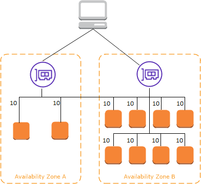
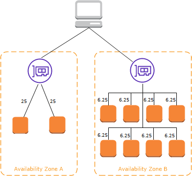

# How ELB works

A load balancer accepts incoming traffic from clients and routes requests to its
registered targets (such as EC2 instances) in one or more Availability Zones. The load
balancer also monitors the health of its registered targets and ensures that it routes
traffic only to healthy targets. When the load balancer detects an unhealthy target, it
stops routing traffic to that target. It then resumes routing traffic to that target when it
detects that the target is healthy again.

You configure your load balancer to accept incoming traffic by specifying one or more
_listeners_. A listener is a process that checks for connection
requests. It is configured with a protocol and port number for connections from clients to
the load balancer. Likewise, it is configured with a protocol and port number for
connections from the load balancer to the targets.

###### Contents

- [Availability Zones and load balancer nodes](#availability-zones "#availability-zones")
- [Request routing](#request-routing "#request-routing")
- [Load balancer scheme](#load-balancer-scheme "#load-balancer-scheme")
- [IP address types](#ip-address-types "#ip-address-types")
- [Network MTU for your load balancer](#load-balancer-network-MTU "#load-balancer-network-MTU")

## Availability Zones and load balancer nodes

When you enable an Availability Zone for your load balancer, ELB creates a load
balancer node in the Availability Zone. If you register targets in an Availability Zone
but do not enable the Availability Zone, these registered targets do not receive
traffic. Your load balancer is most effective when you ensure that each enabled
Availability Zone has at least one registered target.

We recommend enabling multiple Availability Zones for all load balancers. With an
Application Load Balancer however, it is a requirement that you enable at least two or more Availability
Zones. This configuration helps ensure that the load balancer can continue to route
traffic. If one Availability Zone becomes unavailable or has no healthy targets, the
load balancer can route traffic to the healthy targets in another Availability
Zone.

After you disable an Availability Zone, the targets in that Availability Zone remain
registered with the load balancer. However, even though they remain registered, the load
balancer does not route traffic to them.

### Cross-zone load balancing

The nodes for your load balancer distribute requests from clients to registered
targets. When cross-zone load balancing is enabled, each load balancer node
distributes traffic across the registered targets in all enabled Availability Zones.
When cross-zone load balancing is disabled, each load balancer node distributes
traffic only across the registered targets in its Availability Zone.

The following diagrams demonstrate the effect of cross-zone load balancing with
round robin as the default routing algorithm. There are two enabled Availability
Zones, with two targets in Availability Zone A and eight targets in Availability
Zone B. Clients send requests, and Amazon Route 53 responds to each request with the IP
address of one of the load balancer nodes. Based on the round robin routing
algorithm, traffic is distributed such that each load balancer node receives 50% of
the traffic from the clients. Each load balancer node distributes its share of the
traffic across the registered targets in its scope.

If cross-zone load balancing is enabled, each of the 10 targets receives 10% of
the traffic. This is because each load balancer node can route its 50% of the client
traffic to all 10 targets.

If cross-zone load balancing is disabled:

- Each of the two targets in Availability Zone A receives 25% of the
  traffic.
- Each of the eight targets in Availability Zone B receives 6.25% of the
  traffic.

This is because each load balancer node can route its 50% of the client traffic
only to targets in its Availability Zone.

With Application Load Balancers, cross-zone load balancing is always enabled at the load balancer level.
At the target group level, cross-zone load balancing can be disabled. For more information,
see [Turn off cross-zone load balancing](../application/edit-target-group-attributes.md#cross_zone_console_disable "../application/edit-target-group-attributes.md#cross_zone_console_disable") in the _User Guide for Application Load Balancers_.

With Network Load Balancers and Gateway Load Balancers, cross-zone load balancing is disabled by
default. After you create the load balancer, you can enable or disable cross-zone
load balancing at any time. For more information, see [Cross-zone load balancing](../network/edit-target-group-attributes.md#target-group-cross-zone "../network/edit-target-group-attributes.md#target-group-cross-zone") in the _User Guide for Network Load Balancers_.

When you create a Classic Load Balancer, the default for cross-zone load balancing depends on how
you create the load balancer. With the API or CLI, cross-zone load balancing is
disabled by default. With the AWS Management Console, the option to enable cross-zone load
balancing is selected by default. After you create a Classic Load Balancer, you can enable or
disable cross-zone load balancing at any time. For more information, see [Enable
cross-zone load balancing](../classic/enable-disable-crosszone-lb.md#enable-cross-zone "../classic/enable-disable-crosszone-lb.md#enable-cross-zone") in the
_User Guide for Classic Load Balancers_.

### Zonal shift

Zonal shift is a capability in Amazon Application Recovery Controller (ARC) (ARC). With zonal shift,
you can shift a load balancer resource away from an impaired Availability Zone
with a single action. This way, you can continue operating from other healthy
Availability Zones in an AWS Region.

When you start a zonal shift, your load balancer stops sending traffic for the
resource to the affected Availability Zone. ARC creates the zonal shift
immediately. However, it can take a short time, typically up to a few
minutes, to complete existing, in-progress connections in the affected Availability
Zone. For more information, see [How a zonal shift works: health checks and zonal IP addresses](../../../r53recovery/latest/dg/arc-zonal-shift.md "../../../r53recovery/latest/dg/arc-zonal-shift.md") in the
_Amazon Application Recovery Controller (ARC) Developer Guide_.

Before you use a zonal shift, review the following:

- Zonal shift is supported when you use a Network Load Balancer with
  cross-zone load balancing turned on or off.
- You can start a zonal shift for a specific load balancer only for a single
  Availability Zone. You can't start a zonal shift for
  multiple Availability Zones.
- AWS proactively removes zonal load balancer IP addresses from DNS when
  multiple infrastructure issues impact services. Always check current Availability
  Zone capacity before you start a zonal shift. If your load balancers have
  cross-zone load balancing turned off and you use a zonal shift to remove a zonal load balancer IP
  address, the Availability Zone affected by the zonal shift also loses target capacity.

For more guidance and information, see [Best practices for zonal shifts in ARC](../../../r53recovery/latest/dg/route53-arc-best-practices.md "../../../r53recovery/latest/dg/route53-arc-best-practices.md") in the _Amazon Application Recovery Controller (ARC)
Developer Guide_.

## Request routing

Before a client sends a request to your load balancer, it resolves the load balancer's
domain name using a Domain Name System (DNS) server. The DNS entry is controlled by
Amazon, because your load balancers are in the `amazonaws.com` domain. The
Amazon DNS servers return one or more IP addresses to the client. These are the IP
addresses of the load balancer nodes for your load balancer. With Network Load Balancers, ELB creates
a network interface for each Availability Zone that you enable, and uses it to get a static
IP address. You can optionally associate one Elastic IP address with each network interface
when you create the Network Load Balancer.

As traffic to your application changes over time, ELB scales your load balancer and
updates the DNS entry. The DNS entry also specifies the time-to-live (TTL) of 60
seconds. This helps ensure that the IP addresses can be remapped quickly in response to
changing traffic.

The client determines which IP address to use to send requests to the load balancer.
The load balancer node that receives the request selects a healthy registered target and
sends the request to the target using its private IP address.

For more information, see [Routing traffic to an ELB load balancer](../../../Route53/latest/DeveloperGuide/routing-to-elb-load-balancer.md "../../../Route53/latest/DeveloperGuide/routing-to-elb-load-balancer.md") in the _Amazon Route 53 Developer Guide_.

### Routing algorithm

With **Application Load Balancers**, the load balancer node that receives
the request uses the following process:

1. Evaluates the listener rules in priority order to determine which rule to
   apply.
2. Selects a target from the target group for the rule action, using the
   routing algorithm configured for the target group. The default routing
   algorithm is round robin. Routing is performed independently for each target
   group, even when a target is registered with multiple target groups.

With **Network Load Balancers**, the load balancer node that receives
the connection uses the following process:

1. Selects a target from the target group for the default rule using a flow
   hash algorithm. It bases the algorithm on:
   - The protocol
   - The source IP address and source port
   - The destination IP address and destination port
   - The TCP sequence number

2. Routes each individual TCP connection to a single target for the life of
   the connection. The TCP connections from a client have different source
   ports and sequence numbers, and can be routed to different targets.

With **Gateway Load Balancers**, the load balancer node that receives
the connection uses a 5-tuple flow hash algorithm to select a target appliance. After
a flow is established, all packets for the same flow are consistently routed to the
same target appliance. The load balancer and target appliances exchange traffic using
the GENEVE protocol on port 6081.

With **Classic Load Balancers**, the load balancer node that receives
the request selects a registered instance as follows:

- Uses the round robin routing algorithm for TCP listeners
- Uses the least outstanding requests routing algorithm for HTTP and HTTPS
  listeners

### HTTP connections

Classic Load Balancers use pre-open connections, but Application Load Balancers do not. Both Classic Load Balancers and Application Load Balancers use
connection multiplexing. This means that requests from multiple clients on multiple
front-end connections can be routed to a given target through a single backend
connection. Connection multiplexing improves latency and reduces the load on your
applications. To prevent connection multiplexing, disable HTTP
`keep-alive` headers by setting the `Connection: close`
header in your HTTP responses.

Application Load Balancers and Classic Load Balancers support pipelined HTTP on front-end connections. They do not
support pipelined HTTP on backend connections.

Application Load Balancers support the following HTTP request methods: GET, HEAD, POST, PUT, DELETE,
OPTIONS, and PATCH.

Application Load Balancers support the following protocols on front-end connections: HTTP/0.9,
HTTP/1.0, HTTP/1.1, and HTTP/2. You can use HTTP/2 only with HTTPS listeners, and
can send up to 128 requests in parallel using one HTTP/2 connection. Application Load Balancers also
support connection upgrades from HTTP to WebSockets. However, if there is a
connection upgrade, Application Load Balancer listener routing rules and AWS WAF integrations no
longer apply.

Application Load Balancers use HTTP/1.1 on backend connections (load balancer to registered target) by
default. However, you can use the protocol version to send the request to the
targets using HTTP/2 or gRPC. For more information, see [Protocol versions](../application/load-balancer-target-groups.md#target-group-protocol-version "../application/load-balancer-target-groups.md#target-group-protocol-version"). The `keep-alive` header is supported on backend
connections by default. For HTTP/1.0 requests from clients that do not have a host
header, the load balancer generates a host header for the HTTP/1.1 requests sent on
the backend connections. The host header contains the DNS name of the load
balancer.

Classic Load Balancers support the following protocols on front-end connections (client to load
balancer): HTTP/0.9, HTTP/1.0, and HTTP/1.1. They use HTTP/1.1 on backend
connections (load balancer to registered target). The `keep-alive` header is
supported on backend connections by default. For HTTP/1.0 requests from clients that
do not have a host header, the load balancer generates a host header for the
HTTP/1.1 requests sent on the backend connections. The host header contains the IP
address of the load balancer node.

### HTTP headers

Application Load Balancers and Classic Load Balancers automatically add **X-Forwarded-For**,
**X-Forwarded-Proto**, and
**X-Forwarded-Port** headers to the request.

Application Load Balancers convert the hostnames in HTTP host headers to lower case before sending
them to targets.

For front-end connections that use HTTP/2, the header names are in lowercase.
Before the request is sent to the target using HTTP/1.1, the following header names
are converted to mixed case: **X-Forwarded-For**,
**X-Forwarded-Proto**, **X-Forwarded-Port**,
**Host**, **X-Amzn-Trace-Id**,
**Upgrade**, and **Connection**. All other
header names are in lowercase.

Application Load Balancers and Classic Load Balancers honor the connection header from the incoming client request
after proxying the response back to the client.

When Application Load Balancers and Classic Load Balancers using HTTP/1.1 receive an **Expect: 100-Continue**
header, they immediately respond with **HTTP/1.1 100 Continue** without
testing the content length header. The **Expect: 100-Continue** request
header is not forwarded to its targets.

When using HTTP/2, Application Load Balancers do not support the **Expect: 100-Continue**
header from client requests. The Application Load Balancer will not respond with **HTTP/2 100 Continue**
or forward this header to its targets.

### HTTP header limits

The following size limits for Application Load Balancers are hard limits that cannot be
changed:

- Request line: 16 K
- Single header: 16 K
- Entire response header: 32 K
- Entire request header: 64 K

## Load balancer scheme

When you create a load balancer, you must choose whether to make it an internal load
balancer or an internet-facing load balancer.

The nodes of an internet-facing load balancer have public IP addresses. The DNS name
of an internet-facing load balancer is publicly resolvable to the public IP addresses of
the nodes. Therefore, internet-facing load balancers can route requests from clients
over the internet.

The nodes of an internal load balancer have only private IP addresses. The DNS name of
an internal load balancer is publicly resolvable to the private IP addresses of the
nodes. Therefore, internal load balancers can only route requests from clients with
access to the VPC for the load balancer.

Both internet-facing and internal load balancers route requests to your targets using
private IP addresses. Therefore, your targets do not need public IP addresses to receive
requests from an internal or an internet-facing load balancer.

If your application has multiple tiers, you can design an architecture that uses both
internal and internet-facing load balancers. For example, this is true if your
application uses web servers that must be connected to the internet, and application
servers that are only connected to the web servers. Create an internet-facing load
balancer and register the web servers with it. Create an internal load balancer and
register the application servers with it. The web servers receive requests from the
internet-facing load balancer and send requests for the application servers to the
internal load balancer. The application servers receive requests from the internal load
balancer.

## IP address types

The IP address type that you specify for your load balancer determines how clients
can communicate with the load balancer.

- IPv4 only – Clients communicate using public and private IPv4 addresses.
  The subnets that you select for your load balancer must have IPv4 address ranges.
- Dualstack – Clients communicate using public and private IPv4 and IPv6 addresses.
  The subnets that you select for your load balancer must have IPv4 and IPv6 address ranges.
- Dualstack without public IPv4 – Clients communicate using public and private IPv6 addresses and private IPv4 addresses.
  The subnets that you select for your load balancer must have IPv4 and IPv6 address ranges.
  This option is not supported with the `internal` load balancer scheme.

The following table describes the IP address types supported for each load balancer type.

| Load balancer type        | IPv4 only | Dualstack | Dualstack without public IPv4 |
| ------------------------- | --------- | --------- | ----------------------------- |
| Application Load Balancer | Yes       | Yes       | Yes                           |
| Network Load Balancer     | Yes       | Yes       | No                            |
| Gateway Load Balancer     | Yes       | Yes       | No                            |
| Classic Load Balancer     | Yes       | No        | No                            |

The IP address type that you specify for your target group determines how the load balancer
can communicate with targets.

- IPv4 only – The load balancer communicates using private IPv4 addresses.
  You must register targets with IPv4 addresses with an IPv4 target group.
- IPv6 only – The load balancer communicates using IPv6 addresses.
  You must register targets with IPv6 addresses with an IPv6 target group.
  The target group must be used with a dualstack load balancer.

The following table describes IP address types supported for each target group protocol.

| Target group protocol | IPv4 only | IPv6 only |
| --------------------- | --------- | --------- |
| HTTP and HTTPS        | Yes       | Yes       |
| TCP                   | Yes       | Yes       |
| TLS                   | Yes       | Yes       |
| UDP and TCP_UDP       | Yes       | Yes       |
| GENEVE                | -         | -         |

## Network MTU for your load balancer

The maximum transmission unit (MTU) determines the size, in bytes, for the largest packet
that can be sent over the network. The larger the MTU of a connection, the more data that
can be passed in a single packet. Ethernet frames consist of the packet, or the actual data
you are sending, and the network overhead information that surrounds it. Traffic
sent over an internet gateway has an MTU of 1500. This means that if a packet is over 1500
bytes, it is fragmented to be sent using multiple frames, or it is dropped if the `Don't 
 Fragment` is set in the IP header.

The MTU size on load balancer nodes is not configurable. Jumbo frames (9001 MTU) are
standard across load balancer nodes for Application Load Balancers, Network Load Balancers, and Classic Load Balancers. Gateway Load Balancers support
8500 MTU. For more information, see [Maximum transmission unit (MTU)](../gateway/gateway-load-balancers.md#mtu "../gateway/gateway-load-balancers.md#mtu") in the _User Guide for Gateway Load Balancers_.

The path MTU is the maximum packet size that is supported on the path between the
originating host and the receiving host. Path MTU Discovery (PMTUD) is used to determine
the path MTU between two devices. Path MTU Discovery is especially important if the client
or target does not support jumbo frames.

When a host sends a packet that is larger than the MTU of the receiving host or larger
than the MTU of a device along the path, the receiving host or device drops the packet,
and then returns the following ICMP message: `Destination Unreachable:
 Fragmentation Needed and Don't Fragment was Set (Type 3, Code 4)`. This
instructs the transmitting host to split the payload into multiple smaller packets, and
retransmit them.

If packets larger than the MTU size of the client or target interface continue to be
dropped, it is likely that Path MTU Discovery (PMTUD) is not working. To avoid this,
ensure that Path MTU Discovery is working end to end, and that you have enabled jumbo
frames on your clients and targets. For more information about Path MTU Discovery and
enabling jumbo frames, see [Path MTU Discovery](../../../AWSEC2/latest/UserGuide/network_mtu.md#path_mtu_discovery "../../../AWSEC2/latest/UserGuide/network_mtu.md#path_mtu_discovery")
in the _Amazon EC2 User Guide_.
