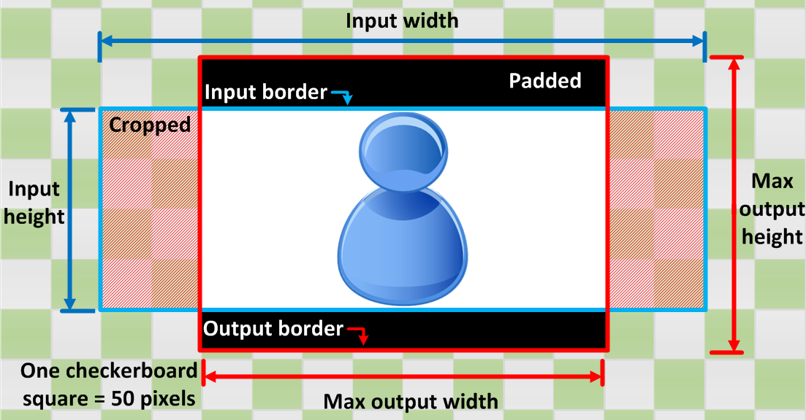

End of support notice: On November 13, 2025, AWS will discontinue support for Amazon Elastic Transcoder. After November 13, 2025, you will no longer be able to access the Elastic Transcoder console or Elastic Transcoder resources.

For more information about transitioning to AWS Elemental MediaConvert, visit this [blog post](https://aws.amazon.com/blogs/media/how-to-migrate-workflows-from-amazon-elastic-transcoder-to-aws-elemental-mediaconvert/ "https://aws.amazon.com/blogs/media/how-to-migrate-workflows-from-amazon-elastic-transcoder-to-aws-elemental-mediaconvert/").

# Sizing Policy and Aspect Ratios

The **Sizing Policy** that you choose affects the scaling that
Elastic Transcoder applies to your output image, as shown in the following table.

| Sizing Policy    | Output Image Might Be Scaled Up | Output Image Might Be Padded When Padding Policy Is "Pad" | Output Image Might Have a Different Pixel Aspect Ratio than Input Image | Output Image Might Be Cropped |
| ---------------- | ------------------------------- | --------------------------------------------------------- | ----------------------------------------------------------------------- | ----------------------------- |
| **Fit**          | Yes                             | Yes                                                       |                                                                         |                               |
| **Fill**         | Yes                             |                                                           |                                                                         | Yes                           |
| **Stretch**      | Yes                             |                                                           | Yes                                                                     |                               |
| **Keep**         |                                 | Yes                                                       |                                                                         | Yes                           |
| **ShrinkToFit**  |                                 | Yes                                                       |                                                                         |                               |
| **ShrinkToFill** |                                 | Yes                                                       |                                                                         | Yes                           |

## Aspect Ratio Thumbnails

The following tables show how the **Sizing Policy**, **Padding
Policy**, **Max Height**, and **Max Width** interact to
change the output image.

###### Topics

- [Fit](#fit-ratio "#fit-ratio")
- [Fill](#fill-ratio "#fill-ratio")
- [Stretch](#stretch-ratio "#stretch-ratio")
- [Keep](#keep-ratio "#keep-ratio")
- [Shrink to Fit](#shrink-to-fit-ratio "#shrink-to-fit-ratio")
- [Shrink to Fill](#shrink-to-fill-ratio "#shrink-to-fill-ratio")

### Fit

If you choose **Fit** for your **Sizing Policy**,
Elastic Transcoder scales your input file until it fits inside the dimensions of your output image,
without exceeding the dimensions of your output image.

For example, if your input file is `200` pixels by `200` pixels
and you want an output image that is `300` pixels by `400` pixels,
Elastic Transcoder increases the size of your file to `300` pixels by `300`
pixels, and applies your padding policy to the sides of your file. If you choose
**Unpadded** for your **Padding Policy**, Elastic Transcoder returns
the `300` pixel by `300` pixel file as your output. If you choose
**Padded**, Elastic Transcoder adds `50` pixels of padding on either side
of your output, and returns a `300` pixel by `400` pixel file.

**Key**

| Condition                                                                            | Input                                                                                  | Output: NoPad                                                                                     | Output: Pad                                                                                   |
| ------------------------------------------------------------------------------------ | -------------------------------------------------------------------------------------- | ------------------------------------------------------------------------------------------------- | --------------------------------------------------------------------------------------------- |
| Input width **<\* • Max output width Input height **<\* • Max output height | Blue user icon with dimensions labeled: 200x200 inner square, 300x400 outer rectangle. | Blue figure icon with size dimensions labeled around it: 400 width, 300 height, 200 top and left. | Diagram showing a blue figure icon centered within a frame with dimensions labeled.           |
| Input width **<\* • Max output width Input height **>\* • Max output height | Blue pawn-shaped figure on a checkered background with red measurement lines.          | Diagram showing a blue figure centered in a 400x200 pixel area with surrounding measurements.     | Diagram showing a blue figure centered within a white rectangle surrounded by black bars.     |
| Input width **>\* • Max output width Input height **<\* • Max output height | Blue user icon centered within a rectangular frame with dimensions labeled.            | Diagram showing a rectangle with dimensions 400x300 inside a larger 500x200 area.                 | Diagram showing dimensions of a rectangle: 500 width, 400 height, with inner area of 300x200. |
| Input width **>\* • Max output width Input height **>\* • Max output height | Blue silhouette icon of a person within a red square frame on a grid background.       | Blue 3D figure resembling a snowman or stacked spheres centered in a square frame.                | Blue 3D snowman-like figure centered within nested squares on a checkered background.         |

### Fill

If you choose **Fill** for your **Sizing Policy**,
Elastic Transcoder scales your input file until it fills the dimensions of your output image, and crops
anything that exceeds the dimensions of your output image.

For example, if your input file is `200` pixels by `200` pixels
and you want an output image that is `300` pixels by `400` pixels,
Elastic Transcoder increases the size of your input to `400` pixels by `400`
pixels, crops off the top and bottom `50` pixels,
and returns a `300` pixel by `400` pixel file. Elastic Transcoder does not use
padding for the **Fill** policy.

**Key**

| Condition                                                                            | Input                                                                                  | Output: NoPad                                                                               | Output: Pad                                                                                 |
| ------------------------------------------------------------------------------------ | -------------------------------------------------------------------------------------- | ------------------------------------------------------------------------------------------- | ------------------------------------------------------------------------------------------- |
| Input width **<\* • Max output width Input height **<\* • Max output height | Blue user icon with dimensions labeled: 200x200 inner square, 300x400 outer rectangle. | Blue figure icon with dimensions and sizing information overlaid on a checkered background. | Blue figure icon with dimensions and sizing information overlaid on a checkered background. |
| Input width **<\* • Max output width Input height **>\* • Max output height | Blue pawn-shaped figure on a checkered background with red measurement lines.          | Diagram showing a blue figure with dimensions: 200 height, 300 width, 400 total height.     | Diagram showing a blue figure with dimensions: 200 height, 300 width, 400 total height.     |
| Input width **>\* • Max output width Input height **<\* • Max output height | Blue user icon centered within a rectangular frame with dimensions labeled.            | Blue hourglass-shaped icon with numerical values indicating dimensions around it.           | Blue hourglass-shaped icon with numerical values indicating dimensions around it.           |
| Input width **>\* • Max output width Input height **>\* • Max output height | Blue silhouette icon of a person within a red square frame on a grid background.       | Blue 3D figure centered in a square frame with measurement indicators on the sides.         | Blue 3D figure centered in a square frame with measurement indicators on the sides.         |

### Stretch

If you choose **Stretch** for your **Sizing Policy**,
Elastic Transcoder stretches or shrinks your input file until it matches the dimensions of your output
file.

For example, if your input file is `200` pixels by `200` pixels
and you want an output image that is `300` pixels by `400` pixels,
Elastic Transcoder increases the size of your input to `300` pixels by `400`
pixels, distorting the proportions of your output image. Elastic Transcoder does not use padding or cropping
for the **Stretch** policy.

**Key**

| Condition                                                                            | Input                                                                                  | Output: NoPad                                                                                    | Output: Pad                                                                                      |
| ------------------------------------------------------------------------------------ | -------------------------------------------------------------------------------------- | ------------------------------------------------------------------------------------------------ | ------------------------------------------------------------------------------------------------ |
| Input width **<\* • Max output width Input height **<\* • Max output height | Blue user icon with dimensions labeled: 200x200 inner square, 300x400 outer rectangle. | Blue 3D object resembling a chess pawn piece with dimensions labeled around it.                  | Blue 3D object resembling a chess pawn piece with dimensions labeled around it.                  |
| Input width **<\* • Max output width Input height **>\* • Max output height | Blue pawn-shaped figure on a checkered background with red measurement lines.          | Diagram showing dimensions of a blue cylindrical object on a checkered background.               | Diagram showing dimensions of a blue cylindrical object on a checkered background.               |
| Input width **>\* • Max output width Input height **<\* • Max output height | Blue user icon centered within a rectangular frame with dimensions labeled.            | Diagram showing a blue bowling pin shape centered within nested rectangles and numerical labels. | Diagram showing a blue bowling pin shape centered within nested rectangles and numerical labels. |
| Input width **>\* • Max output width Input height **>\* • Max output height | Blue silhouette icon of a person within a red square frame on a grid background.       | Blue 3D figure resembling a snowman or stacked spheres centered in a square frame.               | Blue 3D figure resembling a snowman or stacked spheres centered in a square frame.               |

### Keep

If you choose **Keep** for your **Sizing Policy**,
Elastic Transcoder does not scale your input file. Elastic Transcoder crops or pads your input file until it matches
the dimensions of your output image.

For example, if your input file is `400` pixels by `200` pixels
and you want an output image that is `300` pixels by `300` pixels,
Elastic Transcoder crops `100` pixels off of the top and bottom, and applies your padding policy to
the sides. If you choose **Unpadded** for your **Padding
Policy**, Elastic Transcoder returns a `300` pixel by `200` pixel output
file. If you choose **Padded**, Elastic Transcoder returns a `300` pixel by
`300` pixel file.

**Key**

| Condition                                                                            | Input                                                                                  | Output: NoPad                                                                               | Output: Pad                                                                                   |
| ------------------------------------------------------------------------------------ | -------------------------------------------------------------------------------------- | ------------------------------------------------------------------------------------------- | --------------------------------------------------------------------------------------------- |
| Input width **<\* • Max output width Input height **<\* • Max output height | Blue user icon with dimensions labeled: 200x200 inner square, 300x400 outer rectangle. | Diagram showing a blue user icon surrounded by numbered dimensions: 200, 300, and 400.      | Diagram showing a centered image with dimensions labeled: 200x200 inner, 400x300 outer.       |
| Input width **<\* • Max output width Input height **>\* • Max output height | Blue pawn-shaped figure on a checkered background with red measurement lines.          | Blue figure icon with dimensions and grid background indicating size specifications.        | Blue figure icon with dimensions and measurements indicated around it.                        |
| Input width **>\* • Max output width Input height **<\* • Max output height | Blue user icon centered within a rectangular frame with dimensions labeled.            | Diagram showing a blue user icon centered within nested rectangles with labeled dimensions. | Diagram showing image dimensions: 500 width, 400 height, with 200 left and 300 right margins. |
| Input width **>\* • Max output width Input height **>\* • Max output height | Blue silhouette icon of a person within a red square frame on a grid background.       | Blue figure icon centered within red square frame on checkered background.                  | Blue figure icon centered within red square frame on checkered background.                    |

### Shrink to Fit

If you choose **Shrink to Fit** for your **Sizing Policy**,
Elastic Transcoder decreases the size of your input file until it fits inside the dimensions of your output
file, without going over any of the dimensions of your output image. If your input file is
smaller than your output image, Elastic Transcoder does not increase the size of your file.

For example, if your input file is `400` pixels by `400` pixels and
you want an output image that is `200` pixels by `300` pixels,
Elastic Transcoder shrinks your input to `200` pixels by `200` pixels, and
applies your padding policy. If you choose **Unpadded** for your
**Padding Policy**, Elastic Transcoder returns the `200` by
`200` pixel file as your output. If you choose **Padded**,
Elastic Transcoder adds `50` pixels of padding on either side of your output, and returns
a `300` pixel by `300` pixel file.

**Key**

| Condition                                                                            | Input                                                                                  | Output: NoPad                                                                                 | Output: Pad                                                                                   |
| ------------------------------------------------------------------------------------ | -------------------------------------------------------------------------------------- | --------------------------------------------------------------------------------------------- | --------------------------------------------------------------------------------------------- |
| Input width **<\* • Max output width Input height **<\* • Max output height | Blue user icon with dimensions labeled: 200x200 inner square, 300x400 outer rectangle. | Diagram showing a blue user icon surrounded by numbered dimensions: 200, 300, and 400.        | Diagram showing a centered image with dimensions labeled: 200x200 inner, 400x300 outer.       |
| Input width **<\* • Max output width Input height **>\* • Max output height | Blue pawn-shaped figure on a checkered background with red measurement lines.          | Diagram showing a blue figure centered in a 400x200 pixel area with surrounding measurements. | Diagram showing a blue figure centered within a white rectangle surrounded by black bars.     |
| Input width **>\* • Max output width Input height **<\* • Max output height | Blue user icon centered within a rectangular frame with dimensions labeled.            | Diagram showing a rectangle with dimensions 400x300 inside a larger 500x200 area.             | Diagram showing dimensions of a rectangle: 500 width, 400 height, with inner area of 300x200. |
| Input width **>\* • Max output width Input height **>\* • Max output height | Blue silhouette icon of a person within a red square frame on a grid background.       | Blue 3D figure resembling a snowman or stacked spheres centered in a square frame.            | Blue 3D snowman-like figure centered within nested squares on a checkered background.         |

### Shrink to Fill

If you choose **Shrink to Fill** for your **Sizing Policy**,
Elastic Transcoder decreases the size of your input file until it fills the dimensions of your output image,
crops anything that does not fit inside your output image, and applies your padding policy. If
your output image is larger than your input file, Elastic Transcoder does not increase the size of your
file.

For example, if your input file is `400` pixels by `200` pixels
and you want an output image that is `200` pixels by `300` pixels,
Elastic Transcoder
crops `100` pixels from the sides, and applies your padding policy to the top
and bottom of your file. If you choose **Unpadded** for your **Padding
Policy**, Elastic Transcoder returns a `200` pixel by `200` pixel output
file. If you choose **Padded**, Elastic Transcoder returns a `200` pixel by
`300` pixel file.

**Key**

| Condition                                                                            | Input                                                                                  | Output: NoPad                                                                               | Output: Pad                                                                                   |
| ------------------------------------------------------------------------------------ | -------------------------------------------------------------------------------------- | ------------------------------------------------------------------------------------------- | --------------------------------------------------------------------------------------------- |
| Input width **<\* • Max output width Input height **<\* • Max output height | Blue user icon with dimensions labeled: 200x200 inner square, 300x400 outer rectangle. | Diagram showing a blue user icon surrounded by numbered dimensions: 200, 300, and 400.      | Diagram showing a centered image with dimensions labeled: 200x200 inner, 400x300 outer.       |
| Input width **<\* • Max output width Input height **>\* • Max output height | Blue pawn-shaped figure on a checkered background with red measurement lines.          | Blue figure icon with dimensions and grid background indicating size specifications.        | Blue figure icon with dimensions and measurements indicated around it.                        |
| Input width **>\* • Max output width Input height **<\* • Max output height | Blue user icon centered within a rectangular frame with dimensions labeled.            | Diagram showing a blue user icon centered within nested rectangles with labeled dimensions. | Diagram showing image dimensions: 500 width, 400 height, with 200 left and 300 right margins. |
| Input width **>\* • Max output width Input height **>\* • Max output height | Blue silhouette icon of a person within a red square frame on a grid background.       | Blue 3D figure centered in a square frame with measurement indicators on the sides.         | Blue 3D figure centered in a square frame with measurement indicators on the sides.           |
