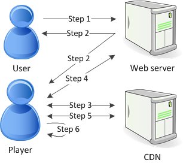

End of support notice: On November 13, 2025, AWS will discontinue support for Amazon Elastic Transcoder. After November 13, 2025, you will no longer be able to access the Elastic Transcoder console or Elastic Transcoder resources.

For more information about transitioning to AWS Elemental MediaConvert, visit this [blog post](https://aws.amazon.com/blogs/media/how-to-migrate-workflows-from-amazon-elastic-transcoder-to-aws-elemental-mediaconvert/ "https://aws.amazon.com/blogs/media/how-to-migrate-workflows-from-amazon-elastic-transcoder-to-aws-elemental-mediaconvert/").

# HLS Content Protection

HTTP Live Streaming (HLS) is a protocol that segments media files for optimization during
streaming. HLS enables media players to play segments with the highest quality resolution that is
supported by their network connection during playback.

You can use Elastic Transcoder to encrypt segments of a streamed media file, send the encrypted segments
over the Internet, and decrypt them upon playback. This protects your media content and ensures
that only authorized users can view the encrypted segments of your media files.

The following is a summary of the playback process of a media file that has HLS
content protection:



1. A user visiting your web page authenticates with your web server, which sets a session cookie in the user's browser.
2. The user loads a player from your web server.
3. The player fetches the master playlist from your content delivery network (CDN). The master playlist
   provides the available bit rates and resolutions for the media file.
4. The player calls your web server, which validates the session cookie, checks that the user is authorized to view the content, and returns the data decryption key.
5. The player chooses a variant playlist and fetches the associated media segments from the CDN.
6. The player uses the data key to decrypt the segments, and begins playing the media.

###### Note

You can use HLS content protection to encrypt segments of a streamed file, or you can
encrypt entire files. You can’t do both, so don’t select both HLS content protection and
individual file protection.

## Keys for HLS Content Protection

To use HLS content protection with Elastic Transcoder, you need two types of keys:

- **AWS KMS key** — The key associated with your Elastic Transcoder pipeline
- **Data key** — The key associated with your Elastic Transcoder job

You must have a AWS KMS key to use HLS content protection. The KMS key
is used to encrypt your data key before it is sent it over the
Internet. We recommend that you create one KMS key to use with all your transcoding jobs.
For more information about creating and
setting up a KMS key, see [Using AWS KMS with Elastic Transcoder](encryption.md#using-kms "encryption.md#using-kms").

The data key is used to encrypt your media file. All variations and segments of the same content
are encrypted using the same data key. If you do not specify a data key,
Elastic Transcoder generates one for you.

## Streaming HLS Protected Content

To deliver HLS protected content, you must have the following:

- A location for storing your encrypted media files and data keys. We recommend that
  you store your files in Amazon S3 and secure your keys in a database, such as DynamoDB. For more
  information on DynamoDB, see [What is Amazon DynamoDB?](../../../amazondynamodb/latest/developerguide/Introduction.md "../../../amazondynamodb/latest/developerguide/Introduction.md")
  in the _Amazon DynamoDB Developer Guide_.
- (Optional) A content distribution network (CDN) to stream your files. For more
  information about CDNs, see
  [Getting Started with CloudFront](../../../AmazonCloudFront/latest/DeveloperGuide/programming-encryption.md "../../../AmazonCloudFront/latest/DeveloperGuide/programming-encryption.md")
  in the _Amazon CloudFront Developer Guide_.
- An application capable of authenticating and authorizing your users, and securely
  serving the data encryption key. You can use Amazon EC2 to run this application. For more
  information, see [Setting Up with Amazon EC2](../../../AWSEC2/latest/WindowsGuide/concepts.md "../../../AWSEC2/latest/WindowsGuide/concepts.md")
  in the _Amazon EC2 User Guide_ (for Windows users) or
  [Setting Up with Amazon EC2](../../../AWSEC2/latest/UserGuide/concepts.md "../../../AWSEC2/latest/UserGuide/concepts.md")
  in the _Amazon EC2 User Guide_ (for Linux users).
- A player capable of decrypting an encrypted HLS file. For more
  information, go to [Http
  Live Streaming](http://en.wikipedia.org/wiki/HTTP_Live_Streaming#Client_software "http://en.wikipedia.org/wiki/HTTP_Live_Streaming#Client_software").

## Creating Encrypted Streamed Content

To prepare your files for HLS content protection, you must associate a KMS key with a new or
existing pipeline.

To set up a pipeline with a KMS key that you specify, see
[Using AWS KMS with Elastic Transcoder](encryption.md#using-kms "encryption.md#using-kms").

The following steps show how to encrypt your files for HLS content protection by using
the Elastic Transcoder console:

###### To use HLS content protection for your files

1. Open the Elastic Transcoder console at
   [https://console.aws.amazon.com/elastictranscoder/](https://console.aws.amazon.com/elastictranscoder/ "https://console.aws.amazon.com/elastictranscoder/").
2. In the navigation pane, click **Jobs** and create a new job. For more information, see
   [Creating a Job in Elastic Transcoder](creating-jobs.md "creating-jobs.md").
3. In **Output Details**, in the **Preset** drop down list,
   select an `HLS` preset.
4. Leave **Encryption Parameters** set to `None`.
5. In **Playlists**, click **Add Playlist** and select either `HLSv3` or
   `HLSv4` as your playlist type.
6. In **Content Protection**, select `Enter Information`.

a. To manage your own key, in **Key Storage Policy**, select `No Store`.
In **License Acquisition Url**, type in the absolute path to the location where you
will store your data key. For example:

```
https://www.example.com/datakey
```

We recommend that you select `No Store` and store your key in a secure
Amazon S3 bucket or a database such as DynamoDB.

b. To store your key in a public Amazon S3 bucket, in **Key Storage Policy**,
select `With Variant Playlists`. Elastic Transcoder writes your data key into the same bucket
as the playlist files.

###### Important

Keys stored using `With Variant Playlists` are written to a public
bucket. Use `No Store` for your actual keys.

###### Note

If you choose `No Store`, Elastic Transcoder returns your data key as part of the job object, but
does not store it. You are responsible for storing the data key.
