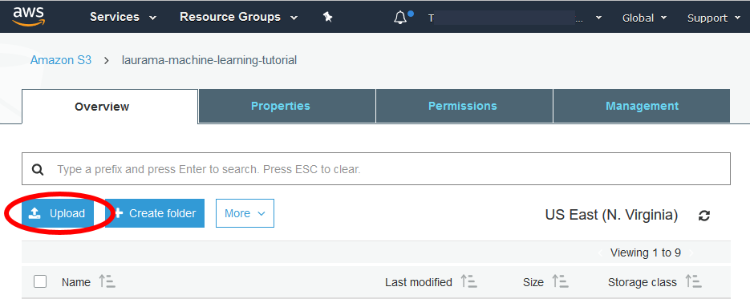

End of support notice: On November 13, 2025, AWS will discontinue support for Amazon Elastic Transcoder. After November 13, 2025, you will no longer be able to access the Elastic Transcoder console or Elastic Transcoder resources.

For more information about transitioning to AWS Elemental MediaConvert, visit this [blog post](https://aws.amazon.com/blogs/media/how-to-migrate-workflows-from-amazon-elastic-transcoder-to-aws-elemental-mediaconvert/ "https://aws.amazon.com/blogs/media/how-to-migrate-workflows-from-amazon-elastic-transcoder-to-aws-elemental-mediaconvert/").

# Create an Amazon S3 Bucket or Two, and Upload a Media

File

Create an Amazon S3 bucket for the files that you want to transcode (the input bucket) and another bucket for the
transcoded files (the output bucket). You can also use the same bucket for the input bucket and the output bucket.

###### To create Amazon S3 buckets and upload a media file

1. Sign in to the AWS Management Console and open the Amazon S3 console at
   [https://console.aws.amazon.com/s3/](https://console.aws.amazon.com/s3/ "https://console.aws.amazon.com/s3/").
2. In the Amazon S3 console, click **Create Bucket**.
3. In the **Create Bucket** dialog box, enter a bucket name. If you want to create separate
   input and output buckets, give the bucket an appropriate name.
4. Select a region for your bucket. By default, Amazon S3 creates buckets in the US Standard region. We recommend that you
   choose a region close to you to optimize latency, minimize costs, or to address regulatory requirements. This is also the region
   in which you want Elastic Transcoder to do the transcoding.
5. Click **Create**.
6. If you want to create separate buckets for the files that you are transcoding and the files that Elastic Transcoder
   has finished transcoding, repeat Step 2 through Step 5.
7. In the **Buckets** pane, click the name of your input bucket.
8. Click **Actions** and then click **Upload**.
9. On the **Upload - Select Files** page, click **Add Files**, and
   upload a media file that you want to transcode.

 10. Click **Start Upload**.
