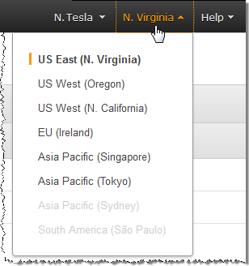

End of support notice: On November 13, 2025, AWS will discontinue support for Amazon Elastic Transcoder. After November 13, 2025, you will no longer be able to access the Elastic Transcoder console or Elastic Transcoder resources.

For more information about transitioning to AWS Elemental MediaConvert, visit this [blog post](https://aws.amazon.com/blogs/media/how-to-migrate-workflows-from-amazon-elastic-transcoder-to-aws-elemental-mediaconvert/ "https://aws.amazon.com/blogs/media/how-to-migrate-workflows-from-amazon-elastic-transcoder-to-aws-elemental-mediaconvert/").

# Create a Job

A job does the work of transcoding. You specify the name of the file that you want to transcode (the input file),
the name that you want Elastic Transcoder to give the transcoded file, the preset that you want Elastic Transcoder to use, and a few other settings.
Elastic Transcoder gets the input file from the Amazon S3 input bucket that you specified in your pipeline, transcodes the file, and saves the
transcoded file or files in the Amazon S3 output bucket that you specified in the pipeline.

For more information about jobs, see [Working with Jobs](working-with-jobs.md "working-with-jobs.md").

###### To create a job using the Elastic Transcoder console

1. Open the Elastic Transcoder console at
   [https://console.aws.amazon.com/elastictranscoder/](https://console.aws.amazon.com/elastictranscoder/ "https://console.aws.amazon.com/elastictranscoder/").
2. In the navigation bar of the Elastic Transcoder console, select the region in which you want to create the job.

 3. In the left pane of the console, click **Pipelines**. (You create the job in the
pipeline—the queue—that you want to use to transcode the file.) 4. On the **Pipelines** page, click **Create New Job**. 5. Enter the applicable values. For more information about each field, see
[Settings that You Specify When You Create an Elastic Transcoder Job](job-settings.md "job-settings.md"). 6. Click **Create Job**.
