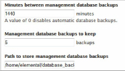

This is version 2.18 of the AWS Elemental Conductor File documentation. This is the
latest version. For prior versions, see the _Archive_ section of
[AWS Elemental Conductor File and AWS Elemental Server Documentation](../../../elemental-server.md "../../../elemental-server.md").

# View Folder for Database Backups

1. On the primary Conductor web interface, choose **Configuration** (cog icon) on the main menu.
2. On the **Conductor Configuration** screen, review the management database fields.

In the following example, the system creates backups every 24 hours and five consecutive backup files are saved. When the system creates the sixth backup, the it deletes the oldest file before saving the most recent backup.

Backup files are named in this format: `<yyyy-mm-dd_hh-mm-ss.tar.bz2>`

###### Important

Similar database fields also appear in the **Settings** > **General** screen on the worker nodes. When the workers are part of a cluster, the system ignores the values set on the worker nodes.
