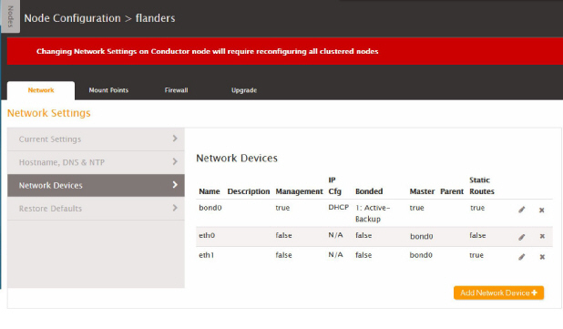

This is version 2.18 of the AWS Elemental Conductor File documentation. This is the
latest version. For prior versions, see the _Archive_ section of
[AWS Elemental Conductor File and AWS Elemental Server Documentation](../../../elemental-server.md "../../../elemental-server.md").

# Bond Ethernet Devices

You can bond Ethernet devices to suit your networking requirements. For example, you might
set up two Ethernet devices as an active/redundant pair.

###### Bonding is a two-step process

- [Step A: Create the Bond](#config-wrkr-cf-cg-ethernet-bond-create "#config-wrkr-cf-cg-ethernet-bond-create")
- [Step B: Assign the Devices](#config-wrkr-cf-cg-ethernet-bond-assign "#config-wrkr-cf-cg-ethernet-bond-assign")

###### Important

We recommend that you set up both eth0 and eth1 with static IP addresses. Eth0, eth1 and bond0 should also all on the same subnet.

###### Prerequisites

Before you begin this process, make sure that you've done the following:

- [Added to AWS Elemental Conductor File the Ethernet devices](config-wrkr-cf-cg-ethernet-add.md "config-wrkr-cf-cg-ethernet-add.md") that you're bonding.

## Step A: Create the Bond

1. Make sure that you have set up the two devices that you want to bond.
2. On the Conductor web interface, choose **Nodes** in the main menu.
3. On the **Nodes** screen, choose **Edit** (wrench icon) beside the primary Conductor node.
4. On the **Node Configuration** screen, choose **Network** > **Network Devices**.
5. On the **Network Devices** tab, choose **Add Network Device**.
6. In the **Add Network Dialog** dialog, select **bond** as the device type. The dialog immediately expands to include more fields.
7. Complete the fields as follows:

| Prompt                                       | Action                                                                                                                                                                                                                                                                             |
| -------------------------------------------- | ---------------------------------------------------------------------------------------------------------------------------------------------------------------------------------------------------------------------------------------------------------------------------------- | --------------------------------------------------------------------------------------------------------------------------------------------------------------------------------------------------------------------------------------------------------------------------------------------------------------------------------------------------------------------------------------------------------------------------------------------------------------------------------------------------------------------------------------------------------------------------------------------------------------------------------------------------------------------------------------------------------------------------------------------------------------------------------------------------------------------------------------------------------------------------------------------- |
| **Bond ID**                                  | A number that is unique among your bonded interfaces.                                                                                                                                                                                                                              |
| **Management**                               |  • Checked: if you are creating a bond in order to bond two management interfaces. For example, if you want to set up both eth0 and eth1 as management interfaces, with eth1 as a backup in case eth0 fails.  • Unchecked: if you are not bonding two management interfaces. |
| **Description**                              | Optional.                                                                                                                                                                                                                                                                          |
| **IP Address**, **Netmask**, and **Gateway** | The fields appear only if you set Address Mode to Static. The eth0, eth1, and bond0 devices should all be on the same subnet.                                                                                                                                                      |
| **Static Routes**                            | Optional.                                                                                                                                                                                                                                                                          |
| **Mode**                                     | Choose the mode that meets your networking requirements.                                                                                                                                                                                                                           |
| More fields                                  | Depending on the mode, more fields may appear. Complete them as required to meet your networking requirements.                                                                                                                                                                     | 8. Choose **Save**. The new device appears in the Network Devices list. 9. If you have additional worker nodes, switch to the web interface for each node and repeat these steps. ## Step B: Assign the Devices 1. Revise the two regular Ethernet devices as follows:  • **Management**: Always Unchecked. This indicates that whether the devices are management or not is defined in the bond, not in the individual devices.)  • **Master Device**: Select the bond that you just created (for example, bond0). 2. Choose **Save**. The Network Devices list shows the two Ethernet devices and the bond, as displayed in this example:  3. If you have additional worker nodes, switch to the web interface for each node and repeat these steps. |
