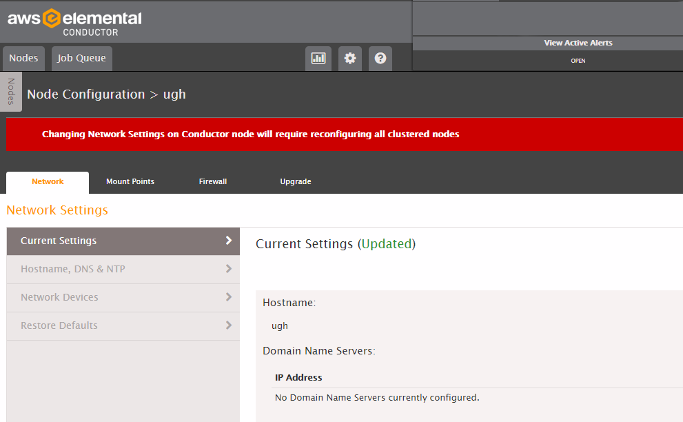
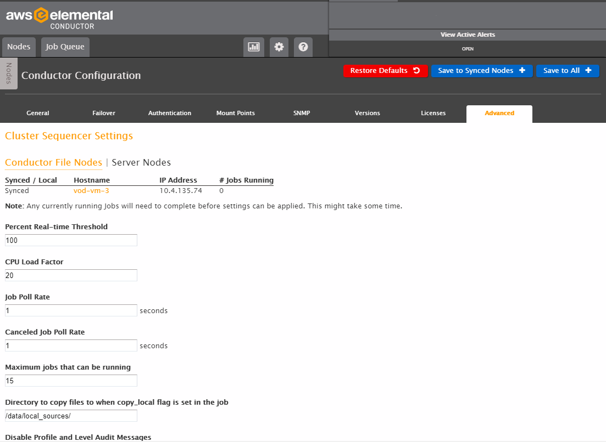

This is version 2.18 of the AWS Elemental Conductor File documentation. This is the
latest version. For prior versions, see the _Archive_ section of
[AWS Elemental Conductor File and AWS Elemental Server Documentation](../../../elemental-server.md "../../../elemental-server.md").

# Where to Work: Configuration Screens

The procedures in this guide use one of three screens on the Conductor web interface. All work is done from the Conductor web interface; there is never a need to switch to the web interface for a worker.

The three screens are:

- The Node Configuration screen for a Conductor node.
- The Node Configuration screen for a worker node.
- The Conductor Configuration screen for a Conductor node.
  These three screens cover slightly different configuration features, and are accessed in slightly different ways. The following tables provides more detail.

| Screen                                  | How to Navigate to this Screen                                              | Purpose of this Screen                                                                                                                                               |
| --------------------------------------- | --------------------------------------------------------------------------- | -------------------------------------------------------------------------------------------------------------------------------------------------------------------- | --------------------------------------------------------------------------------------------------------------------------------------------------------------------------------------------------------------------------------------------------------------------------------------------------------------------------------------------------------------------------------------------------------------------------------------------------------------------------------------------------------------------------------------------------------------------------------------------------------------------------------------------------------------------------------- |
| Node Configuration screen for Conductor | From the Conductor web interface: **Nodes** > **Edit** (wrench icon)        | Configures the Conductor node as one of several nodes in the cluster. Includes network settings, mount points, and firewall for AWS Elemental Conductor File.        |
| Node Configuration screen for worker    | From the Conductor web interface: **Nodes** > **Edit** (wrench icon)        | Configures the worker node as one of several nodes in the cluster. Include network settings, mount points, and firewall for AWS Elemental Server.                    |
| Conductor Configuration screen          | From the Conductor web interface: Configuration (cog icon) in the main menu | Configures the Conductor in its special role as the manager of the cluster. Includes failover management, authentication on the cluster, SNMP management, and so on. | ###### Important Take care to go to the correct screen! Do not confuse the Node Configuration screen with the Conductor Configuration screen. ###### Node Configuration Screen This example shows the Node Configuration screen for a Conductor node. The screen for a worker node is nearly identical.  ###### Conductor Configuration Screen This example shows the Conductor configuration screen.  |
