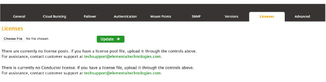

This is version 2.18 of the AWS Elemental Conductor File documentation. This is the
latest version. For prior versions, see the _Archive_ section of
[AWS Elemental Conductor File and AWS Elemental Server Documentation](../../../elemental-server.md "../../../elemental-server.md").

# Step d: Install the License

Files

Now that you have a `.tgz` compressed license file for each instance of the software you are running, you must point the software to it.

From your workstation, perform the following steps on each AWS Elemental Conductor File node.

1. Navigate to the directory where you saved the `.tgz` file and unpack it.
2. Bring up the web interface for the primary AWS Elemental Conductor File system. From the main menu, select **Settings** > **Licenses**. The Licenses screen appears.
3. Select **Choose File** and navigate to the directory where you placed the license files. Select the file name with the hostname portion matching the hostname of this node.

 4. Back on the Licenses screen, choose **Update**. The license file will be installed. Be sure to install each license file: `conductor.lic` and `ui.lic`. 5. Look at the information in the left pane and make sure that:

    * **Total** shows the expected number of licenses in the pool.
    * **Expiration** shows the expected expiry date for the licenses.
    * **Product** shows the correct product for the worker nodes.
    * **Processing** shows the expected CPU and GPU counts.
    * **Pacakages** shows the expted options. These are the add-on optionst built in to the AWS Elemental Server pooled license.

6. Repeat on the secondary AWS Elemental Conductor File node.
