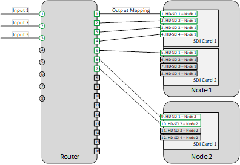

# Step A: Gather information

To set up the router information in Conductor Live, gather the
following information:

- **Information on the router**: The
  name you want to use for the router, its IP address, and any
  information required by your router’s protocol, such as user, level,
  or matrix ID.
- The **router input** port numbers. In
  the diagram below, these are the green circles on the left.

These are the numbers that the router uses for its input ports,
not numbers generated by AWS Elemental software. The router inputs are called
**Inputs** in Conductor Live.

- The **router output** port numbers
  being used by the cables between the router and worker nodes. In the
  diagram below, these are green squares numbered 1 through 7 on the
  right side of the router.

The router outputs are called **Outputs** in
Conductor Live.

- The **inputs to each SDI card** on
  each node. These correspond to the port where cables are plugged into
  the node from the router.

The card inputs are referred to in the **Connected
to** field in Conductor Live.

###### Example SDI Router Configuration

In the following example, _Node 1_ has two SDI
cards. On Card 1, four inputs are being used. On card 2, one input is
being used. _Node 2_ has one card, with two inputs in
use.

In total, seven inputs are in use on the node, so you need seven
outputs from the router. These seven outputs are shown on the right side
of the router.

