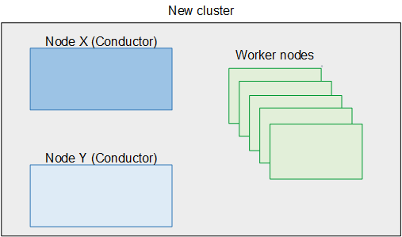

# Step G: Add node Y to cluster

1. Add node Y to the new cluster, and add it to the HA group in that cluster.
   Node Y will assume the role of secondary Conductor. See [Adding the secondary Conductor node to the
   cluster](migrate-topic-add-conductor.md "migrate-topic-add-conductor.md").
2. Re-enable HA on node X. See [Enabling or disabling high
   availability (HA)](migrate-topic-disable-ha.md "migrate-topic-disable-ha.md").

The secondary Conductor (node Y) synchs itself to the primary Conductor (node X). See
[Enabling or disabling high
availability (HA)](migrate-topic-disable-ha.md "migrate-topic-disable-ha.md").
The upgrade process is now complete. Node X is acting as the primary Conductor, node Y is
acting as the secondary Conductor, and all the nodes are running the new software
version.

The deployment now looks like the following diagram.

