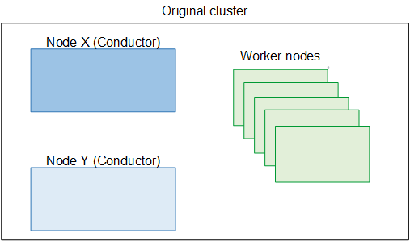
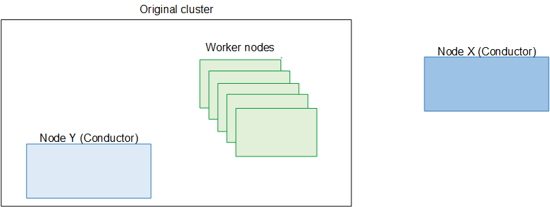

# Step C: Split the cluster

###### Note

In this procedure, the Conductor nodes change their roles. Therefore, the node that is
originally the primary node is called node X. The node that is originally the
secondary node is called node Y.

To split the cluster into two clusters, you first fail over control to the secondary
Conductor node (_node Y_), then you remove the primary Conductor
node (_node X_).

You start with the original deployment of one cluster, which looks like the following
diagram.


You end up with:

- The original cluster controlled by the second node. This cluster is using the
  older version of the software. For example, Conductor Live 3.25.5 and Elemental Live
  2.25.5.
- A new cluster that right now consists only of the primary Conductor node. The Conductor
  is using 3.26.x.
  During this time, the worker nodes (on the original cluster) continue processing
  without interruption.

1. Disable high availability (HA) on the cluster. See [Enabling or disabling high
   availability (HA)](migrate-topic-disable-ha.md "migrate-topic-disable-ha.md").
2. Create a backup of the data on node X. See [Backing up data](migrate-topic-lifeboat.md "migrate-topic-lifeboat.md").

###### Important

Now that you have made a backup of this Conductor node, don't make any changes
to this Conductor node or to cluster until you've finished this migration
process. Don't change the setup of the Conductor node, don't create channels,
don't create new node assignments for any channel, and so on. 3. On the web interface for node X, re-enable HA. See [Enabling or disabling high
availability (HA)](migrate-topic-disable-ha.md "migrate-topic-disable-ha.md"). 4. Perform the commands in the next few steps from the command line.

    1. From the Linux prompt, use the *elemental* user to
     start a remote terminal session with node X.
    2. Fail over to the secondary Conductor node. To fail over, enter these
     commands from the CLI on node X:


    ```
    sudo systemctl stop elemental_se
    sudo systemctl stop serf
    ```

Node Y is now controlling the cluster. 5. To enable user authentication on node Y, enter this command from the
CLI:

```
sudo systemctl restart httpd
```

6. On the web interface for node Y, disable HA. See [Enabling or disabling high
   availability (HA)](migrate-topic-disable-ha.md "migrate-topic-disable-ha.md").
7. Now that HA is disabled, you can remove node X from the cluster. See [Removing a Conductor node from the
   cluster](migrate-topic-remove-c-node.md "migrate-topic-remove-c-node.md").
8. On the CLI, enter the following commands to push the VIP into node Y:

```
sudo systemctl start keepalived
sudo systemctl enable keepalived
```

Node Y is now the Conductor that is controlling the cluster. Note that you no longer have
Conductor redundancy in the cluster.


