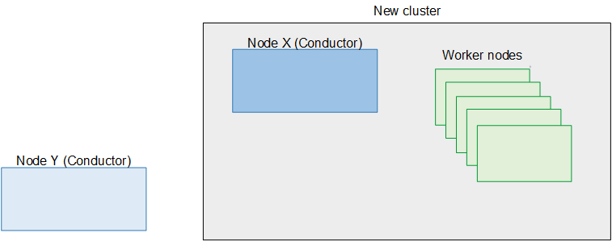

# Step F: Upgrade node Y

After you remove the last worker node, the original cluster no longer exists. Node Y
is no longer controlling any worker nodes. The deployment now looks like the following
diagram.


You can now upgrade node Y. Perform all the following steps on node Y.

1. On node Y, which will soon be the secondary Conductor in the new cluster, you must
   clean the database. Enter the configure commands as follows:

```
cd /opt/elemental_se; sudo ./configure -xeula --skip-all --cleandb --start
```

2. Create a backup of the data on node Y. See [Backing up data](migrate-topic-lifeboat.md "migrate-topic-lifeboat.md").
3. Set boot mode on the node to UEFI. See [Switching boot mode to UEFI](migrate-topic-uefi.md "migrate-topic-uefi.md").
4. Perform a kickstart to upgrade the operating system to RHEL 9. See [Installing RHEL 9](migrate-topic-install-rhel.md "migrate-topic-install-rhel.md").
5. Install Conductor Live version 3.26.x on the node. See [Installing Conductor Live on nodes](migrate-topic-install-cl3.md "migrate-topic-install-cl3.md").
6. Restore the backup onto the node. See [Restoring the database](migrate-topic-restore-database.md "migrate-topic-restore-database.md").
7. If you moved custom files to a safe location as part of your preparation, you
   can now copy these files back to their original location.
