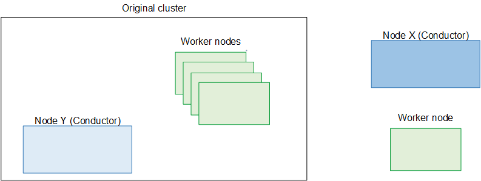

# Step E: Upgrade the worker

nodes

You must now remove each worker from the original cluster (that is controlled by node
Y), upgrade it, and add it to the new cluster (that is controlled by node X).

###### Note

Perform the following steps on one node at a time.

Typically, you move over as many worker nodes as you can in one maintenance window.
Keep in mind that the workers nodes that you don't move over will still be processing.

## Step E1: Remove the worker

node

Before you start, make sure that you have performed the tasks in [Step B: Prepare each node](migrate-split-c-prepare-node.md "migrate-split-c-prepare-node.md").

Remove the worker from the cluster. You perform this action from node Y (the Conductor
node that is controlling the original cluster).See [Removing a worker node from the
cluster](migrate-topic-remove-worker.md "migrate-topic-remove-worker.md").

The deployment now looks like the following diagram. Note that the worker node is
standalone. It isn't being controlled by any Conductor.

## Step E2: Upgrade the worker

node

1. Create a backup of the database on the node. See [Backing up data](migrate-topic-lifeboat.md "migrate-topic-lifeboat.md").
2. Set boot mode on the node to UEFI. See [Backing up data](migrate-topic-lifeboat.md "migrate-topic-lifeboat.md").
3. Perform a kickstart to upgrade the operating system to RHEL 9. See [Installing RHEL 9](migrate-topic-install-rhel.md "migrate-topic-install-rhel.md").
4. Install Elemental Live version 2.26.1 on the node. See [Installing Elemental Live on a worker node](migrate-topic-install-worker.md "migrate-topic-install-worker.md").
5. Restore the database onto each node. See [Restoring the database](migrate-topic-restore-database.md "migrate-topic-restore-database.md").
6. Install new licenses.

If this worker node handles SMPTE 2110 inputs or outputs, you should have
obtained a new license that includes the SMPTE 2110 add-on package. (The
procedure for obtaining a new license is described in the essential notes in
the [current Release Notes](../../../elemental-live.md "../../../elemental-live.md").) To deploy the license, see the section about configuring
licenses in the [AWS Elemental Live Configuration Guide](../../../elemental-live/latest/configguide.md "../../../elemental-live/latest/configguide.md").

### Step E3: Add the worker node to the

new cluster

1. Add the worker node to the cluster. Then add the node to its
   redundancy group. Finally, assign channels to the node, using the [list of channel
   assignments](migrate-split-c-prepare-node.md#migrate-split-c-capture-assignments "migrate-split-c-prepare-node.md#migrate-split-c-capture-assignments")) that you created. See [Adding worker nodes](migrate-topic-add-w.md "migrate-topic-add-w.md").
2. If the original cluster is configured for user authentication, then
   log onto node X and enable node authentication, in order to let
   operators work on the newly added worker node. Note that you must enable
   node authorization each time you add a worker node. For more
   information, see [Enabling user authentication](migrate-topic-user-auth.md "migrate-topic-user-auth.md").
3. This step applies if the original cluster design included nodes that
   connected to an SDI input using a router.

In the section about planning maintenance windows, we recommended that
you migrate all worker nodes that rely on the router at the same time.
If you have followed this advice, and you are now moving those nodes,
you need to reconfigure the router.

You need to reconfigure the router because the new cluster has
information about the SDI inputs and about the router, but it is missing
the mapping from the inputs to the router. You must reconfigure this
information now. You should have [made a note of the previous
mappings](migrate-std-prepare-node.md#migrate-std-capture-router "migrate-std-prepare-node.md#migrate-std-capture-router").

You perform this work on the primary Conductor (node X). See the
information about configuring routers in the _Reference: Configure connectivity_ section of the
[AWS Elemental Conductor Live Configuration Guide](../configguide.md "../configguide.md"). Specifically, start at Step E in that procedure. 4. Set up worker features.

Configuration information about some features isn't included in the
database. If one of these features applies to the current node, you must
set up the feature again. The features are:

    * Enabling OCR conversion to handle captions
    * Disabling RTMP inputs in order to release processing
     resources
    * Setting the maximum for virtual input switching

You perform this work on the primary Conductor (node X). See the section
about features in the [AWS Elemental Live Configuration Guide](../../../elemental-live/latest/configguide.md "../../../elemental-live/latest/configguide.md").

###### Note

You might want to take this opportunity to make other
configuration changes on one or more worker nodes.

We strongly recommend that you don't make these changes to the
configuration until you have tested your workflows in the new
setup. 5. Start channels on this node. You assigned the channels to this node
when you added the node to the cluster. Therefore, the channels that
were running on this node in the original cluster will restart on this
node in the new cluster. See [Restarting channels](migrate-topic-channel-start.md "migrate-topic-channel-start.md").
