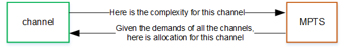

# Features of AWS Elemental Statmux

###### Topics

- [What you can mux](#cl3-smux-content "#cl3-smux-content")
- [Support for multiple output
  configurations](#cl3-statmux-features-outputs "#cl3-statmux-features-outputs")
- [Bitrate allocation](#cl3-statmux-features-bitrate "#cl3-statmux-features-bitrate")
- [Closed-loop bitrate
  allocation](#cl3-statmux-features-allocation "#cl3-statmux-features-allocation")
- [Resiliency in a statmux
  workflow](#cl3-statmux-features-resiliency "#cl3-statmux-features-resiliency")

## What you can mux

Elemental Statmux supports muxing of the following:

- Standard muxing that includes statmuxing: An MPTS can include an SPTS
  that is the output of a channel (event) from an Elemental Live node that is in the
  same Conductor Live cluster. For more information, see [Creating a standard
  MPTS](mpts-design-step-channels.md "mpts-design-step-channels.md").

- Program passthrough: An MPTS can include an SPTS program that you
  pass through from another source – either an MPTS from a third-party
  source, or an SPTS from an Elemental Live node that is in a different Conductor Live
  cluster. For more information, see [Including passthrough
  programs](mpts-passthrough-program.md "mpts-passthrough-program.md").
- Custom stream passthrough: An MPTS can include packets from a custom
  PID. For more information, see [Passing through custom
  streams](mpts-passthrough-high-pids.md "mpts-passthrough-high-pids.md").
- SI/PSI table passthrough: An MPTS can include SI/PSI tables that you
  have generated outside of Elemental Statmux. For more information, see [Passing through SI/PSI
  tables](mpts-passthrough-PSI-pids.md "mpts-passthrough-PSI-pids.md").

## Support for multiple output

configurations

The MPTS can include different types of SPTS channels from Elemental
Live. Elemental Statmux has the ability to mux channels with the following
characteristics:

- Different resolutions: SD, HD, and 4K.
- Different codecs: MPEG-2, AVC, and HEVC.
- Different color ranges: SDR and HDR.

## Bitrate allocation

The following rules apply to the bitrate for an MPTS:

- The MPTS has a maximum bitrate that you specify. As much as possible,
  Elemental Statmux uses up this maximum. However, when necessary, it includes NULL bits
  in the MPTS.
- Each SPTS has either a constant bitrate (the video stream is CBR) or
  a bitrate range (the video is VBR). Elemental Statmux allocates the available bitrate
  among the SPTSes. Elemental Statmux continually adjusts the bitrate allocation among
  the SPTSes.

When you run the MPTS, Elemental Statmux automatically allocates a bit rate to
each SPTS.

The automatic bitrate allocation deals with the video and audio and all
ancillary data.

Within the MPTS, you can prioritize SPTS channels. For example, you can
assign a higher priority to the SPTS channel that is the live sports event.
Elemental Statmux will always assign more bitrate to more important channels, to ensure
that these channels always have higher video quality.

## Closed-loop bitrate

allocation

The Elemental Statmux implementation of statmuxing follows a _closed-loop bitrate allocation model_.

A continual dialog is maintained between the Elemental Statmux node and the Elemental Live
nodes.

For each segment in each SPTS channel, Elemental Live sends complexity
information to Elemental Statmux. Elemental Statmux assesses the demands of all SPTS channels and
sends a bitrate allocation response for that segment to each Elemental Live. Each
Elemental Live uses the allocation response to determine the bitrate for the segment.

## Resiliency in a statmux

workflow

You can configure the statmux workflow for resiliency in various
components of the workflow, including redundant inputs in the Elemental Live nodes
and Elemental Statmux nodes.
